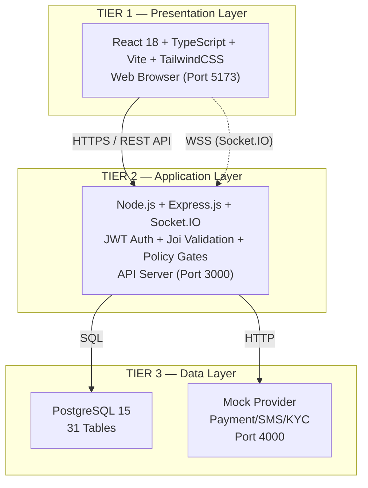
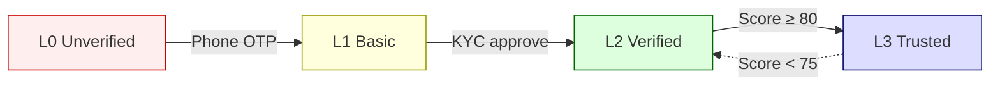

# บทที่ 3 การออกแบบและพัฒนาระบบ (ส่วนที่ 1: Section 3.1–3.3)

> Copy-paste ready สำหรับวิทยานิพนธ์ | Diagram ที่เป็น Mermaid → นำไปวางที่ https://mermaid.live แล้ว export รูป

---

## 3.1 สถาปัตยกรรมระบบ (System Architecture)

ระบบ CareConnect ออกแบบตามแนวคิด 3-Tier Architecture แบ่งการทำงานออกเป็น 3 ชั้นที่แยกหน้าที่กันอย่างชัดเจน ชั้นแรกคือ Presentation Layer ซึ่งเป็นส่วนที่ผู้ใช้โต้ตอบโดยตรง พัฒนาด้วย React 18 ในรูปแบบ Single Page Application (SPA) ใช้ TypeScript เป็นภาษาหลัก Vite เป็น build tool และ TailwindCSS สำหรับ styling ทำงานบน web browser ผ่าน port 5173 สื่อสารกับชั้นถัดไปผ่าน REST API (Axios) และ WebSocket (Socket.IO)

ชั้นที่สองคือ Application Layer ซึ่งเป็น backend ของระบบ พัฒนาด้วย Node.js (ES Modules) ร่วมกับ Express.js ทำหน้าที่ประมวลผล business logic ทั้งหมด ประกอบด้วยระบบ Authentication ด้วย JWT Access Token (อายุ 15 นาทีสำหรับ production) และ Refresh Token (อายุ 7 วัน) ระบบ Authorization ด้วย Policy Gate System ที่ใช้ฟังก์ชัน can() ตรวจสิทธิ์แบบ action-based ระบบ Validation ด้วย Joi Schema สำหรับทุก request ระบบ Real-time ด้วย Socket.IO สำหรับ chat และ notifications และ Background Worker สำหรับคำนวณ Trust Score ทำงานบน port 3000

ชั้นที่สามคือ Data Layer ใช้ PostgreSQL 15 เป็นฐานข้อมูลหลัก ออกแบบด้วยหลักการสำคัญ 4 ประการ ได้แก่ Immutable Ledger ที่ตาราง ledger_transactions เป็น append-only ห้าม UPDATE/DELETE ด้วย database trigger, Derived State ที่ trust_level คำนวณโดย worker เท่านั้น, Constraint Integrity ที่บังคับว่ายอดเงินติดลบไม่ได้และแต่ละงานมี active assignment ได้เพียง 1 รายการ และ UUID Primary Keys สำหรับทุกตาราง นอกจากนี้ยังมี External Services (Mock Provider) บน port 4000 สำหรับจำลอง Payment, SMS และ KYC providers

> 📌 **DIAGRAM: 3-Tier Architecture** — นำไปวางที่ https://mermaid.live

**ตาราง 3.1** Docker Containers ของระบบ

| Container | Port | หน้าที่ |
|-----------|------|---------|
| frontend | 5173 | Serve React SPA และ proxy /api ไปยัง backend |
| backend | 3000 | REST API server และ Socket.IO server |
| postgres | 5432 | PostgreSQL 15 database |
| mock-provider | 4000 | จำลอง Payment, SMS, KYC providers |
| pgadmin | 5050 | Database management UI (ทางเลือก) |
| migrate | — | Database migration (on-demand) |

---

## 3.2 ส่วนประกอบของระบบ (System Components)

### 3.2.1 Frontend Application

ส่วน Frontend พัฒนาด้วย React 18 ในรูปแบบ Single Page Application เขียนด้วย TypeScript ใช้ Vite เป็น build tool และ TailwindCSS เป็น utility-first CSS framework โครงสร้างแบ่งออกเป็น pages/ เก็บหน้าจอจัดกลุ่มตาม role, components/ui/ เก็บ UI components ที่ใช้ซ้ำ, contexts/ เก็บ AuthContext, layouts/ เก็บ layout หลัก, services/ เก็บ module เรียก API และ router.tsx กำหนด routing พร้อม Guards

ระบบ Route Guards ประกอบด้วย RequireAuth, RequireRole, RequirePolicy, RequireProfile และ RequireAdmin ใช้ sessionStorage แทน localStorage เพื่อรองรับหลาย tab พร้อมกันในคนละ role

### 3.2.2 Backend API Server

Backend พัฒนาด้วย Node.js 20 LTS ใช้ ES Modules และ Express.js 4 มี 16 route files รวมกว่า 120 endpoints ทุก request ผ่าน middleware chain: requireAuth (JWT) → requirePolicy (action-based) → Joi validation

**ตาราง 3.2** Route Files และจำนวน Endpoints

| Route File | Mount Path | Endpoints |
|-----------|-----------|-----------|
| authRoutes.js | /api/auth | 21 |
| otpRoutes.js | /api/otp | 4 |
| jobRoutes.js | /api/jobs | 15 |
| caregiverSearchRoutes.js | /api/caregivers | 4 |
| careRecipientRoutes.js | /api/care-recipients | 5 |
| caregiverDocumentRoutes.js | /api/caregiver-documents | 4 |
| reviewRoutes.js | /api/reviews | 3 |
| favoritesRoutes.js | /api/favorites | 3 |
| kycRoutes.js | /api/kyc | 3 |
| walletRoutes.js | /api/wallet | 18 |
| paymentRoutes.js | /api/payments | 3 |
| chatRoutes.js | /api/chat | 9 |
| disputeRoutes.js | /api/disputes | 5 |
| notificationRoutes.js | /api/notifications | 5 |
| webhookRoutes.js | /api/webhooks | 3 |
| adminRoutes.js | /api/admin | 19 |

### 3.2.3 WebSocket Server

ระบบ real-time ใช้ Socket.IO 4 แบ่ง 2 ส่วน: chatSocket.js จัดการ room thread:{threadId} สำหรับ chat (1 งาน = 1 thread) และ realtimeHub.js จัดการ notification push ผ่าน room user:{userId}

### 3.2.4 ฐานข้อมูล

**ตาราง 3.3** กลุ่มตารางในฐานข้อมูล (31 ตาราง)

| กลุ่ม | ตาราง |
|------|-------|
| Users & Auth | users, hirer_profiles, caregiver_profiles, auth_sessions, user_policy_acceptances, password_reset_tokens |
| KYC & Documents | user_kyc_info, caregiver_documents |
| Job System | job_posts, jobs, job_assignments, patient_profiles, job_patient_requirements, job_patient_sensitive_data |
| Evidence | job_gps_events, job_photo_evidence, early_checkout_requests |
| Financial | wallets, ledger_transactions, topup_intents, withdrawal_requests, bank_accounts, banks |
| Communication | chat_threads, chat_messages |
| Dispute | disputes, dispute_messages, dispute_events |
| Notification | notifications |
| Trust & Audit | trust_score_history, audit_events |
| Social | caregiver_reviews, caregiver_favorites |
| Webhook | provider_webhooks |

### 3.2.5 เทคโนโลยีที่ใช้

**ตาราง 3.4** Frontend Technology Stack

| เทคโนโลยี | เวอร์ชัน | หน้าที่ |
|-----------|---------|---------|
| React | 18.2 | UI Framework (Component-based SPA) |
| TypeScript | 5.3 | Type-safe JavaScript |
| Vite | 5.0 | Build tool และ Dev server |
| TailwindCSS | 3.4 | Utility-first CSS framework |
| React Router DOM | 6.21 | Client-side routing |
| Axios | 1.6 | HTTP client สำหรับ REST API |
| Socket.IO Client | 4.6 | Real-time WebSocket |
| react-hot-toast | 2.4 | Toast notification |
| Lucide React | 0.303 | Icon library |
| Leaflet + React-Leaflet | 1.9/4.2 | แผนที่แสดงตำแหน่งงาน |
| zustand | 4.4 | State management |
| zod | 3.22 | Schema validation |
| clsx | 2.1 | Conditional CSS class |
| date-fns | 3.0 | Date/time formatting |

**ตาราง 3.5** Backend Technology Stack

| เทคโนโลยี | เวอร์ชัน | หน้าที่ |
|-----------|---------|---------|
| Node.js | 20 LTS | JavaScript runtime (ESM) |
| Express.js | 4.18 | Web framework + REST API |
| Socket.IO | 4.6 | WebSocket server |
| jsonwebtoken | 9.0 | JWT generation/verification |
| bcrypt | 5.1 | Password hashing |
| Joi | 17.11 | Request validation |
| pg | 8.11 | PostgreSQL client |
| multer | 1.4 | File upload |
| google-auth-library | 9.15 | Google OAuth 2.0 |
| express-rate-limit | 7.1 | Rate limiting |
| nodemailer | 6.9 | Email sending |
| sharp | 0.33 | Image processing |
| winston | 3.11 | Structured logging |
| stripe | 14.21 | Payment integration |
| PostgreSQL | 15 | Relational database |
| Docker Compose | — | Container orchestration |

---

## 3.3 บทบาทผู้ใช้งาน (User Roles)

### 3.3.1 ประเภทผู้ใช้งาน

ระบบ CareConnect กำหนดผู้ใช้งาน 3 บทบาท ได้แก่ Hirer (ผู้ว่าจ้าง) สร้างงาน ค้นหาและว่าจ้างผู้ดูแล ชำระค่าจ้าง, Caregiver (ผู้ดูแล) รับงาน check-in/out รับค่าตอบแทน และ Admin (ผู้ดูแลระบบ) อนุมัติ KYC ตัดสินข้อพิพาท จัดการผู้ใช้

**ตาราง 3.6** ประเภทผู้ใช้งาน

| บทบาท | ประเภทบัญชี | คำอธิบาย |
|-------|------------|---------|
| Hirer | Guest (email) / Member (phone) | ผู้ว่าจ้าง — สร้างงาน, ว่าจ้าง, จ่ายเงิน |
| Caregiver | Guest (email) / Member (phone) | ผู้ดูแล — รับงาน, check-in/out, รับเงิน |
| Admin | — | จัดการระบบ, approve KYC, resolve dispute |

### 3.3.2 ระบบ Trust Level

ระบบ Trust Level แบ่งเป็น 4 ระดับ: L0 (Unverified) เริ่มต้น → L1 (Basic) หลังยืนยัน Phone OTP → L2 (Verified) หลัง KYC + Admin approve → L3 (Trusted) เมื่อ Bank verified + Trust Score ≥ 80 มี hysteresis คือลดลง L2 เมื่อ score < 75

> 📌 **DIAGRAM: Trust Level Progression** — Mermaid code:

**ตาราง 3.7** ปัจจัยการคำนวณ Trust Score (base=50, clamp 0-100)

| ปัจจัย | คะแนน | เพดาน |
|-------|------:|-------|
| งานที่ทำเสร็จ | +5/งาน | +30 |
| รีวิว 4-5 ดาว | +3/รีวิว | +20 |
| รีวิว 3 ดาว | +1/รีวิว | รวมเพดาน |
| รีวิว 1-2 ดาว | -5/รีวิว | -20 |
| ยกเลิกงาน | -10/ครั้ง | -30 |
| GPS violation | -3/ครั้ง | -15 |
| Check-in ตรงเวลา | +2/ครั้ง | +20 |
| โปรไฟล์ครบ | +10 | ครั้งเดียว |
| Response time bonus | +5 | ครั้งเดียว |

**ตาราง 3.8** สิทธิ์การเข้าถึงตาม Role และ Trust Level

| การกระทำ | บทบาท | L0 | L1 | L2 | L3 |
|---------|-------|:--:|:--:|:--:|:--:|
| สมัคร/Login/ดูโปรไฟล์ | ทุก role | ✓ | ✓ | ✓ | ✓ |
| สร้าง job draft | Hirer | ✓ | ✓ | ✓ | ✓ |
| Top-up wallet | ทุก role | ✓ | ✓ | ✓ | ✓ |
| ยกเลิกงาน | Hirer/CG | ✓ | ✓ | ✓ | ✓ |
| เผยแพร่งาน low_risk | Hirer | ✗ | ✓ | ✓ | ✓ |
| รับงาน/Check-in/out | Caregiver | ✗ | ✓ | ✓ | ✓ |
| เผยแพร่งาน high_risk | Hirer | ✗ | ✗ | ✓ | ✓ |
| ถอนเงิน | Caregiver | ✗ | ✗ | ✓ | ✓ |
| Admin: จัดการทุกอย่าง | Admin | ✓ | ✓ | ✓ | ✓ |
