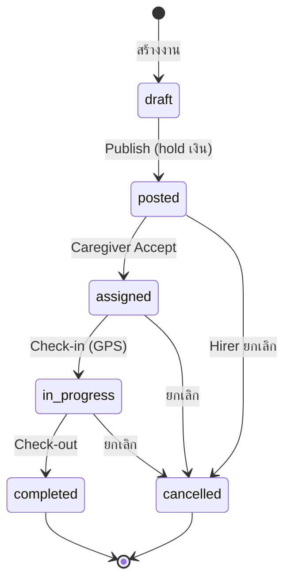
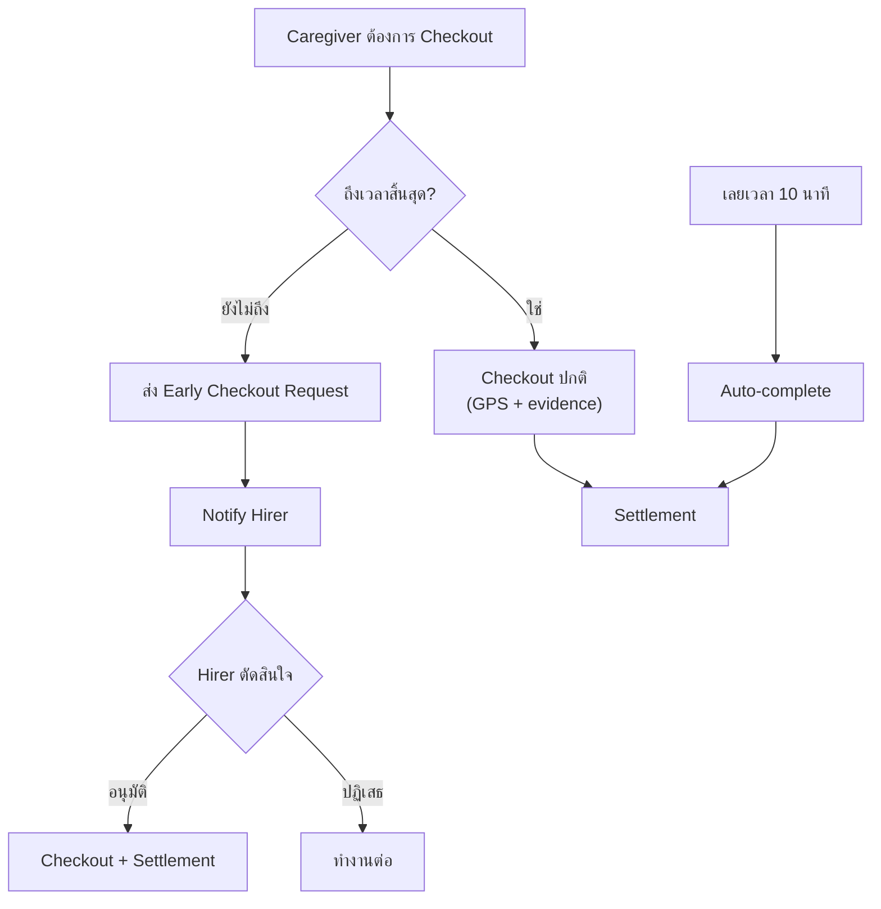
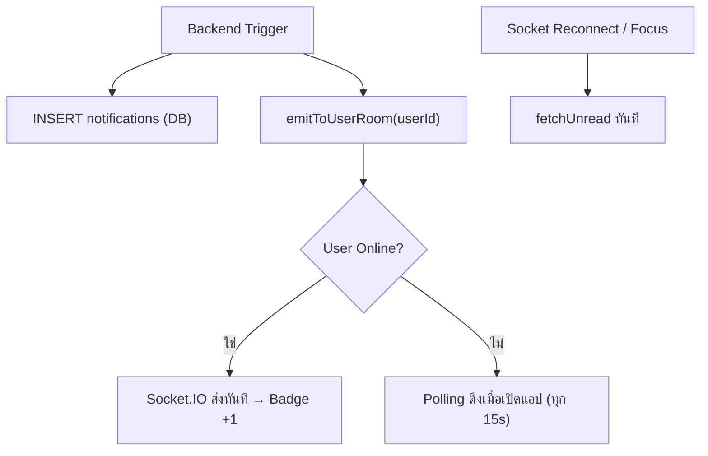
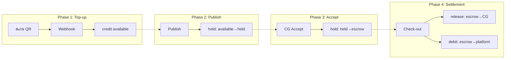
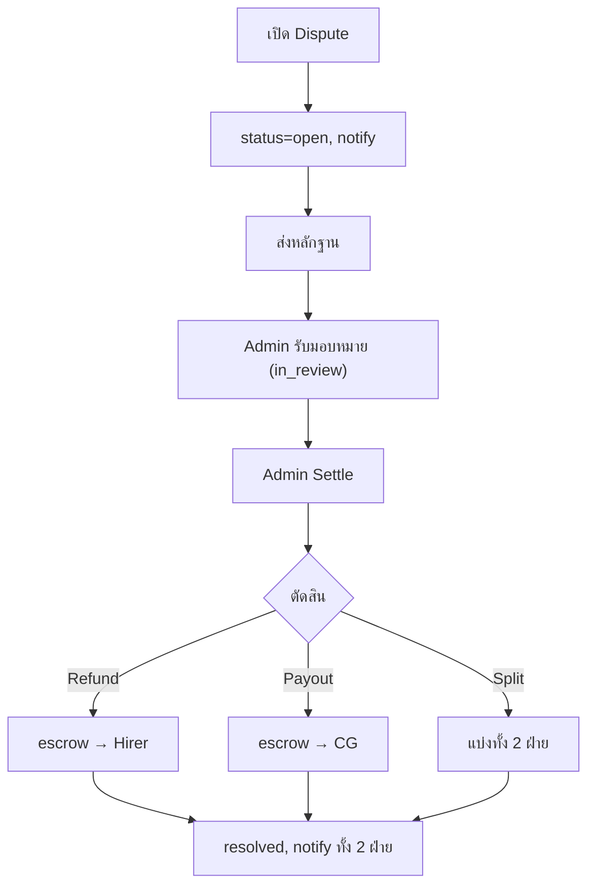

# บทที่ 3 (ส่วนที่ 2: Section 3.4 Functional Requirements)

> Diagram เป็น Mermaid → นำไปวางที่ https://mermaid.live แล้ว export รูป
> PlantUML → นำไปวางที่ https://www.plantuml.com/plantuml/uml

---

## 3.4 ความต้องการเชิงฟังก์ชัน (Functional Requirements)

### 3.4.1 ระบบยืนยันตัวตน (Authentication System)

ระบบยืนยันตัวตนของ CareConnect รองรับการสมัครสมาชิก 3 ช่องทาง ช่องทางแรกคือ Guest Registration โดยผู้ใช้ส่งข้อมูล email, password และ role ที่ต้องการไปยัง POST /api/auth/register/guest ช่องทางที่สองคือ Member Registration โดยใช้เบอร์โทรศัพท์และ password ผ่าน POST /api/auth/register/member และช่องทางที่สามคือ Google OAuth 2.0 ผ่าน GET /api/auth/google ซึ่งใช้ Authorization Code Flow ทั้ง 3 ช่องทางเมื่อสมัครสำเร็จ ระบบจะสร้าง record ใน 3 ตารางพร้อมกันภายใน database transaction เดียว ได้แก่ตาราง users สำหรับข้อมูลบัญชี ตาราง profile ตาม role ที่เลือก (hirer_profiles หรือ caregiver_profiles) และตาราง wallets สำหรับกระเป๋าเงิน พร้อมส่ง JWT token กลับไปยัง frontend ทันที

ระบบ Token ใช้ JSON Web Token (JWT) แบ่งเป็น Access Token ที่มีอายุ 15 นาทีสำหรับ production และ 7 วันสำหรับ development และ Refresh Token ที่มีอายุ 7 วันสำหรับ production และ 30 วันสำหรับ development เมื่อ Access Token หมดอายุ frontend จะเรียก POST /api/auth/refresh พร้อม refresh token เพื่อขอ access token ใหม่โดยอัตโนมัติ โดยไม่ต้องให้ผู้ใช้ login ใหม่

**ตาราง 3.9** Token Configuration

| ชนิด Token | อายุ Production | อายุ Development |
|-----------|----------------|-----------------|
| Access Token | 15 นาที | 7 วัน |
| Refresh Token | 7 วัน | 30 วัน |

สำหรับการยืนยันเบอร์โทรศัพท์ ผู้ใช้เรียก POST /api/otp/phone/send เพื่อรับรหัส OTP 6 หลักทาง SMS จากนั้นส่งรหัสผ่าน POST /api/otp/verify เมื่อยืนยันสำเร็จ ระบบจะตั้งค่า is_phone_verified เป็น true และอัปเกรด Trust Level จาก L0 เป็น L1 ทันที นอกจากนี้ระบบยังรองรับ forgot-password (ขอลิงก์ reset ทาง email), reset-password (ตั้งรหัสผ่านใหม่ด้วย token) และ change-password (เปลี่ยนรหัสผ่านขณะ login อยู่)

### 3.4.2 ระบบจัดการโปรไฟล์ (Profile Management)

ระบบจัดการโปรไฟล์เปิดให้ผู้ใช้ดูและแก้ไขข้อมูลส่วนตัวผ่าน GET/PUT /api/auth/profile ข้อมูลที่แก้ไขได้ครอบคลุมชื่อเต็ม ชื่อแสดงผล ที่อยู่ bio ประสบการณ์ และความเชี่ยวชาญ ผู้ใช้สามารถอัปโหลดรูปโปรไฟล์ผ่าน POST /api/auth/avatar ในรูปแบบ multipart form data โดยระบบใช้ multer สำหรับรับไฟล์และ sharp สำหรับ resize และ compress รูปภาพ

สำหรับผู้ดูแลมีระบบจัดการเอกสารและใบรับรองผ่าน /api/caregiver-documents ส่วนผู้ว่าจ้างมีระบบจัดการผู้รับการดูแล (Care Recipients) ผ่าน CRUD endpoints ที่ /api/care-recipients ซึ่งบันทึกข้อมูลเช่น ชื่อ ช่วงอายุ ระดับการเคลื่อนไหว โรคประจำตัว อุปกรณ์การแพทย์ ข้อมูลเหล่านี้ถูกนำไปคำนวณ risk level อัตโนมัติ การยืนยัน KYC ทำผ่าน POST /api/kyc/submit (บัตรประชาชนหน้า-หลัง + selfie)

### 3.4.3 ระบบค้นหา (Search System)

ระบบค้นหาแบ่งเป็น 2 มุมมอง มุมมองแรกคือฝั่งผู้ว่าจ้างค้นหาผู้ดูแลผ่าน GET /api/caregivers/search รองรับตัวกรอง: คำค้นหา (q), ทักษะ (skills), Trust Level, ประสบการณ์ (experience) และวันที่ว่าง (day) หน้า Landing Page แสดง featured caregivers ผ่าน GET /api/caregivers/public/featured โดยไม่ต้อง login ผู้ว่าจ้างบันทึก Favorites ผ่าน POST /api/favorites/toggle

มุมมองที่สองคือฝั่งผู้ดูแลดูประกาศงานผ่าน GET /api/jobs/feed ระบบกรองด้วย 3 เงื่อนไขอัตโนมัติ: แสดงเฉพาะงานที่ min_trust_level ไม่เกินระดับผู้ดูแล, กรองงานที่ทับซ้อนเวลาออก และไม่แสดงงานที่ผู้ดูแลสร้างเอง

### 3.4.4 ระบบสื่อสาร (Chat / Real-time System)

ระบบ Chat ออกแบบเป็น Thread-based โดย 1 งาน = 1 chat thread สร้างอัตโนมัติเมื่อผู้ดูแลรับงาน ปิดอัตโนมัติเมื่อยกเลิก ฝั่ง REST API รองรับ GET/POST /api/chat/threads/:threadId/messages, mark-read และ unread count

สำหรับ real-time ใช้ Socket.IO โดย client ส่ง thread:join เข้าห้องแชท ส่งข้อความผ่าน message:send ซึ่ง server broadcast message:new ไปทุก client ในห้อง รองรับ typing indicator (typing:start/stop) และ mark as read (message:read)

**ตาราง 3.10** Socket.IO Events

| Client → Server | Server → Client | คำอธิบาย |
|----------------|----------------|---------|
| thread:join | thread:joined | เข้าห้องแชท |
| message:send | message:new | ส่ง/รับข้อความ |
| typing:start | typing:started | กำลังพิมพ์ |
| typing:stop | typing:stopped | หยุดพิมพ์ |
| message:read | message:read | อ่านแล้ว |

### 3.4.5 ระบบจัดการงาน (Task / Appointment Management)

ฝั่งผู้ว่าจ้างเริ่มจากสร้างงาน draft กรอกข้อมูลครบ จากนั้น Publish ให้ปรากฏใน Job Feed หรือ Direct Assign ส่งตรงไปผู้ดูแล ยกเลิกได้ทุกขั้นตอนก่อน checkout

**ตาราง 3.11** ประเภทงาน (Job Types)

| ประเภท | คำอธิบาย |
|--------|---------|
| companionship | เป็นเพื่อนผู้สูงอายุ |
| personal_care | ดูแลส่วนตัว (อาบน้ำ, แต่งตัว, ป้อนอาหาร) |
| medical_monitoring | เฝ้าระวังทางการแพทย์ |
| dementia_care | ดูแลผู้ป่วยสมองเสื่อม |
| post_surgery | ดูแลหลังผ่าตัด |
| emergency | งานฉุกเฉิน |

ระบบคำนวณ Risk Level อัตโนมัติผ่าน computeRiskLevel() เป็น high_risk เมื่อเข้าเงื่อนไข 1 ใน 5 กลุ่ม โดย low_risk ต้องการ L1+ และ high_risk ต้องการ L2+

**ตาราง 3.12** เงื่อนไข Risk Level

| กลุ่มเงื่อนไข | ค่าที่ trigger high_risk |
|--------------|------------------------|
| ประเภทงาน | emergency, post_surgery, dementia_care, medical_monitoring |
| อุปกรณ์การแพทย์ | ventilator, tracheostomy, oxygen, feeding_tube |
| อาการผู้ป่วย | shortness_of_breath, chest_pain, seizure, uncontrolled_bleeding |
| พฤติกรรมเสี่ยง | aggression, cognitive delirium, wandering + fall_risk |
| งานเฉพาะทาง | tube_feeding, medication_administration, wound_dressing, catheter_care |

> 📌 **DIAGRAM: Job Status State Machine** — Mermaid code:

ผู้ดูแลเมื่อรับงานแล้ว Check-in ด้วย GPS (ระบบตรวจ geofence 100 ม.) แล้ว Check-out พร้อม evidence note กรณีเลิกก่อนเวลาส่ง Early Checkout Request ให้ผู้ว่าจ้างอนุมัติ เลยเวลา 10 นาที → auto-complete

> 📌 **DIAGRAM: Early Checkout Flow** — Mermaid code:

### 3.4.6 ระบบแจ้งเตือน (Notification System)

ระบบแจ้งเตือนทำงาน 2 ช่องทาง: real-time ผ่าน Socket.IO ส่งไปยัง room user:{userId} และ Polling Fallback ผ่าน GET /api/notifications/unread-count ทุก 15 วินาที + fetch เมื่อ focus, visibility change, online หรือ Socket.IO reconnect ทุก notification บันทึกลง DB สถานะ queued → sent → delivered → read

**ตาราง 3.13** Notification Events

| Event | ผู้ส่ง | ผู้รับ |
|-------|--------|--------|
| Caregiver รับงาน | Caregiver | Hirer |
| Hirer มอบหมายงานตรง | Hirer | Caregiver |
| Check-in / Check-out | Caregiver | Hirer |
| ยกเลิกงาน | Hirer/CG | อีกฝ่าย |
| Early checkout req/response | Hirer/CG | อีกฝ่าย |
| Dispute สร้างใหม่ | Hirer/CG | Admin + อีกฝ่าย |
| KYC อนุมัติ/ปฏิเสธ | Admin | User |

> 📌 **DIAGRAM: Notification Delivery** — Mermaid code:

### 3.4.7 ระบบชำระเงิน (Payment System)

ระบบการเงินออกแบบบน Double-entry Ledger ทุกรายการมี from_wallet_id → to_wallet_id ตาราง ledger_transactions เป็น append-only มี idempotency_key (UNIQUE) ป้องกัน duplicate

**ตาราง 3.14** ประเภท Wallet

| ประเภท | เจ้าของ | คำอธิบาย | สร้างเมื่อ |
|--------|--------|---------|-----------|
| hirer | ผู้ว่าจ้าง | กระเป๋าเงินหลัก | สมัครสมาชิก |
| caregiver | ผู้ดูแล | กระเป๋ารับเงิน | สมัครสมาชิก |
| escrow | ต่องาน | พักเงินระหว่างงาน | Caregiver Accept |
| platform | ระบบ | ค่าธรรมเนียม | ระบบสร้างครั้งเดียว |
| platform_replacement | ระบบ | กองทุนทดแทน | ระบบสร้างครั้งเดียว |

**ตาราง 3.15** Ledger Transaction Types

| ประเภท | จาก → ไป | เกิดเมื่อ |
|--------|----------|----------|
| credit | external → hirer wallet | Top-up สำเร็จ |
| hold | hirer available → held | Publish งาน |
| hold | hirer held → escrow | Caregiver Accept |
| release | escrow → caregiver wallet | Checkout (ค่าจ้าง) |
| debit | escrow → platform wallet | Checkout (fee) |
| release | hirer held → available | ยกเลิก (posted) |
| reversal | escrow → hirer available | ยกเลิก (assigned+) |

> 📌 **DIAGRAM: Payment Flow 4 Phases** — Mermaid code:

การถอนเงิน: ผู้ดูแล L2+ ขอผ่าน POST /api/wallet/withdraw → Admin review → approve → mark paid

### 3.4.8 ระบบข้อมูลและเนื้อหา (Content / Information System)

ระบบข้อพิพาท (Dispute) เปิดให้ทั้ง 2 ฝ่ายสร้างผ่าน POST /api/disputes ส่งหลักฐานผ่าน POST /api/disputes/:id/messages Admin Settle ผ่าน POST /api/admin/disputes/:id/settle เลือก refund/payout/split เงินดำเนินการผ่าน escrow อัตโนมัติ

> 📌 **DIAGRAM: Dispute Flow** — Mermaid code:

ระบบรีวิว: ผู้ว่าจ้างให้คะแนน 1-5 ดาว + comment หลังงานเสร็จ (1 รีวิว/งาน) คะแนนส่งผลต่อ Trust Score
