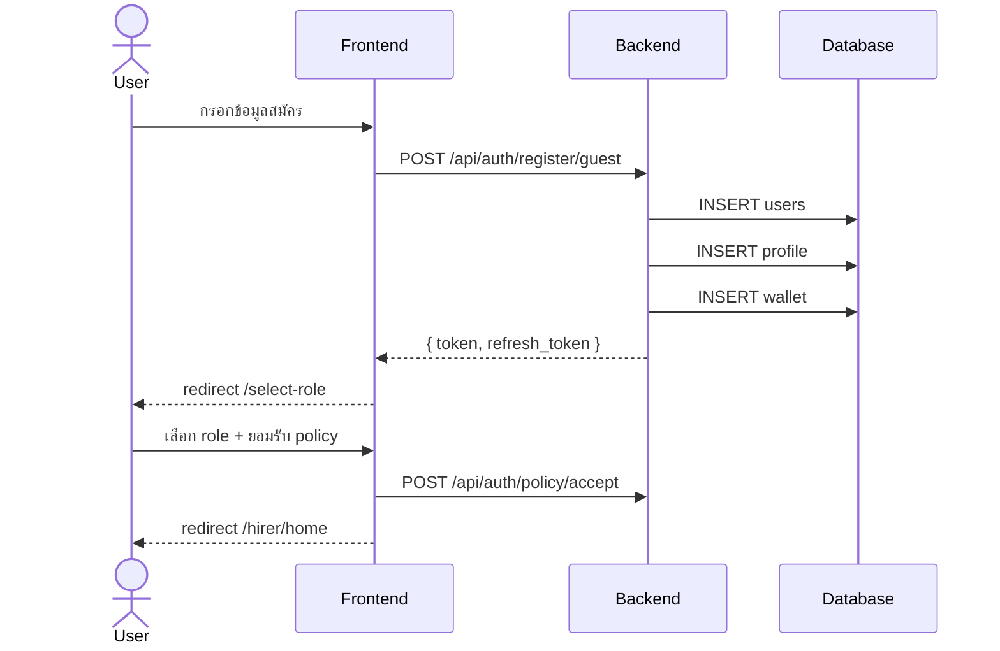
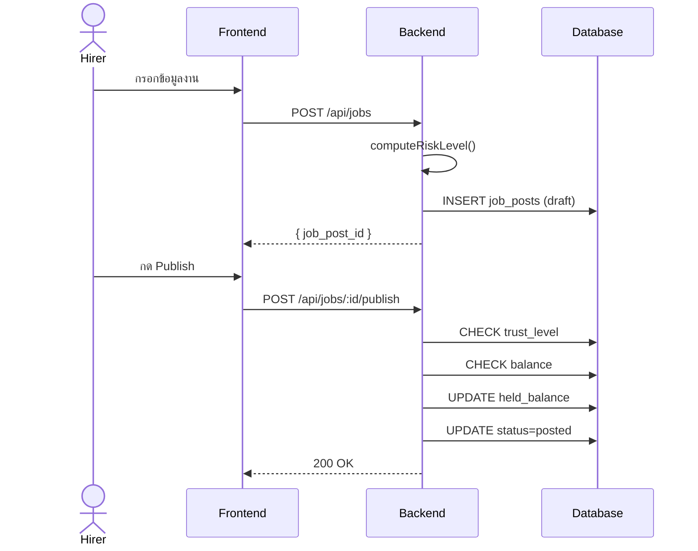
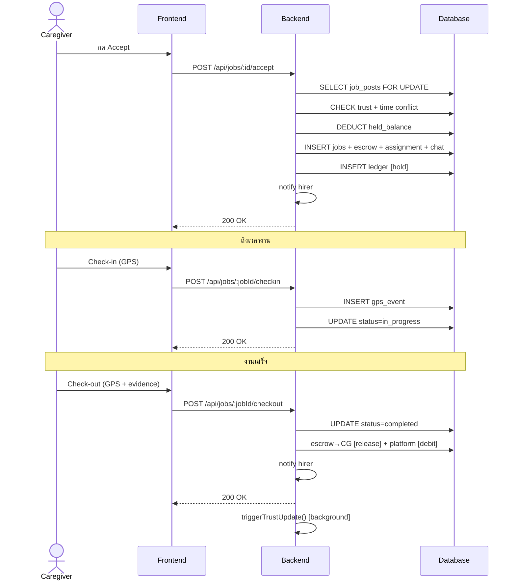
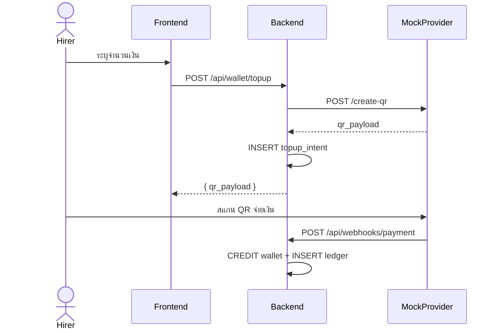
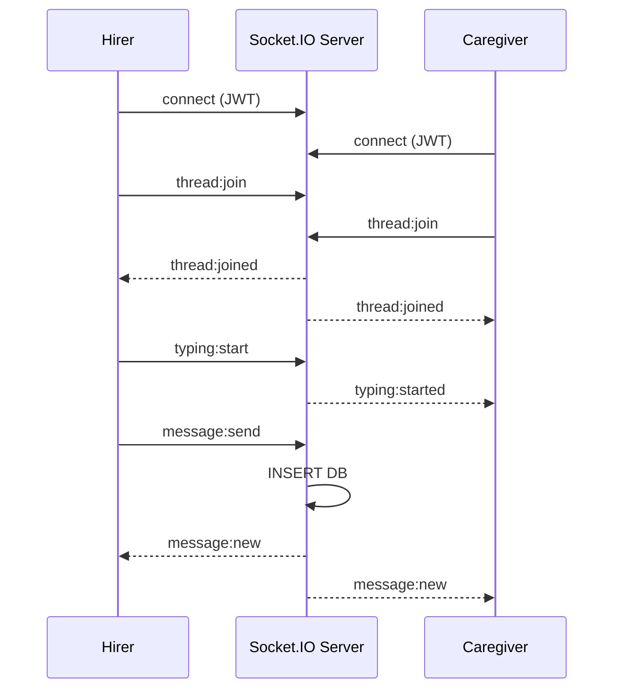
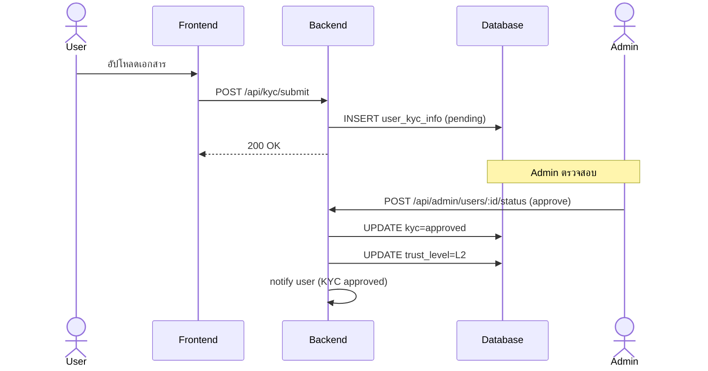

# บทที่ 3 (ส่วนที่ 3: Section 3.5–3.8 Sequence, UI, Database)

> Diagram เป็น Mermaid → https://mermaid.live | PlantUML → https://www.plantuml.com/plantuml/uml | dbdiagram → https://dbdiagram.io

---

## 3.5 Use Case

### 3.5.1 Use Case Diagram

> 📌 **DIAGRAM: Use Case** — Mermaid code (วางที่ https://mermaid.live):

```mermaid
flowchart TD
  %% Actors
  Guest([Guest])
  Hirer([Hirer])
  Caregiver([Caregiver])
  Admin([Admin])

  %% System boundary
  subgraph SYS[CareConnect System]
    direction TB

    subgraph AUTH["Authentication"]
      direction TB
      UC01((สมัครสมาชิก))
      UC02((Login))
      UC03((ยืนยัน OTP))
    end

    subgraph HJ["Hirer: Job & Payment"]
      direction TB
      UC04((สร้างงาน))
      UC05((เผยแพร่งาน))
      UC06((ค้นหา Caregiver))
      UC07((Direct<br/>Assign))
      UC08((Top-up<br/>Wallet))
      UC09((เปิด Dispute))
      UC10((อนุมัติ<br/>Early Checkout))
    end

    subgraph CJ["Caregiver: Job Execution"]
      direction TB
      UC11((ดู Job Feed))
      UC12((รับงาน))
      UC13((Check-in/out))
      UC14((Chat Real-time))
      UC15((ถอนเงิน))
      UC16((เปิด Dispute))
    end

    subgraph ADM["Admin"]
      direction TB
      UC17((จัดการ Users))
      UC18((Approve KYC))
      UC19((Settle Dispute))
      UC20((ดู Reports/<br/>Ledger))
    end
  end

  %% Associations
  Guest --- UC01
  Guest --- UC02
  Guest --- UC03

  Hirer --- UC04
  Hirer --- UC05
  Hirer --- UC06
  Hirer --- UC07
  Hirer --- UC08
  Hirer --- UC09
  Hirer --- UC10

  Caregiver --- UC11
  Caregiver --- UC12
  Caregiver --- UC13
  Caregiver --- UC14
  Caregiver --- UC15
  Caregiver --- UC16

  Admin --- UC17
  Admin --- UC18
  Admin --- UC19
  Admin --- UC20
```



### 3.5.2 Use Case Descriptions

**ตาราง 3.16** Use Case Descriptions

| UC ID | ชื่อ | Actor | Preconditions | Main Flow | Postconditions |
|-------|-----|-------|--------------|-----------|---------------|
| UC-01 | สมัครสมาชิก | Guest | ยังไม่มีบัญชี | เลือกช่องทาง → กรอกข้อมูล → สร้าง user+profile+wallet → รับ JWT → เลือก role → ยอมรับ policy | มีบัญชี, L0 |
| UC-02 | สร้าง/เผยแพร่งาน | Hirer (L1+) | Login, มี care recipient, เงินพอ | กรอกงาน → คำนวณ risk → draft → Publish → ตรวจ Trust+เงิน → hold → posted | งานใน Job Feed |
| UC-03 | รับงาน/ทำงาน | Caregiver (≥min_trust) | งาน posted, ไม่ทับซ้อน | Accept → สร้าง job+assignment+chat+escrow → Check-in (GPS) → Check-out (evidence) → Settlement | completed, ได้เงิน |
| UC-04 | เติมเงิน | Hirer | Login แล้ว | ระบุจำนวน → QR → สแกน → webhook → credit wallet | ยอดเพิ่ม |
| UC-05 | เปิด Dispute | Hirer/CG + Admin | มีงานดำเนินการ | เปิด → ส่งหลักฐาน → Admin Settle → notify | resolved |

---

## 3.6 Sequence Diagram

> 📌 **DIAGRAM: Guest Registration** — Mermaid code:



> 📌 **DIAGRAM: Job Creation & Publishing** — Mermaid code:



> 📌 **DIAGRAM: Caregiver Accept & Check-in/out** — Mermaid code:



> 📌 **DIAGRAM: Top-up Flow** — Mermaid code:



> 📌 **DIAGRAM: Real-time Chat** — Mermaid code:



> 📌 **DIAGRAM: KYC Flow** — Mermaid code:



---

## 3.7 การออกแบบส่วนติดต่อผู้ใช้ (UI Design)

> 📌 **NOTE**: ในรูปเล่มจริงควรแทรก screenshot หน้าจอจริงประกอบแต่ละกลุ่ม

**ตาราง 3.17** หน้าจอ Public

| URL | หน้าจอ | คำอธิบาย |
|-----|-------|---------|
| / | LandingPage | แนะนำระบบ, featured caregivers |
| /about | AboutPage | เกี่ยวกับแพลตฟอร์ม |
| /faq | FAQPage | คำถามที่พบบ่อย |
| /contact | ContactPage | ติดต่อเรา |

**ตาราง 3.18** หน้าจอ Authentication (11 หน้า)

| URL | หน้าจอ | คำอธิบาย |
|-----|-------|---------|
| /login | LoginEntryPage | เลือก email/phone/google |
| /login/email | LoginEmailPage | login ด้วย email |
| /login/phone | LoginPhonePage | login ด้วยเบอร์โทร |
| /auth/callback | AuthCallbackPage | Google OAuth callback |
| /register | RegisterTypePage | เลือกประเภทสมัคร |
| /register/guest | GuestRegisterPage | สมัครด้วย email |
| /register/member | MemberRegisterPage | สมัครด้วยเบอร์โทร |
| /select-role | RoleSelectionPage | เลือก Hirer/Caregiver |
| /register/consent | ConsentPage | ยอมรับ policy |
| /forgot-password | ForgotPasswordPage | ขอลิงก์ reset |
| /reset-password | ResetPasswordPage | ตั้งรหัสผ่านใหม่ |

**ตาราง 3.19** หน้าจอ Hirer (11 หน้า)

| URL | หน้าจอ | คำอธิบาย |
|-----|-------|---------|
| /hirer/home | HirerHomePage | รายการงาน, ปฏิทิน, สถิติ |
| /hirer/create-job | CreateJobPage | สร้างงาน (wizard form) |
| /hirer/search-caregivers | SearchCaregiversPage | ค้นหา + Direct Assign |
| /hirer/caregiver/:id | CaregiverPublicProfilePage | โปรไฟล์ผู้ดูแล |
| /hirer/care-recipients | CareRecipientsPage | จัดการผู้รับการดูแล |
| /hirer/care-recipients/new | CareRecipientFormPage | เพิ่มผู้รับการดูแล |
| /hirer/care-recipients/:id/edit | CareRecipientFormPage | แก้ไขผู้รับการดูแล |
| /hirer/wallet | HirerWalletPage | กระเป๋าเงิน |
| /hirer/wallet/receipt/:jobId | JobReceiptPage | ใบเสร็จต่องาน |
| /hirer/wallet/history | HirerPaymentHistoryPage | ประวัติชำระเงิน |
| /hirer/favorites | FavoritesPage | caregiver ที่บันทึก |

**ตาราง 3.20** หน้าจอ Caregiver (7 หน้า)

| URL | หน้าจอ | คำอธิบาย |
|-----|-------|---------|
| /caregiver/jobs/feed | CaregiverJobFeedPage | ดูประกาศงาน |
| /caregiver/jobs/my-jobs | CaregiverMyJobsPage | งานที่รับ, check-in/out |
| /caregiver/jobs/:id/preview | JobPreviewPage | ดูงานก่อนรับ |
| /caregiver/profile | ProfilePage | โปรไฟล์ |
| /caregiver/wallet | CaregiverWalletPage | กระเป๋าเงิน |
| /caregiver/wallet/earning/:jobId | JobEarningDetailPage | รายได้ต่องาน |
| /caregiver/wallet/history | EarningsHistoryPage | ประวัติรายได้ |

**ตาราง 3.21** หน้าจอ Shared (8 หน้า)

| URL | หน้าจอ | คำอธิบาย |
|-----|-------|---------|
| /jobs/:id | JobDetailPage | รายละเอียดงาน |
| /chat/:jobId | ChatRoomPage | ห้องแชท |
| /dispute/:disputeId | DisputeChatPage | ห้องข้อพิพาท |
| /notifications | NotificationsPage | ประวัติแจ้งเตือน |
| /profile | ProfilePage | โปรไฟล์ส่วนตัว |
| /settings | SettingsPage | ตั้งค่าบัญชี |
| /kyc | KycPage | KYC verification |
| /wallet/bank-accounts | BankAccountsPage | จัดการบัญชีธนาคาร |

**ตาราง 3.22** หน้าจอ Admin (8 หน้า)

| URL | หน้าจอ | คำอธิบาย |
|-----|-------|---------|
| /admin/login | AdminLoginPage | Login Admin |
| /admin/dashboard | AdminDashboardPage | ภาพรวม, สถิติ |
| /admin/users | AdminUsersPage | จัดการ user, KYC |
| /admin/jobs | AdminJobsPage | ดู/ยกเลิกงาน |
| /admin/financial | AdminFinancialPage | ledger transactions |
| /admin/disputes | AdminDisputesPage | settle disputes |
| /admin/reports | AdminReportsPage | รายงานสรุป |
| /admin/settings | AdminSettingsPage | ตั้งค่าระบบ |

---

## 3.8 การออกแบบฐานข้อมูล (Database Design)

### 3.8.1 ER Diagram

> 📌 **DIAGRAM: ER Diagram** — นำโค้ดนี้ไปวางที่ https://dbdiagram.io/d

```dbml
Table users {
  id UUID [pk]
  email VARCHAR [unique]
  phone_number VARCHAR [unique]
  role user_role [not null]
  trust_level trust_level [default: 'L0']
  trust_score INT [default: 0]
  status user_status [default: 'active']
}
Table hirer_profiles {
  id UUID [pk]
  user_id UUID [ref: - users.id, unique]
  display_name VARCHAR
}
Table caregiver_profiles {
  id UUID [pk]
  user_id UUID [ref: - users.id, unique]
  display_name VARCHAR
  average_rating NUMERIC
}
Table patient_profiles {
  id UUID [pk]
  hirer_id UUID [ref: > users.id]
  patient_display_name VARCHAR
}
Table job_posts {
  id UUID [pk]
  hirer_id UUID [ref: > users.id]
  patient_profile_id UUID [ref: > patient_profiles.id]
  preferred_caregiver_id UUID [ref: > users.id]
  status job_status
  risk_level risk_level
}
Table jobs {
  id UUID [pk]
  job_post_id UUID [ref: > job_posts.id]
  hirer_id UUID [ref: > users.id]
  status job_status
}
Table job_assignments {
  id UUID [pk]
  job_id UUID [ref: > jobs.id]
  caregiver_id UUID [ref: > users.id]
  status assignment_status
}
Table wallets {
  id UUID [pk]
  user_id UUID [ref: > users.id]
  job_id UUID [ref: > jobs.id]
  wallet_type VARCHAR
  available_balance BIGINT
  held_balance BIGINT
}
Table ledger_transactions {
  id UUID [pk]
  from_wallet_id UUID [ref: > wallets.id]
  to_wallet_id UUID [ref: > wallets.id]
  amount BIGINT
  type transaction_type
  idempotency_key VARCHAR [unique]
}
Table chat_threads {
  id UUID [pk]
  job_id UUID [ref: - jobs.id]
  status VARCHAR
}
Table chat_messages {
  id UUID [pk]
  thread_id UUID [ref: > chat_threads.id]
  sender_id UUID [ref: > users.id]
  type chat_message_type
}
Table disputes {
  id UUID [pk]
  job_post_id UUID [ref: > job_posts.id]
  opened_by_user_id UUID [ref: > users.id]
  assigned_admin_id UUID [ref: > users.id]
  status dispute_status
}
Table notifications {
  id UUID [pk]
  user_id UUID [ref: > users.id]
  status notification_status
}
Table caregiver_reviews {
  id UUID [pk]
  job_id UUID [ref: > jobs.id]
  reviewer_id UUID [ref: > users.id]
  caregiver_id UUID [ref: > users.id]
  rating INT
}
```

### 3.8.2 รายละเอียดตารางหลัก

ตารางหลักของระบบประกอบด้วย users ซึ่งเก็บข้อมูลผู้ใช้ทุกคน มี UUID primary key, email (UNIQUE, nullable), phone_number (UNIQUE, nullable), password_hash (bcrypt), account_type (guest/member), role (hirer/caregiver/admin), trust_level (L0-L3 เป็น derived state), trust_score (0-100) และ ban flags 4 ตัว (ban_login, ban_job_create, ban_job_accept, ban_withdraw)

ตาราง job_posts เก็บประกาศงานเป็นตารางแรกใน two-table pattern มี job_type (6 ค่า), risk_level (auto-computed), schedule, GPS coordinates, geofence_radius_m (default 100), hourly_rate, total_amount, platform_fee_amount (default 10%), min_trust_level, task flags และ replacement_chain_count (max 3) ตาราง jobs เก็บ instance จริงสร้างเมื่อ Accept การแยก 2 ตารางรองรับ replacement chain สูงสุด 3 ครั้งต่อประกาศ

ตาราง wallets มี available_balance และ held_balance (BIGINT, CHECK ≥ 0) แยก 5 ประเภท ตาราง ledger_transactions เป็น immutable (DB trigger ห้าม UPDATE/DELETE) มี idempotency_key (UNIQUE)

### 3.8.3 Database Enums

**ตาราง 3.23** Database Enums

| ENUM Type | Values |
|-----------|--------|
| user_role | hirer, caregiver, admin |
| user_status | active, suspended, deleted |
| trust_level | L0, L1, L2, L3 |
| job_status | draft, posted, assigned, in_progress, completed, cancelled, expired |
| job_type | companionship, personal_care, medical_monitoring, dementia_care, post_surgery, emergency |
| risk_level | low_risk, high_risk |
| assignment_status | active, replaced, completed, cancelled |
| transaction_type | credit, debit, hold, release, reversal |
| kyc_status | pending, approved, rejected, expired |
| dispute_status | open, in_review, resolved, rejected |
| notification_status | queued, sent, delivered, read, failed |
| chat_message_type | text, image, file, system |
| gps_event_type | check_in, check_out, ping |
