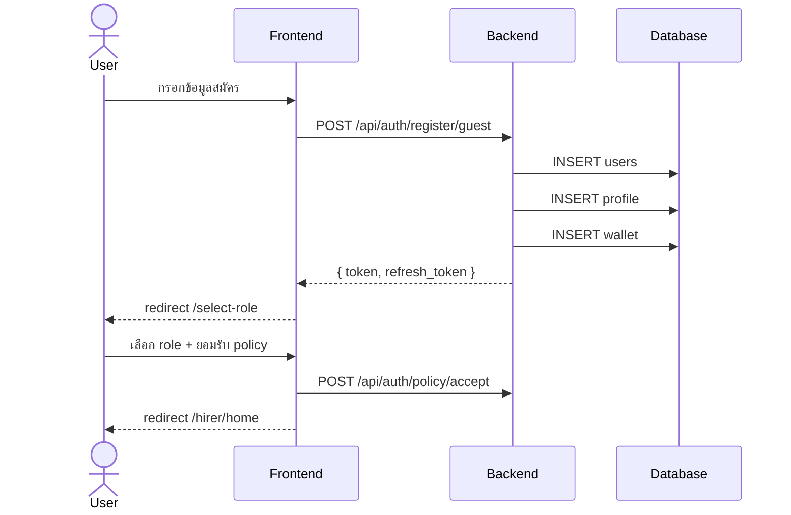
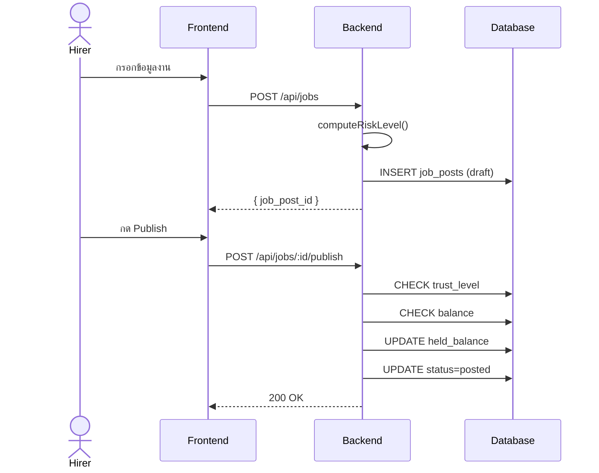
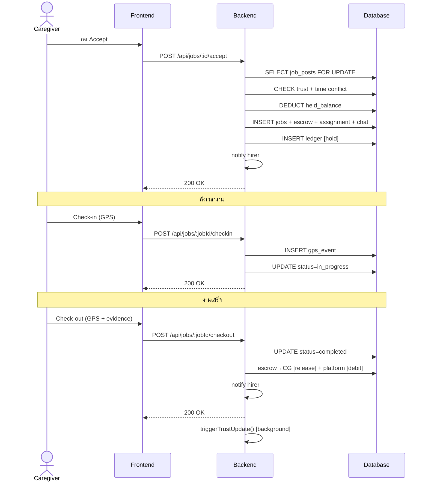
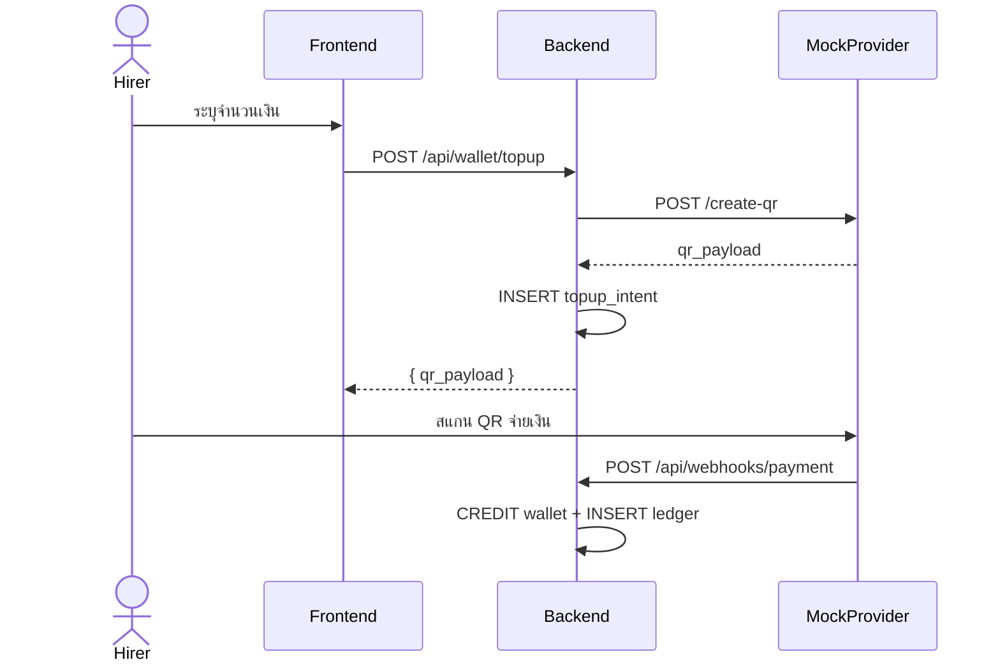
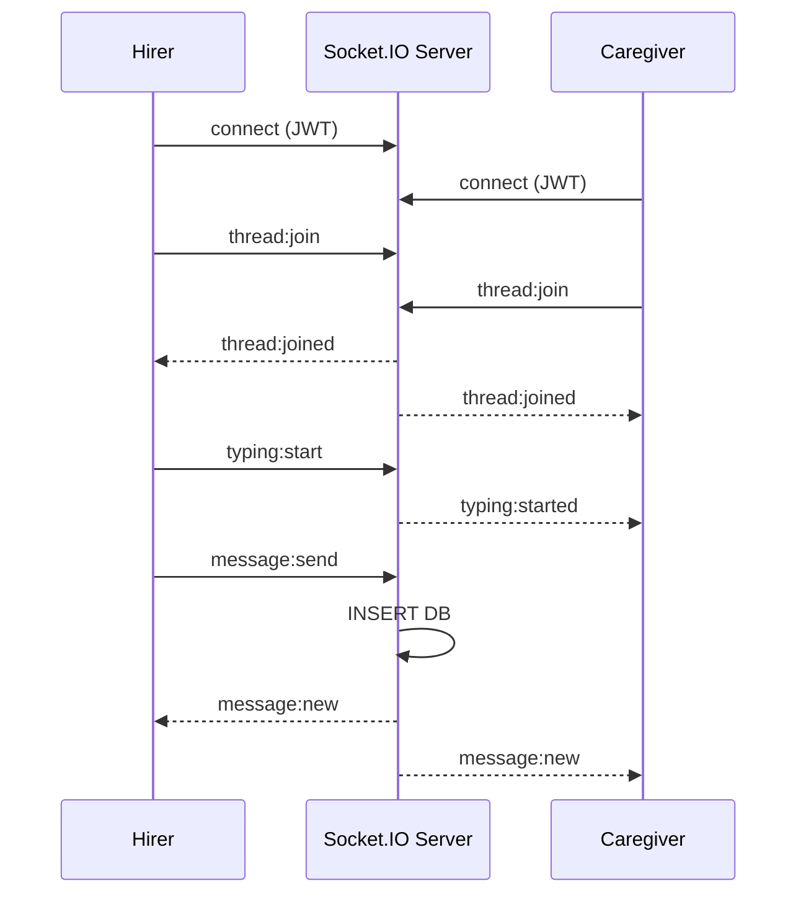
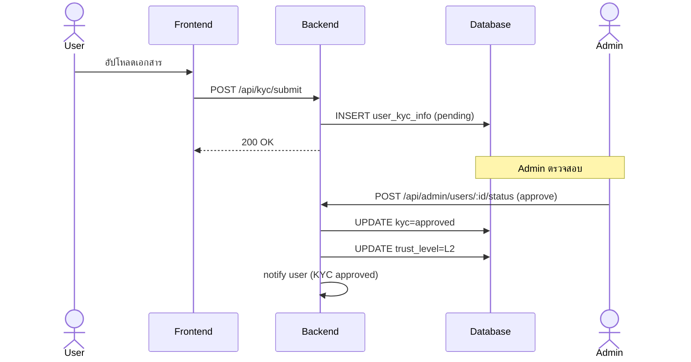

# บทที่ 3 (ส่วนที่ 3: Section 3.5–3.8 Sequence, UI, Database)

> Diagram เป็น Mermaid → https://mermaid.live | PlantUML → https://www.plantuml.com/plantuml/uml | dbdiagram → https://dbdiagram.io

---

## 3.5 Use Case

### 3.5.1 Use Case Diagram

> 📌 **DIAGRAM: Use Case** — PlantUML code (วางที่ plantuml.com):
> Hirer และ Caregiver สืบทอดจาก Guest (หลัง Register/Login → Select Role)

```plantuml
@startuml
left to right direction
skinparam packageStyle rectangle

actor Guest as G
actor Hirer as H
actor Caregiver as CG
actor Admin as A

G <|-- H : Select Role
G <|-- CG : Select Role

package "Authentication" {
  usecase "UC-01\nRegister" as UC01
  usecase "UC-02\nLogin" as UC02
  usecase "UC-03\nGoogle OAuth" as UC03
  usecase "UC-04\nVerify OTP" as UC04
  usecase "UC-05\nForgot/Reset\nPassword" as UC05
  usecase "UC-06\nSelect Role &\nAccept Policy" as UC06
}

G --> UC01
G --> UC02
G --> UC03
G --> UC04
G --> UC05
G --> UC06

package "Profile & Verification" {
  usecase "UC-07\nManage Profile" as UC07
  usecase "UC-08\nChange Password" as UC08
  usecase "UC-09\nSubmit KYC" as UC09
  usecase "UC-10\nUpload Caregiver\nDocuments" as UC10
}

H --> UC07
H --> UC08
H --> UC09
CG --> UC07
CG --> UC08
CG --> UC09
CG --> UC10

package "Hirer - Job & Social" {
  usecase "UC-11\nManage Care\nRecipients" as UC11
  usecase "UC-12\nCreate Job" as UC12
  usecase "UC-13\nPublish Job" as UC13
  usecase "UC-14\nCancel Job" as UC14
  usecase "UC-15\nSearch Caregivers" as UC15
  usecase "UC-16\nDirect Assign" as UC16
  usecase "UC-23\nApprove/Reject\nEarly Checkout" as UC23
  usecase "UC-24\nToggle Favorite" as UC24
  usecase "UC-25\nWrite Review" as UC25
}

H --> UC11
H --> UC12
H --> UC13
H --> UC14
H --> UC15
H --> UC16
H --> UC23
H --> UC24
H --> UC25

package "Caregiver - Job Execution" {
  usecase "UC-17\nView Job Feed" as UC17
  usecase "UC-18\nAccept Job" as UC18
  usecase "UC-19\nReject Direct\nAssignment" as UC19
  usecase "UC-20\nCheck-in" as UC20
  usecase "UC-21\nCheck-out" as UC21
  usecase "UC-22\nRequest Early\nCheckout" as UC22
}

CG --> UC17
CG --> UC18
CG --> UC19
CG --> UC20
CG --> UC21
CG --> UC22

package "Payment" {
  usecase "UC-26\nTop-up Wallet" as UC26
  usecase "UC-27\nView Wallet\n& History" as UC27
  usecase "UC-28\nWithdraw" as UC28
  usecase "UC-29\nManage Bank\nAccounts" as UC29
}

H --> UC26
H --> UC27
H --> UC29
CG --> UC27
CG --> UC28
CG --> UC29

package "Communication" {
  usecase "UC-30\nReal-time Chat" as UC30
  usecase "UC-31\nNotifications" as UC31
}

H --> UC30
H --> UC31
CG --> UC30
CG --> UC31

package "Dispute" {
  usecase "UC-32\nOpen Dispute" as UC32
  usecase "UC-33\nSend Dispute\nEvidence" as UC33
}

H --> UC32
H --> UC33
CG --> UC32
CG --> UC33

package "Admin Functions" {
  usecase "UC-34\nManage Users" as UC34
  usecase "UC-35\nKYC Review" as UC35
  usecase "UC-36\nManage Jobs" as UC36
  usecase "UC-37\nView Ledger" as UC37
  usecase "UC-38\nSettle Dispute" as UC38
  usecase "UC-39\nView Reports\n& Dashboard" as UC39
}

A --> UC34
A --> UC35
A --> UC36
A --> UC37
A --> UC38
A --> UC39

usecase "UC-40\nLogout" as UC40
H --> UC40
CG --> UC40
A --> UC40
@enduml
```



### 3.5.2 Use Case Descriptions

> ตาราง Use Case แยกทุกฟังก์ชัน — ทั้งหมด 40 Use Cases
> แบ่งเป็น 10 กลุ่ม: Authentication, Profile, Care Recipient, Hirer Job, Caregiver Job, Early Checkout, Social, Payment, Communication, Dispute, Admin

---

#### กลุ่มที่ 1: Authentication (UC-01 ถึง UC-06)

**ตาราง 3.16** UC-01: สมัครสมาชิก (Register)

| รายการ | รายละเอียด |
|--------|-----------|
| **Use Case ID** | UC-01 |
| **Use Case** | สมัครสมาชิก (Register) |
| **Actor** | Guest |
| **Main Flow** | 1. ผู้ใช้เข้าหน้า /register เลือกประเภทสมัคร (Guest หรือ Member)<br>2. Guest: กรอก email + password + role → POST /api/auth/register/guest<br>   Member: กรอก phone + password + role → POST /api/auth/register/member<br>3. ระบบตรวจสอบ Joi validation (email format, password ≥ 8 ตัว, role valid)<br>4. ระบบสร้าง users, profile (hirer_profiles/caregiver_profiles), wallet ใน DB transaction เดียว<br>5. ระบบสร้าง JWT access token + refresh token<br>6. ระบบส่ง token กลับ → frontend redirect ไป /select-role |
| **Exceptional Flow** | E1. Email/Phone ซ้ำในระบบ → 409 Conflict "อีเมลนี้ถูกใช้แล้ว"<br>E2. Password น้อยกว่า 8 ตัวอักษร → 400 Validation Error<br>E3. Role ไม่ใช่ hirer/caregiver → 400 Validation Error<br>E4. Rate limit exceeded (authLimiter) → 429 Too Many Requests |

**ตาราง 3.17** UC-02: เข้าสู่ระบบ (Login)

| รายการ | รายละเอียด |
|--------|-----------|
| **Use Case ID** | UC-02 |
| **Use Case** | เข้าสู่ระบบ (Login) |
| **Actor** | Guest |
| **Main Flow** | 1. ผู้ใช้เข้าหน้า /login เลือก Login ด้วย Email หรือ Phone<br>2. Email: กรอก email + password → POST /api/auth/login/email<br>   Phone: กรอก phone + password → POST /api/auth/login/phone<br>3. ระบบตรวจสอบ email/phone ในฐานข้อมูล<br>4. ระบบเปรียบเทียบ password กับ password_hash (bcrypt)<br>5. ระบบสร้าง JWT access token + refresh token<br>6. Frontend บันทึก token ใน sessionStorage → redirect ตาม role |
| **Exceptional Flow** | E1. Email/Phone ไม่มีในระบบ → 401 Unauthorized<br>E2. Password ไม่ตรง → 401 Unauthorized<br>E3. User ถูก ban (ban_login=true) → 403 Forbidden<br>E4. User status=suspended → 403 Forbidden<br>E5. Rate limit exceeded → 429 Too Many Requests |

**ตาราง 3.18** UC-03: เข้าสู่ระบบด้วย Google (Google OAuth)

| รายการ | รายละเอียด |
|--------|-----------|
| **Use Case ID** | UC-03 |
| **Use Case** | เข้าสู่ระบบด้วย Google (Google OAuth 2.0) |
| **Actor** | Guest |
| **Main Flow** | 1. ผู้ใช้กดปุ่ม "Sign in with Google" → GET /api/auth/google<br>2. ระบบ redirect ไป Google Consent Screen (Authorization Code Flow)<br>3. ผู้ใช้อนุญาต → Google redirect กลับ GET /api/auth/google/callback พร้อม code<br>4. ระบบแลก code เป็น token กับ Google → ได้ email, name, google_id<br>5. ถ้า user มีอยู่แล้ว → login ส่ง JWT กลับ<br>6. ถ้า user ใหม่ → สร้าง user + profile + wallet → redirect /select-role |
| **Exceptional Flow** | E1. ผู้ใช้ปฏิเสธ consent → redirect กลับหน้า login พร้อม error<br>E2. Google callback code ไม่ valid → 400 Bad Request<br>E3. Email จาก Google ซ้ำกับบัญชี email ที่มีอยู่ → ผูกบัญชีเดิม |

**ตาราง 3.19** UC-04: ยืนยัน OTP (Verify OTP)

| รายการ | รายละเอียด |
|--------|-----------|
| **Use Case ID** | UC-04 |
| **Use Case** | ยืนยัน OTP (Verify OTP) |
| **Actor** | Hirer, Caregiver |
| **Main Flow** | 1. ผู้ใช้กดขอ OTP → POST /api/otp/phone/send หรือ /api/otp/email/send<br>2. ระบบสร้าง OTP 6 หลัก + บันทึกลง DB (หมดอายุ 5 นาที)<br>3. ระบบส่ง OTP ทาง SMS (SMSOK) หรือ Email (nodemailer)<br>4. ผู้ใช้กรอก OTP → POST /api/otp/verify<br>5. ระบบตรวจสอบ OTP ตรงกันและยังไม่หมดอายุ<br>6. อัปเดต is_phone_verified=true หรือ is_email_verified=true<br>7. ถ้ายืนยันโทรศัพท์สำเร็จ → Trust Level อัปเกรดจาก L0 เป็น L1 |
| **Exceptional Flow** | E1. OTP ไม่ถูกต้อง → 400 "รหัส OTP ไม่ถูกต้อง"<br>E2. OTP หมดอายุ → 400 "รหัส OTP หมดอายุ"<br>E3. ส่ง OTP ซ้ำเร็วเกินไป → 429 Rate Limit<br>E4. เบอร์โทรศัพท์ format ผิด → 400 Validation Error |

**ตาราง 3.20** UC-05: ลืมรหัสผ่าน/รีเซ็ตรหัสผ่าน (Forgot & Reset Password)

| รายการ | รายละเอียด |
|--------|-----------|
| **Use Case ID** | UC-05 |
| **Use Case** | ลืมรหัสผ่าน/รีเซ็ตรหัสผ่าน (Forgot & Reset Password) |
| **Actor** | Guest |
| **Main Flow** | 1. ผู้ใช้เข้าหน้า /forgot-password กรอก email<br>2. POST /api/auth/forgot-password → ระบบสร้าง reset token (hex 64 chars)<br>3. ระบบส่ง email พร้อมลิงก์ reset (nodemailer)<br>4. ผู้ใช้คลิกลิงก์ → เข้าหน้า /reset-password?token=xxx&email=xxx<br>5. กรอกรหัสผ่านใหม่ (≥ 8 ตัว) → POST /api/auth/reset-password<br>6. ระบบตรวจสอบ token ถูกต้องและยังไม่หมดอายุ<br>7. อัปเดต password_hash ใหม่ (bcrypt) |
| **Exceptional Flow** | E1. Email ไม่มีในระบบ → ส่ง 200 OK เสมอ (ไม่เปิดเผยว่า email มีหรือไม่)<br>E2. Token หมดอายุ → 400 "ลิงก์รีเซ็ตหมดอายุ"<br>E3. Token ไม่ถูกต้อง → 400 Bad Request<br>E4. Password ใหม่ < 8 ตัว → 400 Validation Error |

**ตาราง 3.21** UC-06: เลือกบทบาทและยอมรับนโยบาย (Select Role & Accept Policy)

| รายการ | รายละเอียด |
|--------|-----------|
| **Use Case ID** | UC-06 |
| **Use Case** | เลือกบทบาทและยอมรับนโยบาย (Select Role & Accept Policy) |
| **Actor** | Hirer, Caregiver |
| **Main Flow** | 1. หลัง Register/Login ระบบ redirect ไป /select-role<br>2. ผู้ใช้เลือก role (Hirer หรือ Caregiver)<br>3. ระบบแสดงหน้า /register/consent พร้อมเงื่อนไข<br>4. ผู้ใช้อ่านและกดยอมรับ → POST /api/auth/policy/accept<br>5. ระบบบันทึก role + version_policy_accepted ลง DB<br>6. ถ้ายังไม่มี profile ของ role ที่เลือก → สร้าง profile + wallet ใหม่<br>7. redirect ไปหน้าหลักของ role (/hirer/home หรือ /caregiver/jobs/feed) |
| **Exceptional Flow** | E1. ผู้ใช้ยังไม่ login → redirect ไป /login<br>E2. ผู้ใช้เปลี่ยน role ภายหลัง → POST /api/auth/role สร้าง profile ใหม่ถ้ายังไม่มี |

---

#### กลุ่มที่ 2: Profile & Verification (UC-07 ถึง UC-10)

**ตาราง 3.22** UC-07: จัดการโปรไฟล์ (Manage Profile)

| รายการ | รายละเอียด |
|--------|-----------|
| **Use Case ID** | UC-07 |
| **Use Case** | จัดการโปรไฟล์ (Manage Profile) |
| **Actor** | Hirer, Caregiver |
| **Main Flow** | 1. ผู้ใช้เข้าหน้า /profile<br>2. ระบบดึงข้อมูล GET /api/auth/profile → แสดงข้อมูลปัจจุบัน<br>3. ผู้ใช้แก้ไขชื่อ, bio, ประสบการณ์, ความเชี่ยวชาญ, ที่อยู่<br>4. กดบันทึก → PUT /api/auth/profile<br>5. ระบบ validate ด้วย Joi (display_name required)<br>6. อัปเดตข้อมูลใน hirer_profiles/caregiver_profiles<br>7. อัปโหลดรูปโปรไฟล์ → POST /api/auth/avatar (multer + sharp resize) |
| **Exceptional Flow** | E1. display_name ว่าง → 400 Validation Error<br>E2. รูปโปรไฟล์ > 5 MB → 400 "รูปโปรไฟล์ต้องมีขนาดไม่เกิน 5 MB"<br>E3. ไฟล์ไม่ใช่ JPEG/PNG/WebP → 400 "อนุญาตเฉพาะไฟล์รูปภาพ" |

**ตาราง 3.23** UC-08: เปลี่ยนรหัสผ่าน (Change Password)

| รายการ | รายละเอียด |
|--------|-----------|
| **Use Case ID** | UC-08 |
| **Use Case** | เปลี่ยนรหัสผ่าน (Change Password) |
| **Actor** | Hirer, Caregiver |
| **Main Flow** | 1. ผู้ใช้เข้าหน้า /settings<br>2. กรอกรหัสผ่านเดิม (ถ้ามี) + รหัสผ่านใหม่<br>3. POST /api/auth/change-password<br>4. ระบบตรวจสอบรหัสผ่านเดิมตรงกับ hash<br>5. บันทึก password_hash ใหม่ (bcrypt) |
| **Exceptional Flow** | E1. รหัสผ่านเดิมไม่ถูกต้อง → 400 "รหัสผ่านปัจจุบันไม่ถูกต้อง"<br>E2. รหัสผ่านใหม่ < 6 ตัว → 400 Validation Error<br>E3. บัญชี Google OAuth ไม่มีรหัสผ่านเดิม → ข้ามการตรวจ current_password |

**ตาราง 3.24** UC-09: ยืนยัน KYC (Submit KYC)

| รายการ | รายละเอียด |
|--------|-----------|
| **Use Case ID** | UC-09 |
| **Use Case** | ยืนยัน KYC (Submit KYC) |
| **Actor** | Hirer, Caregiver |
| **Main Flow** | 1. ผู้ใช้เข้าหน้า /kyc<br>2. อัปโหลดเอกสาร: บัตรประชาชนด้านหน้า, ด้านหลัง, selfie<br>3. POST /api/kyc/submit (multipart form data)<br>4. ระบบบันทึกไฟล์ + สร้าง record ใน user_kyc_info (status=pending)<br>5. รอ Admin ตรวจสอบ (ดู UC-35)<br>6. เมื่อ Admin approve → trust_level อัปเกรดเป็น L2 |
| **Exceptional Flow** | E1. ขาดไฟล์ selfie → 400 "กรุณาอัปโหลดรูป selfie"<br>E2. ไฟล์ไม่ใช่รูปภาพ → 400 Validation Error<br>E3. KYC ถูก reject → ผู้ใช้สามารถส่งใหม่ได้ |

**ตาราง 3.25** UC-10: อัปโหลดเอกสาร/ใบรับรอง (Upload Caregiver Documents)

| รายการ | รายละเอียด |
|--------|-----------|
| **Use Case ID** | UC-10 |
| **Use Case** | อัปโหลดเอกสาร/ใบรับรอง (Upload Caregiver Documents) |
| **Actor** | Caregiver |
| **Main Flow** | 1. ผู้ดูแลเข้าหน้าจัดการเอกสาร<br>2. เลือกประเภทเอกสาร (ใบรับรอง, ใบอนุญาต, อื่น ๆ)<br>3. POST /api/caregiver-documents (multipart form data)<br>4. ระบบบันทึกไฟล์ + สร้าง record ใน caregiver_documents<br>5. เอกสารแสดงในโปรไฟล์สาธารณะ |
| **Exceptional Flow** | E1. ไฟล์ขนาดเกินกำหนด → 400 Payload Too Large<br>E2. ผู้ใช้ไม่ใช่ Caregiver → 403 Forbidden |

---

#### กลุ่มที่ 3: Care Recipient Management (UC-11)

**ตาราง 3.26** UC-11: จัดการผู้รับการดูแล (Manage Care Recipients)

| รายการ | รายละเอียด |
|--------|-----------|
| **Use Case ID** | UC-11 |
| **Use Case** | จัดการผู้รับการดูแล (Manage Care Recipients — CRUD) |
| **Actor** | Hirer |
| **Main Flow** | 1. ผู้ว่าจ้างเข้าหน้า /hirer/care-recipients<br>2. ระบบดึงรายการ GET /api/care-recipients<br>3. **เพิ่ม**: กด "เพิ่มผู้รับการดูแล" → /hirer/care-recipients/new<br>4. กรอกข้อมูล: ชื่อ, ช่วงอายุ, ระดับการเคลื่อนไหว, โรคประจำตัว, อุปกรณ์การแพทย์, ที่อยู่<br>5. POST /api/care-recipients → ระบบสร้าง patient_profiles record<br>6. **แก้ไข**: กดแก้ไข → /hirer/care-recipients/:id/edit → PUT /api/care-recipients/:id<br>7. **ลบ**: กดลบ → DELETE /api/care-recipients/:id |
| **Exceptional Flow** | E1. ชื่อว่าง → 400 Validation Error<br>E2. ลบผู้รับการดูแลที่มีงานอยู่ → 409 Conflict<br>E3. แก้ไข/ลบของ hirer อื่น → 403 Forbidden |

---

#### กลุ่มที่ 4: Hirer — Job Management (UC-12 ถึง UC-16)

**ตาราง 3.27** UC-12: สร้างงาน (Create Job)

| รายการ | รายละเอียด |
|--------|-----------|
| **Use Case ID** | UC-12 |
| **Use Case** | สร้างงาน (Create Job — Draft) |
| **Actor** | Hirer |
| **Main Flow** | 1. ผู้ว่าจ้างเข้าหน้า /hirer/create-job (wizard form)<br>2. เลือกผู้รับการดูแล (patient_profile_id)<br>3. กรอก: ชื่องาน, ประเภทงาน (6 ค่า), คำอธิบาย<br>4. เลือกวันเวลา (scheduled_start_at, scheduled_end_at) → ระบบคำนวณ total_hours อัตโนมัติ<br>5. กรอกที่อยู่ + ระบบดึง GPS coordinates (lat, lng)<br>6. ตั้งค่า hourly_rate → ระบบคำนวณ total_amount + platform_fee (10%)<br>7. เลือก job_tasks, required_skills, equipment, precautions (flags)<br>8. ระบบเรียก computeRiskLevel() คำนวณ risk_level อัตโนมัติ<br>9. POST /api/jobs → สร้าง job_posts (status=draft) |
| **Exceptional Flow** | E1. ขาด required fields → 400 Joi Validation Error<br>E2. scheduled_end_at ก่อน scheduled_start_at → 400 Validation Error<br>E3. ยังไม่มี care recipient → ต้องสร้างก่อน (UC-11)<br>E4. ban_job_create=true → 403 Forbidden |

**ตาราง 3.28** UC-13: เผยแพร่งาน (Publish Job)

| รายการ | รายละเอียด |
|--------|-----------|
| **Use Case ID** | UC-13 |
| **Use Case** | เผยแพร่งาน (Publish Job) |
| **Actor** | Hirer (L1+) |
| **Main Flow** | 1. ผู้ว่าจ้างดูงาน draft ที่สร้างไว้<br>2. กด Publish → POST /api/jobs/:id/publish<br>3. ระบบตรวจ Trust Level: low_risk ต้องการ L1+, high_risk ต้องการ L2+<br>4. ระบบตรวจ available_balance ≥ total_amount<br>5. ระบบ hold เงิน: available_balance -= total_amount, held_balance += total_amount<br>6. INSERT ledger_transactions (type=hold)<br>7. UPDATE job_posts status=posted<br>8. งานปรากฏใน Job Feed |
| **Exceptional Flow** | E1. Trust Level ไม่เพียงพอ → 403 "Trust level ไม่เพียงพอ"<br>E2. ยอดเงินไม่พอ → 400 "ยอดเงินไม่เพียงพอ"<br>E3. งานไม่ใช่ draft → 400 "สถานะไม่ถูกต้อง"<br>E4. ไม่ใช่เจ้าของงาน → 403 Forbidden |

**ตาราง 3.29** UC-14: ยกเลิกงาน (Cancel Job)

| รายการ | รายละเอียด |
|--------|-----------|
| **Use Case ID** | UC-14 |
| **Use Case** | ยกเลิกงาน (Cancel Job) |
| **Actor** | Hirer |
| **Main Flow** | 1. ผู้ว่าจ้างเปิดรายละเอียดงาน<br>2. กดยกเลิก → กรอกเหตุผล → POST /api/jobs/:id/cancel<br>3. ระบบตรวจสถานะงาน (ยกเลิกได้ก่อน completed)<br>4. **กรณี posted**: คืนเงิน held → available (release)<br>5. **กรณี assigned/in_progress**: คืนเงิน escrow → hirer available (reversal)<br>6. UPDATE status=cancelled<br>7. ปิด chat thread อัตโนมัติ<br>8. Notify ผู้ดูแล (ถ้ามี) |
| **Exceptional Flow** | E1. งาน completed แล้ว → 400 "ไม่สามารถยกเลิกได้"<br>E2. เหตุผลว่าง → 400 Validation Error<br>E3. ไม่ใช่เจ้าของ → 403 Forbidden |

**ตาราง 3.30** UC-15: ค้นหาผู้ดูแล (Search Caregivers)

| รายการ | รายละเอียด |
|--------|-----------|
| **Use Case ID** | UC-15 |
| **Use Case** | ค้นหาผู้ดูแล (Search Caregivers) |
| **Actor** | Hirer |
| **Main Flow** | 1. ผู้ว่าจ้างเข้าหน้า /hirer/search-caregivers<br>2. กรอกตัวกรอง: คำค้น (q), ทักษะ (skills), Trust Level, ประสบการณ์ (experience), วันที่ว่าง (day)<br>3. GET /api/caregivers/search?q=xxx&skills=xxx&...<br>4. ระบบค้นหาจาก caregiver_profiles + users<br>5. แสดงรายการ: ชื่อ, rating, Trust Level, ทักษะ, ปุ่ม "ดูรายละเอียด"<br>6. กดดูรายละเอียด → เปิด modal แสดงโปรไฟล์เต็ม + ปุ่ม "มอบหมายงาน" |
| **Exceptional Flow** | E1. ไม่มีผลลัพธ์ → แสดงข้อความ "ไม่พบผู้ดูแลที่ตรงเงื่อนไข"<br>E2. API error → แสดง error toast |

**ตาราง 3.31** UC-16: มอบหมายงานตรง (Direct Assign)

| รายการ | รายละเอียด |
|--------|-----------|
| **Use Case ID** | UC-16 |
| **Use Case** | มอบหมายงานตรง (Direct Assign) |
| **Actor** | Hirer |
| **Main Flow** | 1. ผู้ว่าจ้างค้นหาผู้ดูแล (UC-15) แล้วกด "มอบหมายงาน"<br>2. เลือกงาน draft/posted ที่ต้องการ<br>3. POST /api/caregivers/assign { job_post_id, caregiver_id }<br>4. ระบบตั้ง preferred_caregiver_id ใน job_posts<br>5. ระบบ Notify ผู้ดูแลให้ accept/reject<br>6. ผู้ดูแลตัดสินใจ (ดู UC-18 หรือ UC-19) |
| **Exceptional Flow** | E1. ผู้ดูแลมีงานทับซ้อนเวลา → 409 Schedule Conflict<br>E2. งานไม่ใช่ draft/posted → 400 "สถานะไม่ถูกต้อง"<br>E3. ผู้ดูแลมี Trust Level ต่ำกว่า min_trust_level → 400 |

---

#### กลุ่มที่ 5: Caregiver — Job Execution (UC-17 ถึง UC-22)

**ตาราง 3.32** UC-17: ดูประกาศงาน (View Job Feed)

| รายการ | รายละเอียด |
|--------|-----------|
| **Use Case ID** | UC-17 |
| **Use Case** | ดูประกาศงาน (View Job Feed) |
| **Actor** | Caregiver |
| **Main Flow** | 1. ผู้ดูแลเข้าหน้า /caregiver/jobs/feed<br>2. GET /api/jobs/feed → ระบบกรอง 3 เงื่อนไขอัตโนมัติ:<br>   - แสดงเฉพาะ min_trust_level ≤ ระดับผู้ดูแล<br>   - กรองงานที่ทับซ้อนเวลากับงานที่รับแล้ว<br>   - ไม่แสดงงานที่ผู้ดูแลสร้างเอง (hirer_id ≠ user_id)<br>3. กรองเพิ่มเติมด้วย job_type, risk_level, is_urgent<br>4. แสดงรายการงาน: ชื่อ, ประเภท, วันเวลา, ค่าจ้าง, risk level<br>5. กดดูรายละเอียด → /caregiver/jobs/:id/preview |
| **Exceptional Flow** | E1. ไม่มีงานที่เหมาะสม → แสดง "ไม่มีงานในขณะนี้"<br>E2. ban_job_accept=true → ไม่เห็นปุ่ม Accept |

**ตาราง 3.33** UC-18: รับงาน (Accept Job)

| รายการ | รายละเอียด |
|--------|-----------|
| **Use Case ID** | UC-18 |
| **Use Case** | รับงาน (Accept Job) |
| **Actor** | Caregiver (≥ min_trust_level) |
| **Main Flow** | 1. ผู้ดูแลดูรายละเอียดงาน → กด Accept<br>2. POST /api/jobs/:id/accept<br>3. ระบบ SELECT job_posts FOR UPDATE (lock row)<br>4. ตรวจ Trust Level ≥ min_trust_level<br>5. ตรวจไม่มีงานทับซ้อนเวลา<br>6. หัก held_balance จาก hirer → โอนเข้า escrow wallet<br>7. INSERT jobs (instance จริง) + job_assignments + chat_thread<br>8. INSERT ledger_transactions (type=hold: held→escrow)<br>9. UPDATE job_posts status=assigned<br>10. Notify ผู้ว่าจ้าง + ส่ง system message ใน chat |
| **Exceptional Flow** | E1. Trust Level ไม่ถึง → 403 "Trust level ไม่เพียงพอ"<br>E2. งานถูกรับไปแล้ว → 409 "งานนี้ถูกรับไปแล้ว"<br>E3. มีงานทับซ้อนเวลา → 409 Schedule Conflict<br>E4. ban_job_accept=true → 403 Forbidden |

**ตาราง 3.34** UC-19: ปฏิเสธงาน Direct Assign (Reject Direct Assignment)

| รายการ | รายละเอียด |
|--------|-----------|
| **Use Case ID** | UC-19 |
| **Use Case** | ปฏิเสธงาน Direct Assign (Reject Direct Assignment) |
| **Actor** | Caregiver |
| **Main Flow** | 1. ผู้ดูแลได้รับ notification ว่าถูก assign งาน<br>2. ดูรายละเอียดงาน → กด Reject<br>3. กรอกเหตุผล (optional) → POST /api/jobs/:id/reject<br>4. ระบบลบ preferred_caregiver_id<br>5. งานกลับเป็น posted (ปรากฏใน Feed ปกติ)<br>6. Notify ผู้ว่าจ้าง |
| **Exceptional Flow** | E1. งานถูก cancel ไปแล้ว → 400 "งานถูกยกเลิกแล้ว"<br>E2. ไม่ใช่ preferred_caregiver → 403 Forbidden |

**ตาราง 3.35** UC-20: เช็คอิน (Check-in)

| รายการ | รายละเอียด |
|--------|-----------|
| **Use Case ID** | UC-20 |
| **Use Case** | เช็คอิน (Check-in) |
| **Actor** | Caregiver |
| **Main Flow** | 1. ผู้ดูแลเข้าหน้างานที่รับ /caregiver/jobs/my-jobs<br>2. กด Check-in → browser ขอ Geolocation<br>3. POST /api/jobs/:jobId/checkin { lat, lng, accuracy_m }<br>4. ระบบ INSERT gps_events (type=check_in)<br>5. ตรวจระยะห่างจาก geofence (default 100 ม.)<br>6. UPDATE jobs + job_posts status=in_progress<br>7. Notify ผู้ว่าจ้าง "ผู้ดูแลเริ่มงานแล้ว" |
| **Exceptional Flow** | E1. GPS อยู่นอก geofence → log warning แต่ไม่ block check-in<br>E2. Browser ปฏิเสธ Geolocation → ใช้ค่าที่ส่งมา (อาจเป็น null)<br>E3. ไม่ใช่ caregiver ของงานนี้ → 403 Forbidden<br>E4. สถานะไม่ใช่ assigned → 400 "สถานะไม่ถูกต้อง" |

**ตาราง 3.36** UC-21: เช็คเอาท์ (Check-out)

| รายการ | รายละเอียด |
|--------|-----------|
| **Use Case ID** | UC-21 |
| **Use Case** | เช็คเอาท์ (Check-out) |
| **Actor** | Caregiver |
| **Main Flow** | 1. ผู้ดูแลกด Check-out → ระบบแสดง modal ให้เขียน evidence note<br>2. กรอก evidence_note (สรุปการทำงาน) → ต้องไม่ว่าง<br>3. POST /api/jobs/:jobId/checkout { lat, lng, evidence_note }<br>4. ระบบ INSERT gps_events (type=check_out)<br>5. UPDATE jobs + job_posts status=completed<br>6. **Settlement**: escrow → caregiver wallet (ค่าจ้าง 90%) + platform wallet (fee 10%)<br>7. INSERT ledger_transactions (release + debit)<br>8. Notify ผู้ว่าจ้าง "งานเสร็จสมบูรณ์"<br>9. Background: triggerTrustUpdate() คำนวณ Trust Score ใหม่ |
| **Exceptional Flow** | E1. evidence_note ว่าง → 400 "กรุณากรอกบันทึกการทำงาน"<br>E2. ยัง check-in ไม่ได้ (status≠in_progress) → 400<br>E3. ก่อน scheduled_end_at → redirect ไป Early Checkout (UC-22) |

**ตาราง 3.37** UC-22: ขอเช็คเอาท์ก่อนเวลา (Request Early Checkout)

| รายการ | รายละเอียด |
|--------|-----------|
| **Use Case ID** | UC-22 |
| **Use Case** | ขอเช็คเอาท์ก่อนเวลา (Request Early Checkout) |
| **Actor** | Caregiver |
| **Main Flow** | 1. ผู้ดูแลต้องการส่งงานก่อน scheduled_end_at<br>2. กรอก evidence_note อธิบายเหตุผล<br>3. POST /api/jobs/:jobId/early-checkout-request { evidence_note }<br>4. ระบบสร้าง early_checkout_requests record (status=pending)<br>5. Notify ผู้ว่าจ้างเพื่ออนุมัติ (UC-23)<br>6. รอผู้ว่าจ้างตอบกลับ |
| **Exceptional Flow** | E1. มี request ค้างอยู่แล้ว → 409 "มีคำขอรออนุมัติอยู่"<br>E2. evidence_note ว่าง → 400 Validation Error<br>E3. Auto-complete เมื่อเลย scheduled_end_at + 10 นาที → checkout อัตโนมัติ |

---

#### กลุ่มที่ 6: Early Checkout Response & Social (UC-23 ถึง UC-25)

**ตาราง 3.38** UC-23: อนุมัติ/ปฏิเสธ Early Checkout (Approve/Reject Early Checkout)

| รายการ | รายละเอียด |
|--------|-----------|
| **Use Case ID** | UC-23 |
| **Use Case** | อนุมัติ/ปฏิเสธ Early Checkout (Approve/Reject Early Checkout) |
| **Actor** | Hirer |
| **Main Flow** | 1. ผู้ว่าจ้างได้รับ notification ว่ามีคำขอ early checkout<br>2. เข้าหน้ารายละเอียดงาน → เห็น Early Checkout Card<br>3. ดู evidence_note จากผู้ดูแล<br>4. **อนุมัติ**: POST /api/jobs/:jobId/early-checkout-respond { action: "approve" }<br>   → ระบบ checkout + settlement ทันที<br>5. **ปฏิเสธ**: POST /api/jobs/:jobId/early-checkout-respond { action: "reject", reason }<br>   → ผู้ดูแลทำงานต่อจนถึงเวลา |
| **Exceptional Flow** | E1. Request หมดอายุ (auto-complete) → 400 "คำขอหมดอายุแล้ว"<br>E2. ไม่ใช่ hirer ของงาน → 403 Forbidden |

**ตาราง 3.39** UC-24: บันทึกผู้ดูแลที่ชอบ (Toggle Favorite)

| รายการ | รายละเอียด |
|--------|-----------|
| **Use Case ID** | UC-24 |
| **Use Case** | บันทึกผู้ดูแลที่ชอบ (Toggle Favorite) |
| **Actor** | Hirer |
| **Main Flow** | 1. ผู้ว่าจ้างดูรายการผู้ดูแลในหน้าค้นหา<br>2. กดไอคอนหัวใจ → POST /api/favorites/toggle { caregiver_id }<br>3. ระบบ toggle: ถ้ายังไม่มี → INSERT, ถ้ามีแล้ว → DELETE<br>4. ดูรายการ Favorites ที่ /hirer/favorites (GET /api/favorites) |
| **Exceptional Flow** | E1. caregiver_id ไม่มีในระบบ → 404 Not Found |

**ตาราง 3.40** UC-25: เขียนรีวิว (Write Review)

| รายการ | รายละเอียด |
|--------|-----------|
| **Use Case ID** | UC-25 |
| **Use Case** | เขียนรีวิว (Write Review) |
| **Actor** | Hirer |
| **Main Flow** | 1. หลังงานเสร็จ (completed) ผู้ว่าจ้างเข้าหน้ารายละเอียดงาน<br>2. แสดงฟอร์มรีวิว: rating 1-5 ดาว + comment<br>3. POST /api/reviews { job_id, caregiver_id, rating, comment }<br>4. ระบบ INSERT caregiver_reviews<br>5. อัปเดต average_rating ใน caregiver_profiles<br>6. ส่งผลต่อ Trust Score ของผู้ดูแล |
| **Exceptional Flow** | E1. งานยังไม่เสร็จ → 400 "ยังไม่สามารถรีวิวได้"<br>E2. รีวิวซ้ำ (1 งาน = 1 รีวิว) → 409 Conflict<br>E3. rating นอกช่วง 1-5 → 400 Validation Error |

---

#### กลุ่มที่ 7: Payment (UC-26 ถึง UC-29)

**ตาราง 3.41** UC-26: เติมเงิน (Top-up Wallet)

| รายการ | รายละเอียด |
|--------|-----------|
| **Use Case ID** | UC-26 |
| **Use Case** | เติมเงิน (Top-up Wallet) |
| **Actor** | Hirer |
| **Main Flow** | 1. ผู้ว่าจ้างเข้าหน้า /hirer/wallet<br>2. กดเติมเงิน → ระบุจำนวนเงิน<br>3. POST /api/wallet/topup { amount } → ระบบส่ง request ไป mock-provider<br>4. Mock-provider สร้าง QR code → ส่งกลับ qr_payload<br>5. แสดง QR popup ให้ scan<br>6. ผู้ใช้ scan QR จ่ายเงิน<br>7. Provider ส่ง webhook → POST /api/webhooks/payment<br>8. ระบบตรวจ HMAC signature → CREDIT available_balance<br>9. INSERT ledger_transactions (type=credit)<br>10. ผู้ใช้กด Confirm → ตรวจสถานะ → แสดงสำเร็จ |
| **Exceptional Flow** | E1. จำนวนเงิน ≤ 0 → 400 Validation Error<br>E2. Webhook signature ไม่ valid → 400 "Invalid signature"<br>E3. Duplicate webhook (idempotency_key ซ้ำ) → ไม่ credit ซ้ำ<br>E4. QR หมดอายุ → ผู้ใช้ต้องสร้าง QR ใหม่ |

**ตาราง 3.42** UC-27: ดูยอดเงินและประวัติ (View Wallet & History)

| รายการ | รายละเอียด |
|--------|-----------|
| **Use Case ID** | UC-27 |
| **Use Case** | ดูยอดเงินและประวัติ (View Wallet & Transaction History) |
| **Actor** | Hirer, Caregiver |
| **Main Flow** | 1. ผู้ใช้เข้าหน้า wallet (/hirer/wallet หรือ /caregiver/wallet)<br>2. GET /api/wallet/balance → แสดง available_balance + held_balance<br>3. ดูประวัติ → GET /api/payments → รายการ transactions<br>4. กดรายการ → ดูรายละเอียด (receipt/earning detail)<br>5. Hirer: /hirer/wallet/receipt/:jobId แสดงใบเสร็จ<br>6. Caregiver: /caregiver/wallet/earning/:jobId แสดงรายได้ |
| **Exceptional Flow** | E1. ยังไม่มี transactions → แสดง "ยังไม่มีรายการ" |

**ตาราง 3.43** UC-28: ถอนเงิน (Withdraw)

| รายการ | รายละเอียด |
|--------|-----------|
| **Use Case ID** | UC-28 |
| **Use Case** | ถอนเงิน (Withdraw) |
| **Actor** | Caregiver (L2+) |
| **Main Flow** | 1. ผู้ดูแลเข้าหน้า wallet → กดถอนเงิน<br>2. เลือกบัญชีธนาคารปลายทาง + ระบุจำนวน<br>3. POST /api/wallet/withdraw { amount, bank_account_id }<br>4. ระบบตรวจ Trust Level ≥ L2<br>5. ตรวจ available_balance ≥ amount<br>6. สร้าง withdrawal_requests record (status=pending)<br>7. Admin review → approve → mark paid (ดู UC-34) |
| **Exceptional Flow** | E1. Trust Level < L2 → 403 "ต้อง KYC ก่อนถอนเงิน"<br>E2. ยอดไม่พอ → 400 "ยอดเงินไม่เพียงพอ"<br>E3. ไม่มีบัญชีธนาคาร → ต้องเพิ่มก่อน (UC-29)<br>E4. ban_withdraw=true → 403 Forbidden |

**ตาราง 3.44** UC-29: จัดการบัญชีธนาคาร (Manage Bank Accounts)

| รายการ | รายละเอียด |
|--------|-----------|
| **Use Case ID** | UC-29 |
| **Use Case** | จัดการบัญชีธนาคาร (Manage Bank Accounts) |
| **Actor** | Hirer, Caregiver |
| **Main Flow** | 1. ผู้ใช้เข้าหน้า /wallet/bank-accounts<br>2. GET /api/wallet/bank-accounts → แสดงรายการบัญชี<br>3. **เพิ่ม**: กรอกธนาคาร + เลขบัญชี + ชื่อ → POST /api/wallet/bank-accounts<br>4. **ตั้งเป็นหลัก**: PUT /api/wallet/bank-accounts/:id/default<br>5. **ลบ**: DELETE /api/wallet/bank-accounts/:id |
| **Exceptional Flow** | E1. Caregiver L0 เพิ่มบัญชี → 403 "ต้อง L1 ขึ้นไป"<br>E2. Hirer L0 เพิ่มบัญชี → อนุญาต (ไม่จำกัด)<br>E3. เลขบัญชีซ้ำ → 409 Conflict |

---

#### กลุ่มที่ 8: Communication (UC-30 ถึง UC-31)

**ตาราง 3.45** UC-30: แชทแบบเรียลไทม์ (Real-time Chat)

| รายการ | รายละเอียด |
|--------|-----------|
| **Use Case ID** | UC-30 |
| **Use Case** | แชทแบบเรียลไทม์ (Real-time Chat) |
| **Actor** | Hirer, Caregiver |
| **Main Flow** | 1. หลัง Accept งาน → ระบบสร้าง chat_thread อัตโนมัติ<br>2. ผู้ใช้เข้าหน้า /chat/:jobId<br>3. GET /api/chat/threads/:threadId/messages → โหลดข้อความเก่า<br>4. Socket.IO: emit thread:join → server join room<br>5. พิมพ์ข้อความ → emit message:send → server broadcast message:new<br>6. Typing indicator: emit typing:start/stop → แสดง "กำลังพิมพ์..."<br>7. อ่านข้อความ → emit message:read → อัปเดต read status |
| **Exceptional Flow** | E1. ไม่ใช่สมาชิกของ thread → 403 Forbidden<br>E2. Thread ถูกปิด (งานยกเลิก) → disable input + แสดง "ห้องแชทปิดแล้ว"<br>E3. Socket หลุด → reconnect อัตโนมัติ + sync ข้อความที่พลาด |

**ตาราง 3.46** UC-31: รับ/ดูแจ้งเตือน (Notifications)

| รายการ | รายละเอียด |
|--------|-----------|
| **Use Case ID** | UC-31 |
| **Use Case** | รับ/ดูแจ้งเตือน (Notifications) |
| **Actor** | Hirer, Caregiver |
| **Main Flow** | 1. ระบบส่ง notification ผ่าน 2 ช่องทาง:<br>   - Real-time: Socket.IO emit ไป room user:{userId}<br>   - Polling: GET /api/notifications/unread-count ทุก 15 วินาที<br>2. TopBar แสดง badge จำนวน unread<br>3. ผู้ใช้กดดู → /notifications → GET /api/notifications<br>4. กดแต่ละรายการ → POST /api/notifications/:id/read → badge ลด<br>5. กด "อ่านทั้งหมด" → POST /api/notifications/read-all |
| **Exceptional Flow** | E1. Socket หลุด → polling 15 วินาที + fetchUnread เมื่อ reconnect/focus/online<br>E2. API error → cache-busting timestamp retry |

---

#### กลุ่มที่ 9: Dispute (UC-32 ถึง UC-33)

**ตาราง 3.47** UC-32: เปิดข้อพิพาท (Open Dispute)

| รายการ | รายละเอียด |
|--------|-----------|
| **Use Case ID** | UC-32 |
| **Use Case** | เปิดข้อพิพาท (Open Dispute) |
| **Actor** | Hirer, Caregiver |
| **Main Flow** | 1. ผู้ใช้เข้าหน้ารายละเอียดงาน → กดเปิด Dispute<br>2. กรอกหัวข้อ + รายละเอียดปัญหา<br>3. POST /api/disputes { job_post_id, subject, description }<br>4. ระบบสร้าง disputes record (status=open)<br>5. Notify Admin + ฝ่ายตรงข้าม<br>6. redirect ไป /dispute/:disputeId |
| **Exceptional Flow** | E1. งานไม่มีอยู่ → 404 Not Found<br>E2. มี dispute เปิดอยู่แล้วสำหรับงานเดียวกัน → 409 Conflict |

**ตาราง 3.48** UC-33: ส่งหลักฐานข้อพิพาท (Send Dispute Evidence)

| รายการ | รายละเอียด |
|--------|-----------|
| **Use Case ID** | UC-33 |
| **Use Case** | ส่งหลักฐานข้อพิพาท (Send Dispute Evidence) |
| **Actor** | Hirer, Caregiver |
| **Main Flow** | 1. ผู้ใช้เข้าหน้า /dispute/:disputeId<br>2. พิมพ์ข้อความหรืออัปโหลดหลักฐาน<br>3. POST /api/disputes/:id/messages { content, type }<br>4. ข้อความแสดงทั้ง 2 ฝ่าย + Admin<br>5. รอ Admin settle (ดู UC-38) |
| **Exceptional Flow** | E1. Dispute ถูก resolve แล้ว → 400 "ข้อพิพาทปิดแล้ว"<br>E2. ไม่ใช่ผู้เกี่ยวข้อง → 403 Forbidden |

---

#### กลุ่มที่ 10: Admin (UC-34 ถึง UC-39)

**ตาราง 3.49** UC-34: จัดการผู้ใช้ (Admin — Manage Users)

| รายการ | รายละเอียด |
|--------|-----------|
| **Use Case ID** | UC-34 |
| **Use Case** | จัดการผู้ใช้ (Admin — Manage Users) |
| **Actor** | Admin |
| **Main Flow** | 1. Admin เข้าหน้า /admin/users<br>2. GET /api/admin/users?q=xxx&role=xxx&status=xxx → รายการผู้ใช้<br>3. กดดูรายละเอียด → GET /api/admin/users/:id<br>4. **เปลี่ยนสถานะ**: POST /api/admin/users/:id/status { status, reason }<br>5. **แก้ไขข้อมูล**: PATCH /api/admin/users/:id/edit { trust_level, trust_score, ... }<br>6. **Ban**: POST /api/admin/users/:id/ban { ban_type, value, reason }<br>7. **ดู Wallet**: GET /api/admin/users/:id/wallet |
| **Exceptional Flow** | E1. ไม่ใช่ Admin → 403 Forbidden<br>E2. User ID ไม่มี → 404 Not Found |

**ตาราง 3.50** UC-35: อนุมัติ/ปฏิเสธ KYC (Admin — KYC Review)

| รายการ | รายละเอียด |
|--------|-----------|
| **Use Case ID** | UC-35 |
| **Use Case** | อนุมัติ/ปฏิเสธ KYC (Admin — KYC Review) |
| **Actor** | Admin |
| **Main Flow** | 1. Admin เข้าหน้า /admin/users กรองผู้ใช้ที่มี KYC pending<br>2. ดูเอกสาร: บัตรประชาชน + selfie<br>3. **Approve**: POST /api/admin/users/:id/status { status: "active" } + อัปเดต kyc_status=approved<br>4. ระบบอัปเกรด trust_level เป็น L2<br>5. Notify ผู้ใช้ "KYC อนุมัติแล้ว"<br>6. **Reject**: ตั้ง kyc_status=rejected + reason → Notify ผู้ใช้ |
| **Exceptional Flow** | E1. เอกสารไม่ชัด → Reject พร้อมเหตุผล<br>E2. User ไม่มี KYC submission → ไม่มีข้อมูลให้ review |

**ตาราง 3.51** UC-36: จัดการงาน (Admin — Manage Jobs)

| รายการ | รายละเอียด |
|--------|-----------|
| **Use Case ID** | UC-36 |
| **Use Case** | จัดการงาน (Admin — Manage Jobs) |
| **Actor** | Admin |
| **Main Flow** | 1. Admin เข้าหน้า /admin/jobs<br>2. GET /api/admin/jobs?q=xxx&status=xxx&risk_level=xxx → รายการงาน<br>3. กดดูรายละเอียด → GET /api/admin/jobs/:id<br>4. **ยกเลิกงาน**: POST /api/admin/jobs/:id/cancel { reason }<br>5. ระบบ refund เงินตามสถานะ (hold/escrow → hirer)<br>6. Notify ทั้ง 2 ฝ่าย |
| **Exceptional Flow** | E1. งาน completed แล้ว → 400 "ไม่สามารถยกเลิกได้"<br>E2. เหตุผลว่าง → 400 Validation Error |

**ตาราง 3.52** UC-37: ดูรายการเงิน (Admin — View Ledger Transactions)

| รายการ | รายละเอียด |
|--------|-----------|
| **Use Case ID** | UC-37 |
| **Use Case** | ดูรายการเงิน (Admin — View Ledger Transactions) |
| **Actor** | Admin |
| **Main Flow** | 1. Admin เข้าหน้า /admin/financial<br>2. GET /api/admin/ledger/transactions?type=xxx&from=xxx&to=xxx<br>3. แสดง: from_wallet → to_wallet, amount, type, reference, timestamp<br>4. กรองตามประเภท, wallet_id, ช่วงวันที่<br>5. Pagination: page + limit |
| **Exceptional Flow** | E1. ไม่มีรายการในช่วงที่เลือก → แสดง "ไม่มีรายการ" |

**ตาราง 3.53** UC-38: ตัดสินข้อพิพาท (Admin — Settle Dispute)

| รายการ | รายละเอียด |
|--------|-----------|
| **Use Case ID** | UC-38 |
| **Use Case** | ตัดสินข้อพิพาท (Admin — Settle Dispute) |
| **Actor** | Admin |
| **Main Flow** | 1. Admin เข้าหน้า /admin/disputes<br>2. GET /api/admin/disputes → รายการ disputes<br>3. กดรับมอบหมาย → POST /api/admin/disputes/:id { assign_to_me: true }<br>4. อ่านหลักฐานทั้ง 2 ฝ่าย<br>5. ตัดสิน → POST /api/admin/disputes/:id/settle { refund_amount, payout_amount, resolution }<br>6. **Refund**: escrow → hirer wallet<br>7. **Payout**: escrow → caregiver wallet<br>8. **Split**: แบ่งตามจำนวนที่กำหนด<br>9. UPDATE dispute status=resolved<br>10. Notify ทั้ง 2 ฝ่าย |
| **Exceptional Flow** | E1. Dispute ถูก resolve แล้ว → 400 "ข้อพิพาทปิดแล้ว"<br>E2. refund + payout > escrow balance → 400 "จำนวนเงินเกิน escrow"<br>E3. idempotency_key ซ้ำ → ไม่ดำเนินการซ้ำ |

**ตาราง 3.54** UC-39: ดูรายงานและสถิติ (Admin — View Reports & Dashboard)

| รายการ | รายละเอียด |
|--------|-----------|
| **Use Case ID** | UC-39 |
| **Use Case** | ดูรายงานและสถิติ (Admin — View Reports & Dashboard) |
| **Actor** | Admin |
| **Main Flow** | 1. Admin เข้าหน้า /admin/dashboard → GET /api/admin/stats<br>2. แสดงสถิติ: จำนวน users (แยก role), jobs (แยก status), wallet totals<br>3. เข้าหน้า /admin/reports → GET /api/admin/reports/summary?from=xxx&to=xxx<br>4. แสดงสรุป: รายได้ platform, จำนวนงาน completed, disputes<br>5. กรองตามช่วงวันที่ |
| **Exceptional Flow** | E1. ช่วงวันที่ไม่ valid → 400 Validation Error |

---

#### General (UC-40)

**ตาราง 3.55** UC-40: ออกจากระบบ (Logout)

| รายการ | รายละเอียด |
|--------|-----------|
| **Use Case ID** | UC-40 |
| **Use Case** | ออกจากระบบ (Logout) |
| **Actor** | Hirer, Caregiver, Admin |
| **Main Flow** | 1. ผู้ใช้กดปุ่ม "ออกจากระบบ" ที่หน้า /profile<br>2. POST /api/auth/logout<br>3. Frontend ลบ token จาก sessionStorage<br>4. Socket.IO disconnect<br>5. redirect ไป /login |
| **Exceptional Flow** | E1. Token หมดอายุแล้ว → ลบ session แล้ว redirect เหมือนกัน |

---

## 3.6 Sequence Diagram

> 📌 **DIAGRAM: Guest Registration** — Mermaid code:



> 📌 **DIAGRAM: Job Creation & Publishing** — Mermaid code:



> 📌 **DIAGRAM: Caregiver Accept & Check-in/out** — Mermaid code:



> 📌 **DIAGRAM: Top-up Flow** — Mermaid code:



> 📌 **DIAGRAM: Real-time Chat** — Mermaid code:



> 📌 **DIAGRAM: KYC Flow** — Mermaid code:



---

## 3.7 การออกแบบส่วนติดต่อผู้ใช้ (UI Design)

> 📌 **NOTE**: ในรูปเล่มจริงควรแทรก screenshot หน้าจอจริงประกอบแต่ละกลุ่ม

**ตาราง 3.17** หน้าจอ Public

| URL | หน้าจอ | คำอธิบาย |
|-----|-------|---------|
| / | LandingPage | แนะนำระบบ, featured caregivers |
| /about | AboutPage | เกี่ยวกับแพลตฟอร์ม |
| /faq | FAQPage | คำถามที่พบบ่อย |
| /contact | ContactPage | ติดต่อเรา |

**ตาราง 3.18** หน้าจอ Authentication (11 หน้า)

| URL | หน้าจอ | คำอธิบาย |
|-----|-------|---------|
| /login | LoginEntryPage | เลือก email/phone/google |
| /login/email | LoginEmailPage | login ด้วย email |
| /login/phone | LoginPhonePage | login ด้วยเบอร์โทร |
| /auth/callback | AuthCallbackPage | Google OAuth callback |
| /register | RegisterTypePage | เลือกประเภทสมัคร |
| /register/guest | GuestRegisterPage | สมัครด้วย email |
| /register/member | MemberRegisterPage | สมัครด้วยเบอร์โทร |
| /select-role | RoleSelectionPage | เลือก Hirer/Caregiver |
| /register/consent | ConsentPage | ยอมรับ policy |
| /forgot-password | ForgotPasswordPage | ขอลิงก์ reset |
| /reset-password | ResetPasswordPage | ตั้งรหัสผ่านใหม่ |

**ตาราง 3.19** หน้าจอ Hirer (11 หน้า)

| URL | หน้าจอ | คำอธิบาย |
|-----|-------|---------|
| /hirer/home | HirerHomePage | รายการงาน, ปฏิทิน, สถิติ |
| /hirer/create-job | CreateJobPage | สร้างงาน (wizard form) |
| /hirer/search-caregivers | SearchCaregiversPage | ค้นหา + Direct Assign |
| /hirer/caregiver/:id | CaregiverPublicProfilePage | โปรไฟล์ผู้ดูแล |
| /hirer/care-recipients | CareRecipientsPage | จัดการผู้รับการดูแล |
| /hirer/care-recipients/new | CareRecipientFormPage | เพิ่มผู้รับการดูแล |
| /hirer/care-recipients/:id/edit | CareRecipientFormPage | แก้ไขผู้รับการดูแล |
| /hirer/wallet | HirerWalletPage | กระเป๋าเงิน |
| /hirer/wallet/receipt/:jobId | JobReceiptPage | ใบเสร็จต่องาน |
| /hirer/wallet/history | HirerPaymentHistoryPage | ประวัติชำระเงิน |
| /hirer/favorites | FavoritesPage | caregiver ที่บันทึก |

**ตาราง 3.20** หน้าจอ Caregiver (7 หน้า)

| URL | หน้าจอ | คำอธิบาย |
|-----|-------|---------|
| /caregiver/jobs/feed | CaregiverJobFeedPage | ดูประกาศงาน |
| /caregiver/jobs/my-jobs | CaregiverMyJobsPage | งานที่รับ, check-in/out |
| /caregiver/jobs/:id/preview | JobPreviewPage | ดูงานก่อนรับ |
| /caregiver/profile | ProfilePage | โปรไฟล์ |
| /caregiver/wallet | CaregiverWalletPage | กระเป๋าเงิน |
| /caregiver/wallet/earning/:jobId | JobEarningDetailPage | รายได้ต่องาน |
| /caregiver/wallet/history | EarningsHistoryPage | ประวัติรายได้ |

**ตาราง 3.21** หน้าจอ Shared (8 หน้า)

| URL | หน้าจอ | คำอธิบาย |
|-----|-------|---------|
| /jobs/:id | JobDetailPage | รายละเอียดงาน |
| /chat/:jobId | ChatRoomPage | ห้องแชท |
| /dispute/:disputeId | DisputeChatPage | ห้องข้อพิพาท |
| /notifications | NotificationsPage | ประวัติแจ้งเตือน |
| /profile | ProfilePage | โปรไฟล์ส่วนตัว |
| /settings | SettingsPage | ตั้งค่าบัญชี |
| /kyc | KycPage | KYC verification |
| /wallet/bank-accounts | BankAccountsPage | จัดการบัญชีธนาคาร |

**ตาราง 3.22** หน้าจอ Admin (8 หน้า)

| URL | หน้าจอ | คำอธิบาย |
|-----|-------|---------|
| /admin/login | AdminLoginPage | Login Admin |
| /admin/dashboard | AdminDashboardPage | ภาพรวม, สถิติ |
| /admin/users | AdminUsersPage | จัดการ user, KYC |
| /admin/jobs | AdminJobsPage | ดู/ยกเลิกงาน |
| /admin/financial | AdminFinancialPage | ledger transactions |
| /admin/disputes | AdminDisputesPage | settle disputes |
| /admin/reports | AdminReportsPage | รายงานสรุป |
| /admin/settings | AdminSettingsPage | ตั้งค่าระบบ |

---

## 3.8 การออกแบบฐานข้อมูล (Database Design)

### 3.8.1 ER Diagram

> 📌 **DIAGRAM: ER Diagram** — นำโค้ดนี้ไปวางที่ https://dbdiagram.io/d

```dbml
Table users {
  id UUID [pk]
  email VARCHAR [unique]
  phone_number VARCHAR [unique]
  role user_role [not null]
  trust_level trust_level [default: 'L0']
  trust_score INT [default: 0]
  status user_status [default: 'active']
}
Table hirer_profiles {
  id UUID [pk]
  user_id UUID [ref: - users.id, unique]
  display_name VARCHAR
}
Table caregiver_profiles {
  id UUID [pk]
  user_id UUID [ref: - users.id, unique]
  display_name VARCHAR
  average_rating NUMERIC
}
Table patient_profiles {
  id UUID [pk]
  hirer_id UUID [ref: > users.id]
  patient_display_name VARCHAR
}
Table job_posts {
  id UUID [pk]
  hirer_id UUID [ref: > users.id]
  patient_profile_id UUID [ref: > patient_profiles.id]
  preferred_caregiver_id UUID [ref: > users.id]
  status job_status
  risk_level risk_level
}
Table jobs {
  id UUID [pk]
  job_post_id UUID [ref: > job_posts.id]
  hirer_id UUID [ref: > users.id]
  status job_status
}
Table job_assignments {
  id UUID [pk]
  job_id UUID [ref: > jobs.id]
  caregiver_id UUID [ref: > users.id]
  status assignment_status
}
Table wallets {
  id UUID [pk]
  user_id UUID [ref: > users.id]
  job_id UUID [ref: > jobs.id]
  wallet_type VARCHAR
  available_balance BIGINT
  held_balance BIGINT
}
Table ledger_transactions {
  id UUID [pk]
  from_wallet_id UUID [ref: > wallets.id]
  to_wallet_id UUID [ref: > wallets.id]
  amount BIGINT
  type transaction_type
  idempotency_key VARCHAR [unique]
}
Table chat_threads {
  id UUID [pk]
  job_id UUID [ref: - jobs.id]
  status VARCHAR
}
Table chat_messages {
  id UUID [pk]
  thread_id UUID [ref: > chat_threads.id]
  sender_id UUID [ref: > users.id]
  type chat_message_type
}
Table disputes {
  id UUID [pk]
  job_post_id UUID [ref: > job_posts.id]
  opened_by_user_id UUID [ref: > users.id]
  assigned_admin_id UUID [ref: > users.id]
  status dispute_status
}
Table notifications {
  id UUID [pk]
  user_id UUID [ref: > users.id]
  status notification_status
}
Table caregiver_reviews {
  id UUID [pk]
  job_id UUID [ref: > jobs.id]
  reviewer_id UUID [ref: > users.id]
  caregiver_id UUID [ref: > users.id]
  rating INT
}
```

### 3.8.2 รายละเอียดตารางหลัก

ตารางหลักของระบบประกอบด้วย users ซึ่งเก็บข้อมูลผู้ใช้ทุกคน มี UUID primary key, email (UNIQUE, nullable), phone_number (UNIQUE, nullable), password_hash (bcrypt), account_type (guest/member), role (hirer/caregiver/admin), trust_level (L0-L3 เป็น derived state), trust_score (0-100) และ ban flags 4 ตัว (ban_login, ban_job_create, ban_job_accept, ban_withdraw)

ตาราง job_posts เก็บประกาศงานเป็นตารางแรกใน two-table pattern มี job_type (6 ค่า), risk_level (auto-computed), schedule, GPS coordinates, geofence_radius_m (default 100), hourly_rate, total_amount, platform_fee_amount (default 10%), min_trust_level, task flags และ replacement_chain_count (max 3) ตาราง jobs เก็บ instance จริงสร้างเมื่อ Accept การแยก 2 ตารางรองรับ replacement chain สูงสุด 3 ครั้งต่อประกาศ

ตาราง wallets มี available_balance และ held_balance (BIGINT, CHECK ≥ 0) แยก 5 ประเภท ตาราง ledger_transactions เป็น immutable (DB trigger ห้าม UPDATE/DELETE) มี idempotency_key (UNIQUE)

### 3.8.3 Database Enums

**ตาราง 3.23** Database Enums

| ENUM Type | Values |
|-----------|--------|
| user_role | hirer, caregiver, admin |
| user_status | active, suspended, deleted |
| trust_level | L0, L1, L2, L3 |
| job_status | draft, posted, assigned, in_progress, completed, cancelled, expired |
| job_type | companionship, personal_care, medical_monitoring, dementia_care, post_surgery, emergency |
| risk_level | low_risk, high_risk |
| assignment_status | active, replaced, completed, cancelled |
| transaction_type | credit, debit, hold, release, reversal |
| kyc_status | pending, approved, rejected, expired |
| dispute_status | open, in_review, resolved, rejected |
| notification_status | queued, sent, delivered, read, failed |
| chat_message_type | text, image, file, system |
| gps_event_type | check_in, check_out, ping |
