# บทที่ 3 (ส่วนที่ 3: Section 3.5–3.8 Sequence, UI, Database)

> Diagram เป็น Mermaid → https://mermaid.live | PlantUML → https://www.plantuml.com/plantuml/uml | dbdiagram → https://dbdiagram.io

---

## 3.5 Use Case

### 3.5.1 Use Case Diagram

> 📌 **DIAGRAM: Use Case** — PlantUML code (วางที่ plantuml.com):
> Hirer และ Caregiver สืบทอดจาก Guest (หลัง Register/Login → Select Role)

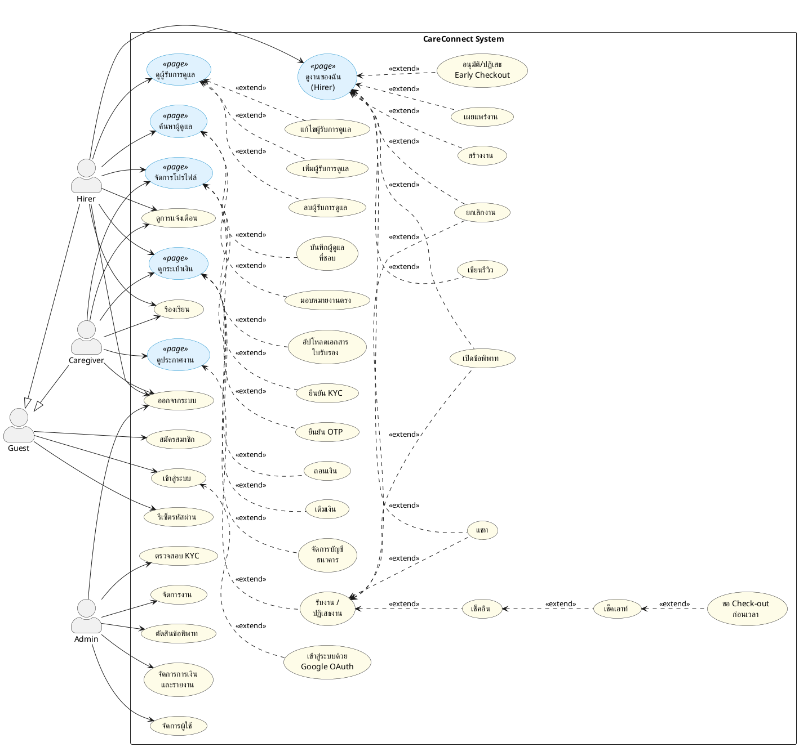
```plantuml
@startuml
left to right direction
skinparam actorStyle awesome
skinparam usecase {
  BackgroundColor #FEFCE8
  BackgroundColor<<page>> #E0F2FE
  BorderColor<<page>> #0284C7
}

actor "Guest" as G
actor "Hirer" as H
actor "Caregiver" as CG
actor "Admin" as A

G <|-- H
G <|-- CG

rectangle "CareConnect System" {

  ' === Authentication ===
  usecase "สมัครสมาชิก" as UC01
  usecase "เข้าสู่ระบบ" as UC02
  usecase "เข้าสู่ระบบด้วย\nGoogle OAuth" as UC03
  usecase "รีเซ็ตรหัสผ่าน" as UC04

  ' === Profile ===
  usecase "ออกจากระบบ" as UC05
  usecase "จัดการโปรไฟล์" as UC06 <<page>>
  usecase "ยืนยัน OTP" as UC07
  usecase "ยืนยัน KYC" as UC08
  usecase "อัปโหลดเอกสาร\nใบรับรอง" as UC09

  ' === ผู้รับการดูแล ===
  usecase "ดูผู้รับการดูแล" as UC10 <<page>>
  usecase "เพิ่มผู้รับการดูแล" as UC11
  usecase "แก้ไขผู้รับการดูแล" as UC12
  usecase "ลบผู้รับการดูแล" as UC13

  ' === Hirer — งานของฉัน ===
  usecase "ดูงานของฉัน\n(Hirer)" as UC14 <<page>>
  usecase "สร้างงาน" as UC15
  usecase "เผยแพร่งาน" as UC16
  usecase "ยกเลิกงาน" as UC17
  usecase "อนุมัติ/ปฏิเสธ\nEarly Checkout" as UC21
  usecase "เขียนรีวิว" as UC22
  usecase "แชท" as UC32
  usecase "เปิดข้อพิพาท" as UC34

  ' === ค้นหาผู้ดูแล ===
  usecase "ค้นหาผู้ดูแล" as UC18 <<page>>
  usecase "มอบหมายงานตรง" as UC19
  usecase "บันทึกผู้ดูแล\nที่ชอบ" as UC20

  ' === กระเป๋าเงิน ===
  usecase "ดูกระเป๋าเงิน" as UC29 <<page>>
  usecase "เติมเงิน" as UC28
  usecase "ถอนเงิน" as UC30
  usecase "จัดการบัญชี\nธนาคาร" as UC31

  ' === Shared ===
  usecase "ดูการแจ้งเตือน" as UC33
  usecase "ร้องเรียน" as UC35

  ' === Caregiver — ค้นหางาน ===
  usecase "ดูประกาศงาน" as UC23 <<page>>
  usecase "รับงาน /\nปฏิเสธงาน" as UC24

  ' === Caregiver — ปฏิบัติงาน ===
  usecase "เช็คอิน" as UC25
  usecase "เช็คเอาท์" as UC26
  usecase "ขอ Check-out\nก่อนเวลา" as UC27

  ' === Admin ===
  usecase "จัดการผู้ใช้" as UC36
  usecase "ตรวจสอบ KYC" as UC37
  usecase "จัดการงาน" as UC38
  usecase "ตัดสินข้อพิพาท" as UC39
  usecase "จัดการการเงิน\nและรายงาน" as UC40
}

' === Guest ===
G --> UC01
G --> UC02
G --> UC04
UC02 <.. UC03 : <<extend>>

' === Hirer ===
H --> UC06
H --> UC10
H --> UC14
H --> UC18
H --> UC29
H --> UC33
H --> UC35
H --> UC05

UC06 <.. UC07 : <<extend>>
UC06 <.. UC08 : <<extend>>

UC10 <.. UC11 : <<extend>>
UC10 <.. UC12 : <<extend>>
UC10 <.. UC13 : <<extend>>

UC14 <.. UC15 : <<extend>>
UC14 <.. UC16 : <<extend>>
UC14 <.. UC17 : <<extend>>
UC14 <.. UC21 : <<extend>>
UC14 <.. UC22 : <<extend>>
UC14 <.. UC32 : <<extend>>
UC14 <.. UC34 : <<extend>>

UC18 <.. UC19 : <<extend>>
UC18 <.. UC20 : <<extend>>

UC29 <.. UC28 : <<extend>>
UC29 <.. UC31 : <<extend>>

' === Caregiver ===
CG --> UC06
CG --> UC23
CG --> UC29
CG --> UC33
CG --> UC35
CG --> UC05

UC06 <.. UC09 : <<extend>>

UC23 <.. UC24 : <<extend>>

UC24 <.. UC25 : <<extend>>
UC25 <.. UC26 : <<extend>>
UC26 <.. UC27 : <<extend>>
UC24 <.. UC17 : <<extend>>
UC24 <.. UC32 : <<extend>>
UC24 <.. UC34 : <<extend>>

UC29 <.. UC30 : <<extend>>

' === Admin ===
A --> UC05
A --> UC36
A --> UC37
A --> UC38
A --> UC39
A --> UC40

@enduml
```

**ตาราง 3.15** รายการ Use Cases ทั้งหมดในระบบ CareConnect (40 Use Cases)

| UC ID | ชื่อ Use Case | Actor | เข้าถึงจาก | ประเภท |
|-------|--------------|-------|-----------|--------|
| UC-01 | สมัครสมาชิก | Guest | /register | หน้าหลัก |
| UC-02 | เข้าสู่ระบบ | Guest | /login | หน้าหลัก |
| UC-03 | เข้าสู่ระบบด้วย Google OAuth | Guest | extend จาก UC-02 | ทางเลือก |
| UC-04 | รีเซ็ตรหัสผ่าน | Guest | /forgot-password | หน้าหลัก |
| UC-05 | ออกจากระบบ | H, CG, Admin | /profile | หน้าหลัก |
| UC-06 | จัดการโปรไฟล์ | H, CG | /profile (🔵) | หน้าหลัก |
| UC-07 | ยืนยัน OTP | H, CG | extend จาก UC-06 | ทางเลือก |
| UC-08 | ยืนยัน KYC | H, CG | extend จาก UC-06 | ทางเลือก |
| UC-09 | อัปโหลดเอกสารใบรับรอง | CG | extend จาก UC-06 | ทางเลือก |
| UC-10 | ดูผู้รับการดูแล | H | /hirer/care-recipients (🔵) | หน้าหลัก |
| UC-11 | เพิ่มผู้รับการดูแล | H | extend จาก UC-10 | ทางเลือก |
| UC-12 | แก้ไขผู้รับการดูแล | H | extend จาก UC-10 | ทางเลือก |
| UC-13 | ลบผู้รับการดูแล | H | extend จาก UC-10 | ทางเลือก |
| UC-14 | ดูงานของฉัน (Hirer) | H | /hirer/home (🔵) | หน้าหลัก |
| UC-15 | สร้างงาน | H | extend จาก UC-14 | ทางเลือก |
| UC-16 | เผยแพร่งาน | H | extend จาก UC-14 | ทางเลือก |
| UC-17 | ยกเลิกงาน | H, CG | extend จาก UC-14 (H) / UC-24 (CG) | ทางเลือก |
| UC-18 | ค้นหาผู้ดูแล | H | /hirer/search-caregivers (🔵) | หน้าหลัก |
| UC-19 | มอบหมายงานตรง | H | extend จาก UC-18 | ทางเลือก |
| UC-20 | บันทึกผู้ดูแลที่ชอบ | H | extend จาก UC-18 | ทางเลือก |
| UC-21 | อนุมัติ/ปฏิเสธ Early Checkout | H | extend จาก UC-14 | ทางเลือก |
| UC-22 | เขียนรีวิว | H | extend จาก UC-14 | ทางเลือก |
| UC-23 | ดูประกาศงาน | CG | /caregiver/jobs/feed (🔵) | หน้าหลัก |
| UC-24 | รับงาน / ปฏิเสธงาน | CG | extend จาก UC-23 | ทางเลือก |
| UC-25 | เช็คอิน | CG | extend จาก UC-24 | ทางเลือก |
| UC-26 | เช็คเอาท์ | CG | extend จาก UC-25 | ทางเลือก |
| UC-27 | ขอ Check-out ก่อนเวลา | CG | extend จาก UC-26 | ทางเลือก |
| UC-28 | เติมเงิน | H, CG | extend จาก UC-29 | ทางเลือก |
| UC-29 | ดูกระเป๋าเงิน | H, CG | /wallet (🔵) | หน้าหลัก |
| UC-30 | ถอนเงิน | CG | extend จาก UC-29 | ทางเลือก |
| UC-31 | จัดการบัญชีธนาคาร | H, CG | extend จาก UC-29 | ทางเลือก |
| UC-32 | แชทเรียลไทม์ | H, CG | extend จาก UC-14 (H) / UC-24 (CG) | ทางเลือก |
| UC-33 | ดูการแจ้งเตือน | H, CG | /notifications (🔵) | หน้าหลัก |
| UC-34 | เปิดข้อพิพาท | H, CG | extend จาก UC-14 (H) / UC-24 (CG) | ทางเลือก |
| UC-35 | ร้องเรียน | H, CG | /complaint (🔵) | หน้าหลัก |
| UC-36 | จัดการผู้ใช้ | Admin | /admin/users | หน้าหลัก |
| UC-37 | ตรวจสอบ KYC | Admin | /admin/users | หน้าหลัก |
| UC-38 | จัดการงาน (Admin) | Admin | /admin/jobs | หน้าหลัก |
| UC-39 | ตัดสินข้อพิพาท | Admin | /admin/disputes | หน้าหลัก |
| UC-40 | จัดการการเงินและรายงาน | Admin | /admin/financial | หน้าหลัก |

### 3.5.2 Use Case Descriptions

> Use Case Diagram ประกอบด้วย **40 Use Cases** (UC-01 ถึง UC-40) สำหรับ 4 Actors
> - UC สีฟ้า (🔵) = **หน้าหลัก** ที่ผู้ใช้เข้าถึงผ่าน Tab/Menu
> - UC อื่น = **actions** ที่ทำได้จากหน้านั้น (<<extend>>)
> - ทุก UC สามารถนำไปเขียน Test Case ได้โดยตรง

---

#### กลุ่มที่ 1: Authentication (UC-01 ถึง UC-05)

**ตาราง 3.16** UC-01: สมัครสมาชิก

| รายการ | รายละเอียด |
|--------|-----------|
| **Use Case ID** | UC-01 |
| **Use Case** | สมัครสมาชิก |
| **Actor** | Guest |
| **Pre Conditions** | 1. ผู้ใช้ยังไม่มีบัญชีในระบบ |
| **Main Flow** | 1. ผู้ใช้เข้าหน้าสมัครสมาชิก เลือกสมัครด้วย Email หรือ เบอร์โทรศัพท์<br>2. กรอกข้อมูล (email/phone, รหัสผ่าน, เลือกบทบาท)<br>3. ระบบสร้างบัญชี + กระเป๋าเงินอัตโนมัติ<br>4. ผู้ใช้เลือกบทบาท (ผู้ว่าจ้าง/ผู้ดูแล) และยอมรับนโยบาย<br>5. ระบบนำไปหน้าหลักของบทบาทที่เลือก |
| **Exceptional Flow** | 1. Email หรือเบอร์โทรศัพท์ซ้ำ → แสดงข้อความ "อีเมล/เบอร์โทรนี้ถูกใช้แล้ว"<br>2. รหัสผ่านน้อยกว่า 8 ตัวอักษร → แสดงข้อความแจ้งเตือน |

**ตาราง 3.17** UC-02: เข้าสู่ระบบ

| รายการ | รายละเอียด |
|--------|-----------|
| **Use Case ID** | UC-02 |
| **Use Case** | เข้าสู่ระบบ |
| **Actor** | Guest |
| **Pre Conditions** | 1. ผู้ใช้มีบัญชีในระบบแล้ว |
| **Main Flow** | 1. ผู้ใช้เข้าหน้าเข้าสู่ระบบ เลือก Login ด้วย Email หรือ เบอร์โทรศัพท์<br>2. กรอกข้อมูล (email/phone + รหัสผ่าน)<br>3. ระบบตรวจสอบข้อมูลถูกต้อง<br>4. ระบบนำไปหน้าหลักตามบทบาท |
| **Exceptional Flow** | 1. ข้อมูลไม่ถูกต้อง → แสดง "อีเมลหรือรหัสผ่านไม่ถูกต้อง"<br>2. บัญชีถูกระงับ → แสดง "บัญชีถูกระงับการใช้งาน" |

**ตาราง 3.18** UC-03: เข้าสู่ระบบด้วย Google OAuth

| รายการ | รายละเอียด |
|--------|-----------|
| **Use Case ID** | UC-03 |
| **Use Case** | เข้าสู่ระบบด้วย Google OAuth |
| **Actor** | Guest |
| **Pre Conditions** | 1. ผู้ใช้มีบัญชี Google<br>2. ผู้ใช้อยู่ในหน้าเข้าสู่ระบบ |
| **Main Flow** | 1. ผู้ใช้กดปุ่ม "Sign in with Google"<br>2. ระบบพาไปหน้า Google เพื่อขออนุญาต<br>3. ผู้ใช้อนุญาตการเข้าถึง<br>4. หากเคยสมัครแล้ว → เข้าสู่ระบบทันที<br>5. หากยังไม่เคยสมัคร → สร้างบัญชีใหม่ แล้วให้เลือกบทบาท |
| **Exceptional Flow** | 1. ผู้ใช้ปฏิเสธการอนุญาต → กลับไปหน้าเข้าสู่ระบบ |

**ตาราง 3.19** UC-04: รีเซ็ตรหัสผ่าน

| รายการ | รายละเอียด |
|--------|-----------|
| **Use Case ID** | UC-04 |
| **Use Case** | รีเซ็ตรหัสผ่าน |
| **Actor** | Guest |
| **Pre Conditions** | 1. ผู้ใช้มีบัญชี email ในระบบ |
| **Main Flow** | 1. ผู้ใช้เข้าหน้า "ลืมรหัสผ่าน" กรอก email<br>2. ระบบส่งลิงก์รีเซ็ตไปทาง email<br>3. ผู้ใช้คลิกลิงก์ แล้วตั้งรหัสผ่านใหม่<br>4. ระบบแสดง "เปลี่ยนรหัสผ่านสำเร็จ" |
| **Exceptional Flow** | 1. ลิงก์หมดอายุ → แสดง "ลิงก์รีเซ็ตหมดอายุ กรุณาขอใหม่" |

**ตาราง 3.20** UC-05: ออกจากระบบ

| รายการ | รายละเอียด |
|--------|-----------|
| **Use Case ID** | UC-05 |
| **Use Case** | ออกจากระบบ |
| **Actor** | Hirer, Caregiver, Admin |
| **Pre Conditions** | 1. ผู้ใช้เข้าสู่ระบบแล้ว |
| **Main Flow** | 1. ผู้ใช้กดปุ่ม "ออกจากระบบ" ที่หน้าโปรไฟล์<br>2. ระบบลบข้อมูล session<br>3. ระบบนำไปหน้าเข้าสู่ระบบ |

---

#### กลุ่มที่ 2: Profile & Verification (UC-06 ถึง UC-09)

**ตาราง 3.21** UC-06: จัดการโปรไฟล์

| รายการ | รายละเอียด |
|--------|-----------|
| **Use Case ID** | UC-06 |
| **Use Case** | จัดการโปรไฟล์ |
| **Actor** | Hirer, Caregiver |
| **Pre Conditions** | 1. ผู้ใช้เข้าสู่ระบบแล้ว<br>2. ผู้ใช้อยู่ในหน้าโปรไฟล์ |
| **Main Flow** | 1. ระบบแสดงข้อมูลโปรไฟล์ปัจจุบัน<br>2. ผู้ใช้แก้ไขชื่อ, bio, ประสบการณ์, ความเชี่ยวชาญ, ที่อยู่<br>3. กดบันทึก → ระบบอัปเดตข้อมูล<br>4. ผู้ใช้สามารถอัปโหลดรูปโปรไฟล์ หรือเปลี่ยนรหัสผ่านได้ |
| **Exceptional Flow** | 1. ชื่อว่าง → แสดง "กรุณากรอกชื่อ"<br>2. รูปโปรไฟล์เกิน 5 MB → แสดง "ไฟล์ใหญ่เกินไป" |

**ตาราง 3.22** UC-07: ยืนยัน OTP

| รายการ | รายละเอียด |
|--------|-----------|
| **Use Case ID** | UC-07 |
| **Use Case** | ยืนยัน OTP (Email / Phone) |
| **Actor** | Hirer, Caregiver |
| **Pre Conditions** | 1. ผู้ใช้เข้าสู่ระบบแล้ว<br>2. ผู้ใช้อยู่ในหน้าจัดการโปรไฟล์<br>3. ยังไม่ได้ยืนยันเบอร์โทร/อีเมล |
| **Main Flow** | 1. ผู้ใช้กดขอรหัส OTP<br>2. ระบบส่งรหัส 6 หลักทาง SMS หรือ Email<br>3. ผู้ใช้กรอกรหัส OTP<br>4. ระบบตรวจสอบ → ยืนยันสำเร็จ<br>5. Trust Level อัปเกรดจาก L0 เป็น L1 |
| **Exceptional Flow** | 1. รหัส OTP ไม่ถูกต้อง → แสดง "รหัสไม่ถูกต้อง"<br>2. รหัสหมดอายุ → แสดง "รหัสหมดอายุ กรุณาขอใหม่" |

**ตาราง 3.23** UC-08: ยืนยัน KYC

| รายการ | รายละเอียด |
|--------|-----------|
| **Use Case ID** | UC-08 |
| **Use Case** | ยืนยัน KYC (บัตรประชาชน) |
| **Actor** | Hirer, Caregiver |
| **Pre Conditions** | 1. ผู้ใช้เข้าสู่ระบบแล้ว<br>2. ผู้ใช้อยู่ในหน้าจัดการโปรไฟล์<br>3. ผู้ใช้ยืนยัน OTP แล้ว (Trust Level ≥ L1) |
| **Main Flow** | 1. ผู้ใช้กดไปหน้ายืนยัน KYC<br>2. อัปโหลดรูปบัตรประชาชน (หน้า + หลัง) และรูป selfie<br>3. ระบบบันทึกเอกสาร แสดงสถานะ "รอตรวจสอบ"<br>4. Admin ตรวจสอบแล้วอนุมัติ → Trust Level อัปเกรดเป็น L2 |
| **Exceptional Flow** | 1. ขาดรูป selfie → แสดง "กรุณาอัปโหลดรูป selfie"<br>2. Admin ปฏิเสธ → ผู้ใช้สามารถส่งใหม่ได้ |

**ตาราง 3.24** UC-09: อัปโหลดเอกสารใบรับรอง

| รายการ | รายละเอียด |
|--------|-----------|
| **Use Case ID** | UC-09 |
| **Use Case** | อัปโหลดเอกสารใบรับรอง |
| **Actor** | Caregiver |
| **Pre Conditions** | 1. ผู้ใช้เข้าสู่ระบบเป็นผู้ดูแล<br>2. ผู้ใช้อยู่ในหน้าจัดการโปรไฟล์ |
| **Main Flow** | 1. ผู้ดูแลเลือกเอกสารที่ต้องการอัปโหลด (ใบรับรอง, ใบอนุญาต)<br>2. กดอัปโหลด → ระบบบันทึกเอกสาร<br>3. เอกสารแสดงในโปรไฟล์สาธารณะ<br>4. สามารถลบเอกสารที่อัปโหลดแล้วได้ |
| **Exceptional Flow** | 1. ไฟล์เกิน 10 MB → แสดง "ไฟล์ใหญ่เกินไป" |

---

#### กลุ่มที่ 3: Hirer — จัดการงาน (UC-10 ถึง UC-22)

**ตาราง 3.25** UC-10: ดูผู้รับการดูแล

| รายการ | รายละเอียด |
|--------|-----------|
| **Use Case ID** | UC-10 |
| **Use Case** | ดูผู้รับการดูแล |
| **Actor** | Hirer |
| **Pre Conditions** | 1. ผู้ใช้เข้าสู่ระบบเป็นผู้ว่าจ้าง |
| **Main Flow** | 1. ผู้ว่าจ้างกดแท็บ "ผู้รับการดูแล"<br>2. ระบบแสดงรายการผู้รับการดูแลที่เคยเพิ่มไว้<br>3. ผู้ใช้สามารถกดดูรายละเอียดแต่ละคนได้ |

**ตาราง 3.26** UC-11: เพิ่มผู้รับการดูแล

| รายการ | รายละเอียด |
|--------|-----------|
| **Use Case ID** | UC-11 |
| **Use Case** | เพิ่มผู้รับการดูแล |
| **Actor** | Hirer |
| **Pre Conditions** | 1. ผู้ใช้เข้าสู่ระบบเป็นผู้ว่าจ้าง<br>2. ผู้ใช้อยู่ในหน้าจัดการผู้รับการดูแล (UC-10) |
| **Main Flow** | 1. ผู้ว่าจ้างกด "เพิ่มผู้รับการดูแล"<br>2. กรอกข้อมูล: ชื่อ, อายุ, ระดับการเคลื่อนไหว, โรคประจำตัว, ที่อยู่<br>3. กดบันทึก → ระบบเพิ่มข้อมูลผู้รับการดูแล |
| **Exceptional Flow** | 1. ชื่อว่าง → แสดง "กรุณากรอกชื่อ" |

**ตาราง 3.27** UC-12: แก้ไขผู้รับการดูแล

| รายการ | รายละเอียด |
|--------|-----------|
| **Use Case ID** | UC-12 |
| **Use Case** | แก้ไขผู้รับการดูแล |
| **Actor** | Hirer |
| **Pre Conditions** | 1. ผู้ใช้เข้าสู่ระบบเป็นผู้ว่าจ้าง<br>2. ผู้ใช้อยู่ในหน้าจัดการผู้รับการดูแล (UC-10)<br>3. มีผู้รับการดูแลอย่างน้อย 1 คน |
| **Main Flow** | 1. ผู้ว่าจ้างกดปุ่มแก้ไขที่ผู้รับการดูแลที่ต้องการ<br>2. แก้ไขข้อมูลที่ต้องการ<br>3. กดบันทึก → ระบบอัปเดตข้อมูล |

**ตาราง 3.28** UC-13: ลบผู้รับการดูแล

| รายการ | รายละเอียด |
|--------|-----------|
| **Use Case ID** | UC-13 |
| **Use Case** | ลบผู้รับการดูแล |
| **Actor** | Hirer |
| **Pre Conditions** | 1. ผู้ใช้เข้าสู่ระบบเป็นผู้ว่าจ้าง<br>2. ผู้ใช้อยู่ในหน้าจัดการผู้รับการดูแล (UC-10) |
| **Main Flow** | 1. ผู้ว่าจ้างกดปุ่มลบที่ผู้รับการดูแลที่ต้องการ<br>2. ระบบยืนยันการลบ → ลบข้อมูล |
| **Exceptional Flow** | 1. ผู้รับการดูแลมีงานที่กำลังดำเนินอยู่ → แสดง "ไม่สามารถลบได้" |

**ตาราง 3.29** UC-14: ดูงานของฉัน (Hirer)

| รายการ | รายละเอียด |
|--------|-----------|
| **Use Case ID** | UC-14 |
| **Use Case** | ดูงานของฉัน (Hirer) |
| **Actor** | Hirer |
| **Pre Conditions** | 1. ผู้ใช้เข้าสู่ระบบเป็นผู้ว่าจ้าง |
| **Main Flow** | 1. ผู้ว่าจ้างกดแท็บ "งานของฉัน" (หน้าหลัก)<br>2. ระบบแสดงรายการงานทั้งหมดที่สร้างไว้ แบ่งตามสถานะ<br>3. ผู้ใช้สามารถกดดูรายละเอียดงานแต่ละรายการ<br>4. จากหน้านี้สามารถสร้างงาน, เผยแพร่, ยกเลิก, แชท, เปิดข้อพิพาท, รีวิว ได้ |

**ตาราง 3.30** UC-15: สร้างงาน

| รายการ | รายละเอียด |
|--------|-----------|
| **Use Case ID** | UC-15 |
| **Use Case** | สร้างงาน |
| **Actor** | Hirer |
| **Pre Conditions** | 1. ผู้ใช้เข้าสู่ระบบเป็นผู้ว่าจ้าง<br>2. ผู้ใช้อยู่ในหน้างานของฉัน (UC-14)<br>3. มีผู้รับการดูแลอย่างน้อย 1 คน |
| **Main Flow** | 1. ผู้ว่าจ้างกด "สร้างงาน"<br>2. เลือกผู้รับการดูแล<br>3. กรอกรายละเอียดงาน: ชื่องาน, ประเภท, คำอธิบาย, วันเวลา, ที่อยู่, ค่าจ้างต่อชั่วโมง<br>4. ระบบคำนวณจำนวนชั่วโมง ค่าจ้างรวม และระดับความเสี่ยงอัตโนมัติ<br>5. กดบันทึก → ระบบสร้างงาน (สถานะ Draft) |
| **Exceptional Flow** | 1. ข้อมูลไม่ครบ → แสดงข้อความแจ้งเตือน<br>2. เวลาสิ้นสุดก่อนเวลาเริ่ม → แสดง "เวลาไม่ถูกต้อง" |

**ตาราง 3.31** UC-16: เผยแพร่งาน

| รายการ | รายละเอียด |
|--------|-----------|
| **Use Case ID** | UC-16 |
| **Use Case** | เผยแพร่งาน |
| **Actor** | Hirer |
| **Pre Conditions** | 1. ผู้ใช้เข้าสู่ระบบเป็นผู้ว่าจ้าง<br>2. ผู้ใช้อยู่ในหน้างานของฉัน (UC-14)<br>3. มีงาน Draft ที่สร้างไว้<br>4. ผู้ใช้มี Trust Level L1 ขึ้นไป<br>5. มียอดเงินในกระเป๋าเพียงพอ |
| **Main Flow** | 1. ผู้ว่าจ้างเปิดรายละเอียดงาน Draft<br>2. กดปุ่ม "เผยแพร่งาน"<br>3. ระบบล็อคเงินจากกระเป๋าเงินอัตโนมัติ<br>4. งานปรากฏในหน้าค้นหางานของผู้ดูแล |
| **Exceptional Flow** | 1. Trust Level ไม่เพียงพอ → แสดง "ต้องยืนยันตัวตนก่อน"<br>2. ยอดเงินไม่พอ → แสดง "กรุณาเติมเงินก่อน" |

**ตาราง 3.32** UC-17: ยกเลิกงาน

| รายการ | รายละเอียด |
|--------|-----------|
| **Use Case ID** | UC-17 |
| **Use Case** | ยกเลิกงาน |
| **Actor** | Hirer, Caregiver |
| **Pre Conditions** | 1. ผู้ใช้เข้าสู่ระบบแล้ว<br>2. ผู้ใช้เป็นเจ้าของงานหรือผู้ดูแลที่รับงาน<br>3. งานยังไม่เสร็จสมบูรณ์ |
| **Main Flow** | 1. ผู้ใช้เปิดรายละเอียดงาน กดปุ่ม "ยกเลิกงาน"<br>2. กรอกเหตุผลการยกเลิก<br>3. ระบบคืนเงินให้ผู้ว่าจ้างอัตโนมัติ<br>4. แจ้งเตือนอีกฝ่าย |
| **Exceptional Flow** | 1. งานเสร็จแล้ว → แสดง "ไม่สามารถยกเลิกได้" |

**ตาราง 3.33** UC-18: ค้นหาผู้ดูแล

| รายการ | รายละเอียด |
|--------|-----------|
| **Use Case ID** | UC-18 |
| **Use Case** | ค้นหาผู้ดูแล |
| **Actor** | Hirer |
| **Pre Conditions** | 1. ผู้ใช้เข้าสู่ระบบเป็นผู้ว่าจ้าง |
| **Main Flow** | 1. ผู้ว่าจ้างกดแท็บ "ค้นหาผู้ดูแล"<br>2. กรอกตัวกรอง: ทักษะ, ประสบการณ์, Trust Level, วันที่ว่าง<br>3. ระบบแสดงรายการผู้ดูแลที่ตรงเงื่อนไข<br>4. กดดูรายละเอียด → เปิด modal แสดงโปรไฟล์เต็ม |
| **Exceptional Flow** | 1. ไม่พบผู้ดูแล → แสดง "ไม่พบผู้ดูแลที่ตรงเงื่อนไข" |

**ตาราง 3.34** UC-19: มอบหมายงานตรง

| รายการ | รายละเอียด |
|--------|-----------|
| **Use Case ID** | UC-19 |
| **Use Case** | มอบหมายงานตรง |
| **Actor** | Hirer |
| **Pre Conditions** | 1. ผู้ใช้เข้าสู่ระบบเป็นผู้ว่าจ้าง<br>2. ผู้ใช้อยู่ในหน้าค้นหาผู้ดูแล (UC-18)<br>3. มีงานที่สร้างไว้อย่างน้อย 1 งาน |
| **Main Flow** | 1. ผู้ว่าจ้างกด "มอบหมายงาน" ที่ผู้ดูแลที่ต้องการ<br>2. เลือกงานที่ต้องการมอบหมาย<br>3. ระบบส่งแจ้งเตือนให้ผู้ดูแลเพื่อตอบรับ/ปฏิเสธ |
| **Exceptional Flow** | 1. ผู้ดูแลมีงานทับซ้อนเวลา → แสดง "ผู้ดูแลไม่ว่างในช่วงเวลานี้" |

**ตาราง 3.35** UC-20: บันทึกผู้ดูแลที่ชอบ

| รายการ | รายละเอียด |
|--------|-----------|
| **Use Case ID** | UC-20 |
| **Use Case** | บันทึกผู้ดูแลที่ชอบ |
| **Actor** | Hirer |
| **Pre Conditions** | 1. ผู้ใช้เข้าสู่ระบบเป็นผู้ว่าจ้าง<br>2. ผู้ใช้อยู่ในหน้าค้นหาผู้ดูแล (UC-18) |
| **Main Flow** | 1. ผู้ว่าจ้างกดไอคอนหัวใจที่ผู้ดูแลที่ชอบ<br>2. ระบบบันทึก/ยกเลิกรายการโปรด<br>3. ดูรายการโปรดทั้งหมดได้ที่หน้า "รายการโปรด" |

**ตาราง 3.36** UC-21: อนุมัติ/ปฏิเสธ Early Checkout

| รายการ | รายละเอียด |
|--------|-----------|
| **Use Case ID** | UC-21 |
| **Use Case** | อนุมัติ/ปฏิเสธ Early Checkout |
| **Actor** | Hirer |
| **Pre Conditions** | 1. ผู้ใช้เข้าสู่ระบบเป็นผู้ว่าจ้าง<br>2. ผู้ใช้อยู่ในหน้างานของฉัน (UC-14)<br>3. มีคำขอส่งงานก่อนเวลาจากผู้ดูแล |
| **Main Flow** | 1. ผู้ว่าจ้างได้รับแจ้งเตือนว่ามีคำขอส่งงานก่อนเวลา<br>2. เข้าดูรายละเอียดงาน → เห็นคำขอพร้อมหลักฐาน<br>3. กด "อนุมัติ" → ระบบจ่ายเงินและปิดงานทันที<br>4. หรือกด "ปฏิเสธ" → ผู้ดูแลทำงานต่อจนถึงเวลาสิ้นสุด |

**ตาราง 3.37** UC-22: เขียนรีวิว

| รายการ | รายละเอียด |
|--------|-----------|
| **Use Case ID** | UC-22 |
| **Use Case** | เขียนรีวิว |
| **Actor** | Hirer |
| **Pre Conditions** | 1. ผู้ใช้เข้าสู่ระบบเป็นผู้ว่าจ้าง<br>2. ผู้ใช้อยู่ในหน้างานของฉัน (UC-14)<br>3. งานเสร็จสมบูรณ์แล้ว<br>4. ยังไม่เคยรีวิวงานนี้ |
| **Main Flow** | 1. ผู้ว่าจ้างเปิดรายละเอียดงานที่เสร็จแล้ว<br>2. ให้คะแนน 1-5 ดาว + เขียนความคิดเห็น<br>3. กดส่ง → ระบบบันทึกรีวิว |
| **Exceptional Flow** | 1. รีวิวซ้ำ → แสดง "คุณรีวิวงานนี้ไปแล้ว" |

---

#### กลุ่มที่ 4: Caregiver — ปฏิบัติงาน (UC-23 ถึง UC-27)

**ตาราง 3.38** UC-23: ดูประกาศงาน

| รายการ | รายละเอียด |
|--------|-----------|
| **Use Case ID** | UC-23 |
| **Use Case** | ดูประกาศงาน |
| **Actor** | Caregiver |
| **Pre Conditions** | 1. ผู้ใช้เข้าสู่ระบบเป็นผู้ดูแล |
| **Main Flow** | 1. ผู้ดูแลกดแท็บ "ค้นหางาน"<br>2. ระบบแสดงรายการงานที่เหมาะสมกับ Trust Level ของผู้ดูแล<br>3. กรองเพิ่มเติมได้ตาม ประเภทงาน, ระดับความเสี่ยง, งานเร่งด่วน<br>4. กดดูรายละเอียดงาน → แสดงข้อมูลงานเต็ม |
| **Exceptional Flow** | 1. ไม่มีงาน → แสดง "ไม่มีงานในขณะนี้" |

**ตาราง 3.39** UC-24: รับงาน / ปฏิเสธงาน

| รายการ | รายละเอียด |
|--------|-----------|
| **Use Case ID** | UC-24 |
| **Use Case** | รับงาน / ปฏิเสธงาน |
| **Actor** | Caregiver |
| **Pre Conditions** | 1. ผู้ใช้เข้าสู่ระบบเป็นผู้ดูแล<br>2. ผู้ใช้อยู่ในหน้าดูประกาศงาน (UC-23) หรือได้รับแจ้งเตือนจากการมอบหมายงานตรง<br>3. ผู้ใช้มี Trust Level ตามที่งานกำหนด |
| **Main Flow** | 1. ผู้ดูแลดูรายละเอียดงาน → กด "รับงาน"<br>2. ระบบสร้างห้องแชทอัตโนมัติ + แจ้งเตือนผู้ว่าจ้าง<br>3. **กรณีปฏิเสธ** (Direct Assign): กด "ปฏิเสธ" + กรอกเหตุผล → งานกลับไปเปิดรับสมัคร |
| **Exceptional Flow** | 1. งานถูกรับไปแล้ว → แสดง "งานนี้ถูกรับไปแล้ว"<br>2. มีงานทับซ้อนเวลา → แสดง "คุณมีงานในช่วงเวลานี้แล้ว" |

**ตาราง 3.40** UC-25: เช็คอิน

| รายการ | รายละเอียด |
|--------|-----------|
| **Use Case ID** | UC-25 |
| **Use Case** | เช็คอิน (GPS) |
| **Actor** | Caregiver |
| **Pre Conditions** | 1. ผู้ใช้เข้าสู่ระบบเป็นผู้ดูแล<br>2. ผู้ใช้รับงานแล้ว (UC-24)<br>3. ผู้ใช้อยู่ในหน้างานของฉัน |
| **Main Flow** | 1. ผู้ดูแลกดปุ่ม "เช็คอิน"<br>2. ระบบขอตำแหน่ง GPS จากเบราว์เซอร์<br>3. ระบบบันทึกตำแหน่ง + เปลี่ยนสถานะงานเป็น "กำลังดำเนินการ"<br>4. แจ้งเตือนผู้ว่าจ้าง "ผู้ดูแลเริ่มงานแล้ว" |

**ตาราง 3.41** UC-26: เช็คเอาท์

| รายการ | รายละเอียด |
|--------|-----------|
| **Use Case ID** | UC-26 |
| **Use Case** | เช็คเอาท์ (GPS + หลักฐาน) |
| **Actor** | Caregiver |
| **Pre Conditions** | 1. ผู้ใช้เข้าสู่ระบบเป็นผู้ดูแล<br>2. ผู้ใช้เช็คอินแล้ว (UC-25)<br>3. ถึงเวลาสิ้นสุดงาน |
| **Main Flow** | 1. ผู้ดูแลกดปุ่ม "เช็คเอาท์"<br>2. กรอกบันทึกการทำงาน (ต้องไม่ว่าง)<br>3. ระบบบันทึกตำแหน่ง GPS + จ่ายเงินให้ผู้ดูแลอัตโนมัติ<br>4. แจ้งเตือนผู้ว่าจ้าง "งานเสร็จสมบูรณ์" |
| **Exceptional Flow** | 1. ไม่กรอกบันทึกการทำงาน → แสดง "กรุณากรอกบันทึกการทำงาน" |

**ตาราง 3.42** UC-27: ขอ Check-out ก่อนเวลา

| รายการ | รายละเอียด |
|--------|-----------|
| **Use Case ID** | UC-27 |
| **Use Case** | ขอ Check-out ก่อนเวลา |
| **Actor** | Caregiver |
| **Pre Conditions** | 1. ผู้ใช้เข้าสู่ระบบเป็นผู้ดูแล<br>2. ผู้ใช้เช็คอินแล้ว (UC-25)<br>3. ยังไม่ถึงเวลาสิ้นสุดงาน |
| **Main Flow** | 1. ผู้ดูแลกรอกเหตุผลที่ต้องการส่งงานก่อนเวลา<br>2. ส่งคำขอ → ระบบแจ้งเตือนผู้ว่าจ้างเพื่ออนุมัติ (UC-21)<br>3. รอผู้ว่าจ้างตอบกลับ |
| **Exceptional Flow** | 1. มีคำขอค้างอยู่แล้ว → แสดง "มีคำขอรออนุมัติอยู่" |

---

#### กลุ่มที่ 5: กระเป๋าเงิน (UC-28 ถึง UC-31)

**ตาราง 3.43** UC-28: เติมเงิน

| รายการ | รายละเอียด |
|--------|-----------|
| **Use Case ID** | UC-28 |
| **Use Case** | เติมเงิน (QR Code) |
| **Actor** | Hirer, Caregiver |
| **Pre Conditions** | 1. ผู้ใช้เข้าสู่ระบบแล้ว<br>2. ผู้ใช้อยู่ในหน้ากระเป๋าเงิน (UC-29) |
| **Main Flow** | 1. ผู้ใช้กดปุ่ม "เติมเงิน" ระบุจำนวนเงิน<br>2. ระบบสร้าง QR Code แสดงใน popup<br>3. ผู้ใช้สแกน QR จ่ายเงินผ่านแอปธนาคาร<br>4. กดยืนยัน → ระบบตรวจสอบสถานะ → แสดง "เติมเงินสำเร็จ" |
| **Exceptional Flow** | 1. QR หมดอายุ → แสดง "กรุณาสร้าง QR ใหม่" |

**ตาราง 3.44** UC-29: ดูกระเป๋าเงิน

| รายการ | รายละเอียด |
|--------|-----------|
| **Use Case ID** | UC-29 |
| **Use Case** | ดูกระเป๋าเงิน |
| **Actor** | Hirer, Caregiver |
| **Pre Conditions** | 1. ผู้ใช้เข้าสู่ระบบแล้ว |
| **Main Flow** | 1. ผู้ใช้กดแท็บ "กระเป๋าเงิน"<br>2. ระบบแสดงยอดเงินคงเหลือ + ยอดที่ถูกล็อค<br>3. ดูประวัติธุรกรรมทั้งหมด<br>4. กดรายการ → ดูรายละเอียด (ใบเสร็จ/รายได้) |

**ตาราง 3.45** UC-30: ถอนเงิน

| รายการ | รายละเอียด |
|--------|-----------|
| **Use Case ID** | UC-30 |
| **Use Case** | ถอนเงิน |
| **Actor** | Caregiver |
| **Pre Conditions** | 1. ผู้ใช้เข้าสู่ระบบเป็นผู้ดูแล<br>2. ผู้ใช้อยู่ในหน้ากระเป๋าเงิน (UC-29)<br>3. มี Trust Level L2 ขึ้นไป<br>4. มีบัญชีธนาคารอย่างน้อย 1 บัญชี<br>5. มียอดเงินเพียงพอ |
| **Main Flow** | 1. ผู้ดูแลกดปุ่ม "ถอนเงิน"<br>2. เลือกบัญชีธนาคาร + ระบุจำนวน<br>3. กดยืนยัน → ระบบสร้างคำขอถอนเงิน รอ Admin อนุมัติ |
| **Exceptional Flow** | 1. Trust Level ไม่ถึง → แสดง "ต้องยืนยัน KYC ก่อนถอนเงิน"<br>2. ยอดไม่พอ → แสดง "ยอดเงินไม่เพียงพอ" |

**ตาราง 3.46** UC-31: จัดการบัญชีธนาคาร

| รายการ | รายละเอียด |
|--------|-----------|
| **Use Case ID** | UC-31 |
| **Use Case** | จัดการบัญชีธนาคาร |
| **Actor** | Hirer, Caregiver |
| **Pre Conditions** | 1. ผู้ใช้เข้าสู่ระบบแล้ว<br>2. ผู้ใช้อยู่ในหน้ากระเป๋าเงิน (UC-29) |
| **Main Flow** | 1. ผู้ใช้กดไปหน้า "จัดการบัญชีธนาคาร"<br>2. ดูรายการบัญชีที่เพิ่มไว้<br>3. เพิ่มบัญชีใหม่: เลือกธนาคาร + กรอกเลขบัญชี + ชื่อ<br>4. ลบบัญชีที่ไม่ต้องการ |

---

#### กลุ่มที่ 6: การสื่อสาร (UC-32 ถึง UC-33)

**ตาราง 3.47** UC-32: แชทเรียลไทม์

| รายการ | รายละเอียด |
|--------|-----------|
| **Use Case ID** | UC-32 |
| **Use Case** | แชทเรียลไทม์ |
| **Actor** | Hirer, Caregiver |
| **Pre Conditions** | 1. ผู้ใช้เข้าสู่ระบบแล้ว<br>2. ผู้ใช้อยู่ในหน้ารายละเอียดงาน (UC-14 หรือ UC-24)<br>3. มีห้องแชทที่สร้างจากการรับงาน |
| **Main Flow** | 1. ผู้ใช้กดปุ่ม "แชท" ที่รายละเอียดงาน<br>2. ระบบแสดงข้อความเก่า<br>3. พิมพ์ข้อความ → ส่งแบบเรียลไทม์<br>4. เห็น "กำลังพิมพ์..." เมื่ออีกฝ่ายพิมพ์ |
| **Exceptional Flow** | 1. งานถูกยกเลิก → ห้องแชทปิด แสดง "ห้องแชทปิดแล้ว" |

**ตาราง 3.48** UC-33: ดูการแจ้งเตือน

| รายการ | รายละเอียด |
|--------|-----------|
| **Use Case ID** | UC-33 |
| **Use Case** | ดูการแจ้งเตือน |
| **Actor** | Hirer, Caregiver |
| **Pre Conditions** | 1. ผู้ใช้เข้าสู่ระบบแล้ว |
| **Main Flow** | 1. ระบบแสดง badge จำนวนแจ้งเตือนที่ยังไม่อ่านที่ TopBar<br>2. ผู้ใช้กดไอคอนแจ้งเตือน → เปิดหน้าแจ้งเตือน<br>3. ดูรายการแจ้งเตือนทั้งหมด<br>4. กดแต่ละรายการ → ทำเครื่องหมายอ่านแล้ว<br>5. กด "อ่านทั้งหมด" → ล้าง badge |

---

#### กลุ่มที่ 7: ข้อพิพาทและร้องเรียน (UC-34 ถึง UC-35)

**ตาราง 3.49** UC-34: เปิดข้อพิพาท

| รายการ | รายละเอียด |
|--------|-----------|
| **Use Case ID** | UC-34 |
| **Use Case** | เปิดข้อพิพาท |
| **Actor** | Hirer, Caregiver |
| **Pre Conditions** | 1. ผู้ใช้เข้าสู่ระบบแล้ว<br>2. ผู้ใช้อยู่ในหน้ารายละเอียดงาน (UC-14 หรือ UC-24)<br>3. ยังไม่มีข้อพิพาทเปิดอยู่สำหรับงานนี้ |
| **Main Flow** | 1. ผู้ใช้กดปุ่ม "เปิดข้อพิพาท" ที่รายละเอียดงาน<br>2. กรอกเหตุผลและรายละเอียด<br>3. ระบบสร้างข้อพิพาท แจ้งเตือน Admin และอีกฝ่าย<br>4. ทั้ง 2 ฝ่ายส่งหลักฐานเพิ่มเติมได้<br>5. รอ Admin ตัดสิน (UC-39) |
| **Exceptional Flow** | 1. มีข้อพิพาทเปิดอยู่แล้ว → แสดง "มีข้อพิพาทเปิดอยู่แล้ว" |

**ตาราง 3.50** UC-35: ร้องเรียน

| รายการ | รายละเอียด |
|--------|-----------|
| **Use Case ID** | UC-35 |
| **Use Case** | ร้องเรียน |
| **Actor** | Hirer, Caregiver |
| **Pre Conditions** | 1. ผู้ใช้เข้าสู่ระบบแล้ว |
| **Main Flow** | 1. ผู้ใช้กดเมนู "ร้องเรียน" จาก TopBar<br>2. เลือกหมวดหมู่ปัญหา + กรอกรายละเอียด<br>3. แนบไฟล์หลักฐาน (สูงสุด 5 ไฟล์)<br>4. กดส่ง → ระบบบันทึกเรื่องร้องเรียน รอ Admin ตรวจสอบ |
| **Exceptional Flow** | 1. ไฟล์เกิน 10 MB → แสดง "ไฟล์ใหญ่เกินไป" |

---

#### กลุ่มที่ 8: Admin (UC-36 ถึง UC-40)

**ตาราง 3.51** UC-36: จัดการผู้ใช้

| รายการ | รายละเอียด |
|--------|-----------|
| **Use Case ID** | UC-36 |
| **Use Case** | จัดการผู้ใช้ |
| **Actor** | Admin |
| **Pre Conditions** | 1. ผู้ใช้เข้าสู่ระบบเป็น Admin |
| **Main Flow** | 1. Admin เข้าหน้าจัดการผู้ใช้<br>2. ค้นหาและดูรายการผู้ใช้ทั้งหมด (กรองตาม role, สถานะ)<br>3. กดดูรายละเอียด → เปลี่ยนสถานะ, แก้ไขข้อมูล, Ban, ดูกระเป๋าเงิน |

**ตาราง 3.52** UC-37: ตรวจสอบ KYC

| รายการ | รายละเอียด |
|--------|-----------|
| **Use Case ID** | UC-37 |
| **Use Case** | ตรวจสอบ KYC |
| **Actor** | Admin |
| **Pre Conditions** | 1. ผู้ใช้เข้าสู่ระบบเป็น Admin<br>2. มีผู้ใช้ที่ส่ง KYC รอตรวจสอบ |
| **Main Flow** | 1. Admin เข้าหน้าจัดการผู้ใช้ กรอง KYC pending<br>2. ดูเอกสาร: บัตรประชาชน + รูป selfie<br>3. อนุมัติ → Trust Level อัปเกรดเป็น L2<br>4. หรือ ปฏิเสธ พร้อมเหตุผล → แจ้งเตือนผู้ใช้ |

**ตาราง 3.53** UC-38: จัดการงาน (Admin)

| รายการ | รายละเอียด |
|--------|-----------|
| **Use Case ID** | UC-38 |
| **Use Case** | จัดการงาน (Admin) |
| **Actor** | Admin |
| **Pre Conditions** | 1. ผู้ใช้เข้าสู่ระบบเป็น Admin |
| **Main Flow** | 1. Admin เข้าหน้าจัดการงาน<br>2. ดูรายการงานทั้งหมด (กรองตาม สถานะ, ประเภท, ความเสี่ยง)<br>3. กดดูรายละเอียด<br>4. ยกเลิกงานที่มีปัญหา → ระบบคืนเงินอัตโนมัติ + แจ้งเตือนทั้ง 2 ฝ่าย |

**ตาราง 3.54** UC-39: ตัดสินข้อพิพาท

| รายการ | รายละเอียด |
|--------|-----------|
| **Use Case ID** | UC-39 |
| **Use Case** | ตัดสินข้อพิพาท |
| **Actor** | Admin |
| **Pre Conditions** | 1. ผู้ใช้เข้าสู่ระบบเป็น Admin<br>2. มีข้อพิพาทที่ยังไม่ได้ตัดสิน |
| **Main Flow** | 1. Admin เข้าหน้าจัดการข้อพิพาท<br>2. กดรับมอบหมาย<br>3. อ่านหลักฐานจากทั้ง 2 ฝ่าย<br>4. ตัดสิน: คืนเงินให้ผู้ว่าจ้าง / จ่ายเงินให้ผู้ดูแล / แบ่งตามสัดส่วน<br>5. แจ้งเตือนทั้ง 2 ฝ่าย |

**ตาราง 3.55** UC-40: จัดการการเงินและรายงาน

| รายการ | รายละเอียด |
|--------|-----------|
| **Use Case ID** | UC-40 |
| **Use Case** | จัดการการเงินและรายงาน |
| **Actor** | Admin |
| **Pre Conditions** | 1. ผู้ใช้เข้าสู่ระบบเป็น Admin |
| **Main Flow** | 1. Admin เข้าหน้าจัดการการเงิน<br>2. ดูรายการธุรกรรมทั้งหมด (กรองตามประเภท, วันที่)<br>3. ดู Dashboard สถิติภาพรวม: จำนวนผู้ใช้, งาน, ยอดเงิน<br>4. ดูรายงานสรุปรายได้<br>5. ตรวจสอบและอนุมัติ/ปฏิเสธคำขอถอนเงิน |

---

## 3.6 Sequence Diagram

> 📌 นำ Mermaid code ไปวางที่ https://mermaid.live แล้ว export รูปใส่วิทยานิพนธ์

### 3.6.1 การสมัครสมาชิก (Registration)

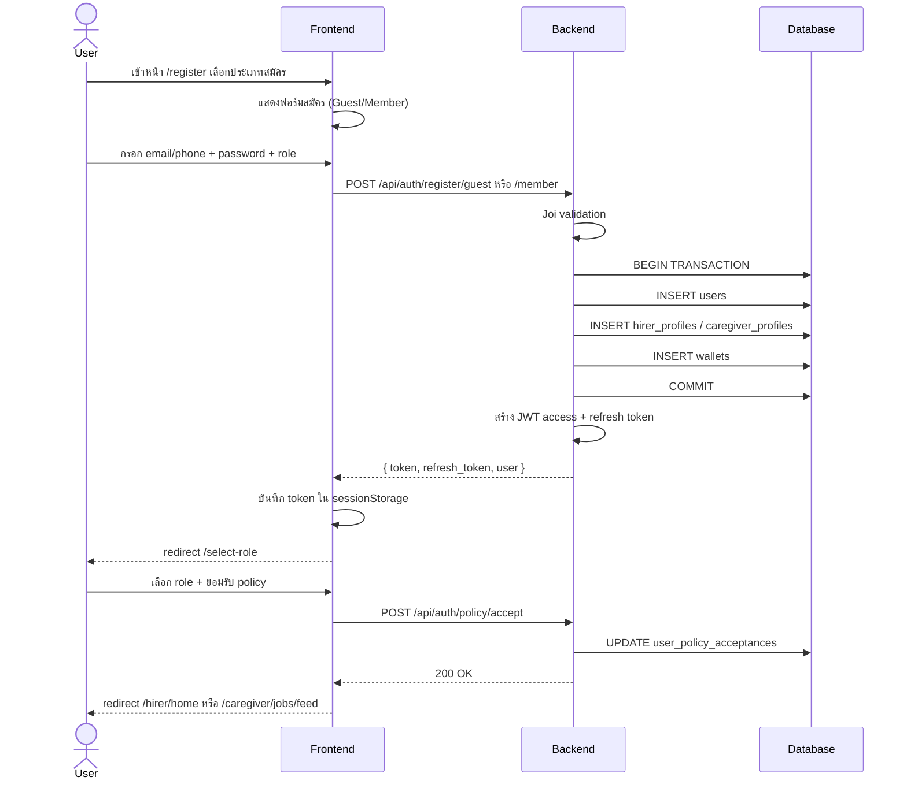
```mermaid
sequenceDiagram
    actor User
    participant FE as Frontend
    participant BE as Backend
    participant DB as Database
    User->>FE: เข้าหน้า /register เลือกประเภทสมัคร
    FE->>FE: แสดงฟอร์มสมัคร (Guest/Member)
    User->>FE: กรอก email/phone + password + role
    FE->>BE: POST /api/auth/register/guest หรือ /member
    BE->>BE: Joi validation
    BE->>DB: BEGIN TRANSACTION
    BE->>DB: INSERT users
    BE->>DB: INSERT hirer_profiles / caregiver_profiles
    BE->>DB: INSERT wallets
    BE->>DB: COMMIT
    BE->>BE: สร้าง JWT access + refresh token
    BE-->>FE: { token, refresh_token, user }
    FE->>FE: บันทึก token ใน sessionStorage
    FE-->>User: redirect /select-role
    User->>FE: เลือก role + ยอมรับ policy
    FE->>BE: POST /api/auth/policy/accept
    BE->>DB: UPDATE user_policy_acceptances
    BE-->>FE: 200 OK
    FE-->>User: redirect /hirer/home หรือ /caregiver/jobs/feed
```

### 3.6.2 การเข้าสู่ระบบ (Login)

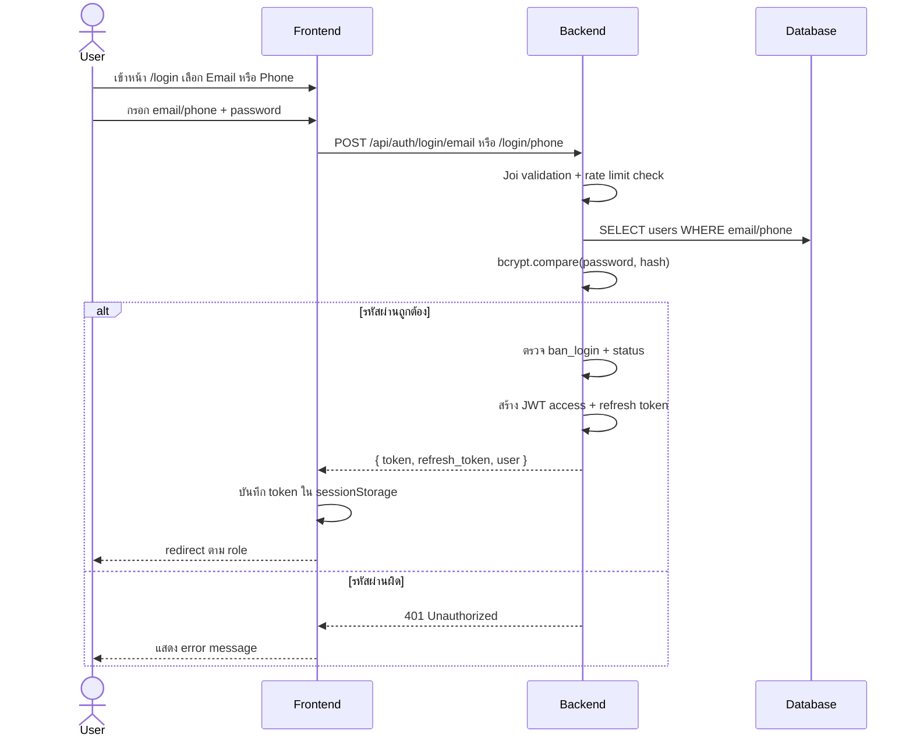
```mermaid
sequenceDiagram
    actor User
    participant FE as Frontend
    participant BE as Backend
    participant DB as Database
    User->>FE: เข้าหน้า /login เลือก Email หรือ Phone
    User->>FE: กรอก email/phone + password
    FE->>BE: POST /api/auth/login/email หรือ /login/phone
    BE->>BE: Joi validation + rate limit check
    BE->>DB: SELECT users WHERE email/phone
    BE->>BE: bcrypt.compare(password, hash)
    alt รหัสผ่านถูกต้อง
        BE->>BE: ตรวจ ban_login + status
        BE->>BE: สร้าง JWT access + refresh token
        BE-->>FE: { token, refresh_token, user }
        FE->>FE: บันทึก token ใน sessionStorage
        FE-->>User: redirect ตาม role
    else รหัสผ่านผิด
        BE-->>FE: 401 Unauthorized
        FE-->>User: แสดง error message
    end
```

### 3.6.3 การเข้าสู่ระบบด้วย Google OAuth 2.0

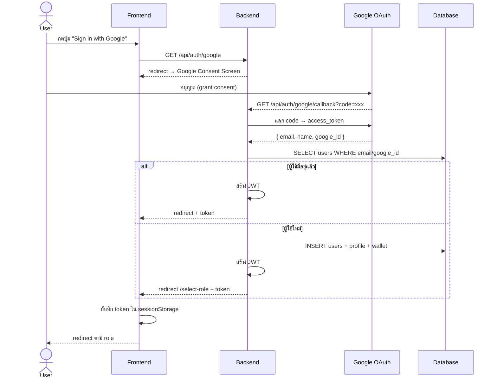
```mermaid
sequenceDiagram
    actor User
    participant FE as Frontend
    participant BE as Backend
    participant Google as Google OAuth
    participant DB as Database
    User->>FE: กดปุ่ม "Sign in with Google"
    FE->>BE: GET /api/auth/google
    BE-->>FE: redirect → Google Consent Screen
    User->>Google: อนุญาต (grant consent)
    Google-->>BE: GET /api/auth/google/callback?code=xxx
    BE->>Google: แลก code → access_token
    Google-->>BE: { email, name, google_id }
    BE->>DB: SELECT users WHERE email/google_id
    alt ผู้ใช้มีอยู่แล้ว
        BE->>BE: สร้าง JWT
        BE-->>FE: redirect + token
    else ผู้ใช้ใหม่
        BE->>DB: INSERT users + profile + wallet
        BE->>BE: สร้าง JWT
        BE-->>FE: redirect /select-role + token
    end
    FE->>FE: บันทึก token ใน sessionStorage
    FE-->>User: redirect ตาม role
```

### 3.6.4 การยืนยัน OTP

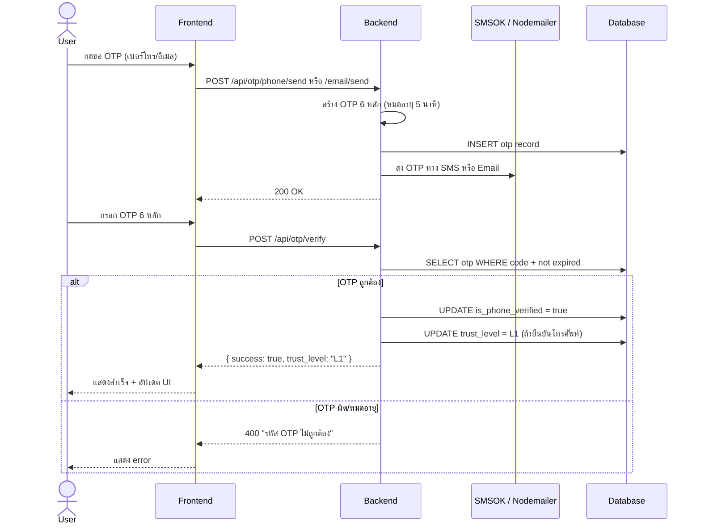
```mermaid
sequenceDiagram
    actor User
    participant FE as Frontend
    participant BE as Backend
    participant SMS as SMSOK / Nodemailer
    participant DB as Database
    User->>FE: กดขอ OTP (เบอร์โทร/อีเมล)
    FE->>BE: POST /api/otp/phone/send หรือ /email/send
    BE->>BE: สร้าง OTP 6 หลัก (หมดอายุ 5 นาที)
    BE->>DB: INSERT otp record
    BE->>SMS: ส่ง OTP ทาง SMS หรือ Email
    BE-->>FE: 200 OK
    User->>FE: กรอก OTP 6 หลัก
    FE->>BE: POST /api/otp/verify
    BE->>DB: SELECT otp WHERE code + not expired
    alt OTP ถูกต้อง
        BE->>DB: UPDATE is_phone_verified = true
        BE->>DB: UPDATE trust_level = L1 (ถ้ายืนยันโทรศัพท์)
        BE-->>FE: { success: true, trust_level: "L1" }
        FE-->>User: แสดงสำเร็จ + อัปเดต UI
    else OTP ผิด/หมดอายุ
        BE-->>FE: 400 "รหัส OTP ไม่ถูกต้อง"
        FE-->>User: แสดง error
    end
```

### 3.6.5 การสร้างและเผยแพร่งาน (Job Creation & Publishing)

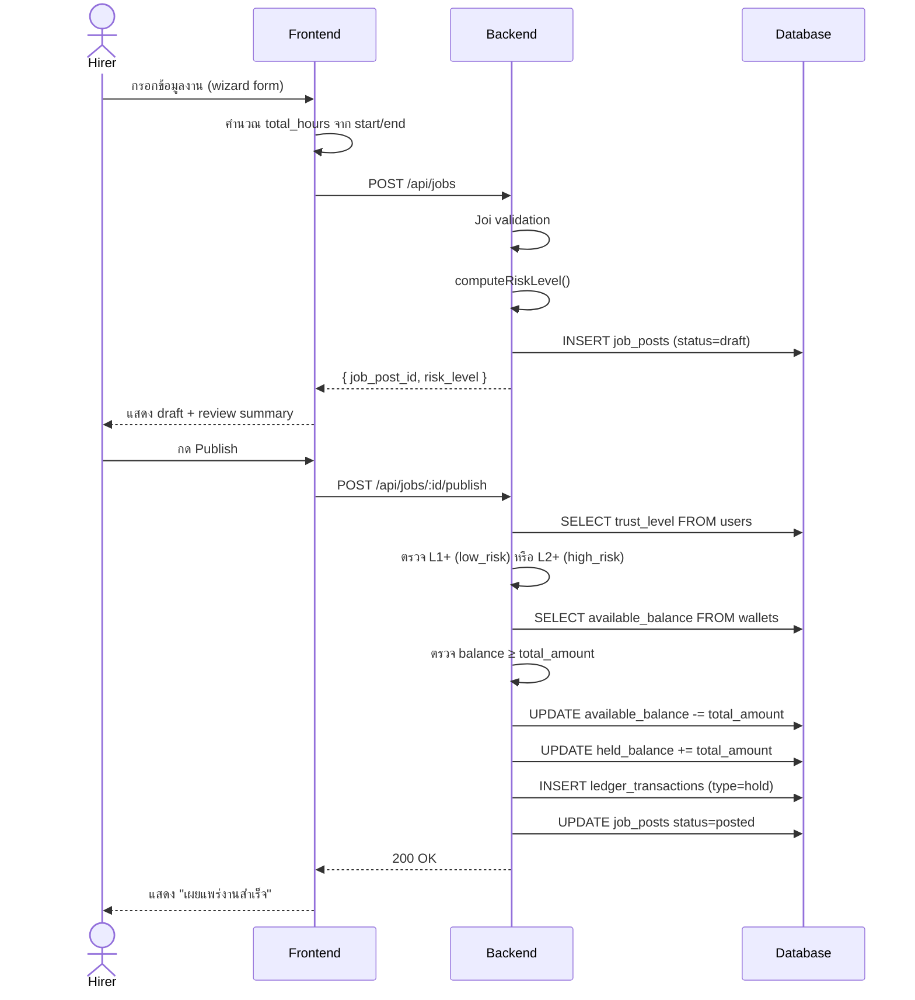
```mermaid
sequenceDiagram
    actor Hirer
    participant FE as Frontend
    participant BE as Backend
    participant DB as Database
    Hirer->>FE: กรอกข้อมูลงาน (wizard form)
    FE->>FE: คำนวณ total_hours จาก start/end
    FE->>BE: POST /api/jobs
    BE->>BE: Joi validation
    BE->>BE: computeRiskLevel()
    BE->>DB: INSERT job_posts (status=draft)
    BE-->>FE: { job_post_id, risk_level }
    FE-->>Hirer: แสดง draft + review summary
    Hirer->>FE: กด Publish
    FE->>BE: POST /api/jobs/:id/publish
    BE->>DB: SELECT trust_level FROM users
    BE->>BE: ตรวจ L1+ (low_risk) หรือ L2+ (high_risk)
    BE->>DB: SELECT available_balance FROM wallets
    BE->>BE: ตรวจ balance ≥ total_amount
    BE->>DB: UPDATE available_balance -= total_amount
    BE->>DB: UPDATE held_balance += total_amount
    BE->>DB: INSERT ledger_transactions (type=hold)
    BE->>DB: UPDATE job_posts status=posted
    BE-->>FE: 200 OK
    FE-->>Hirer: แสดง "เผยแพร่งานสำเร็จ"
```

### 3.6.6 การมอบหมายงานตรง (Direct Assign)

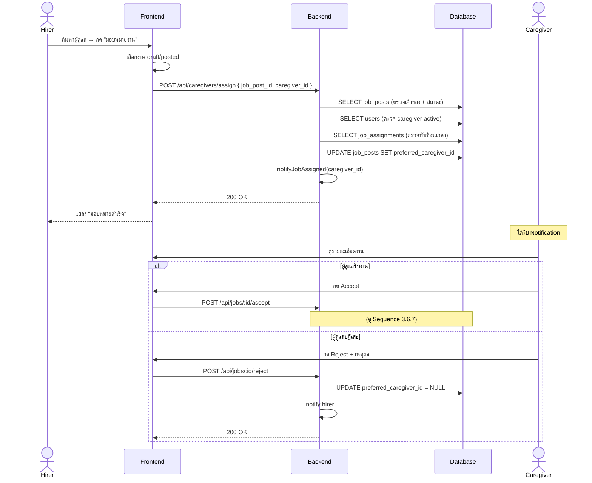
```mermaid
sequenceDiagram
    actor Hirer
    participant FE as Frontend
    participant BE as Backend
    participant DB as Database
    actor CG as Caregiver
    Hirer->>FE: ค้นหาผู้ดูแล → กด "มอบหมายงาน"
    FE->>FE: เลือกงาน draft/posted
    FE->>BE: POST /api/caregivers/assign { job_post_id, caregiver_id }
    BE->>DB: SELECT job_posts (ตรวจเจ้าของ + สถานะ)
    BE->>DB: SELECT users (ตรวจ caregiver active)
    BE->>DB: SELECT job_assignments (ตรวจทับซ้อนเวลา)
    BE->>DB: UPDATE job_posts SET preferred_caregiver_id
    BE->>BE: notifyJobAssigned(caregiver_id)
    BE-->>FE: 200 OK
    FE-->>Hirer: แสดง "มอบหมายสำเร็จ"
    Note over CG: ได้รับ Notification
    CG->>FE: ดูรายละเอียดงาน
    alt ผู้ดูแลรับงาน
        CG->>FE: กด Accept
        FE->>BE: POST /api/jobs/:id/accept
        Note over BE,DB: (ดู Sequence 3.6.7)
    else ผู้ดูแลปฏิเสธ
        CG->>FE: กด Reject + เหตุผล
        FE->>BE: POST /api/jobs/:id/reject
        BE->>DB: UPDATE preferred_caregiver_id = NULL
        BE->>BE: notify hirer
        BE-->>FE: 200 OK
    end
```

### 3.6.7 การรับงาน เช็คอิน และเช็คเอาท์ (Accept, Check-in, Check-out)

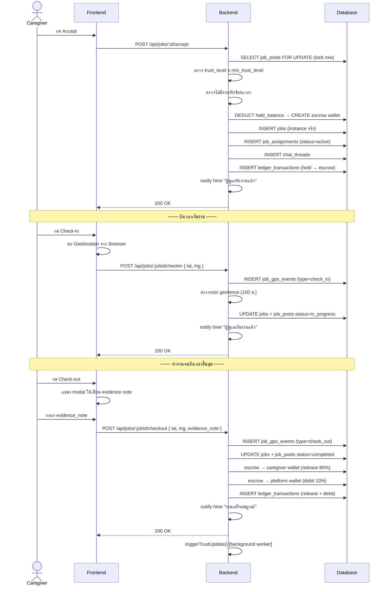
```mermaid
sequenceDiagram
    actor CG as Caregiver
    participant FE as Frontend
    participant BE as Backend
    participant DB as Database
    CG->>FE: กด Accept
    FE->>BE: POST /api/jobs/:id/accept
    BE->>DB: SELECT job_posts FOR UPDATE (lock row)
    BE->>BE: ตรวจ trust_level ≥ min_trust_level
    BE->>BE: ตรวจไม่มีงานทับซ้อนเวลา
    BE->>DB: DEDUCT held_balance → CREATE escrow wallet
    BE->>DB: INSERT jobs (instance จริง)
    BE->>DB: INSERT job_assignments (status=active)
    BE->>DB: INSERT chat_threads
    BE->>DB: INSERT ledger_transactions (hold → escrow)
    BE->>BE: notify hirer "ผู้ดูแลรับงานแล้ว"
    BE-->>FE: 200 OK
    Note over CG,DB: ─── ถึงเวลาเริ่มงาน ───
    CG->>FE: กด Check-in
    FE->>FE: ขอ Geolocation จาก Browser
    FE->>BE: POST /api/jobs/:jobId/checkin { lat, lng }
    BE->>DB: INSERT job_gps_events (type=check_in)
    BE->>BE: ตรวจระยะ geofence (100 ม.)
    BE->>DB: UPDATE jobs + job_posts status=in_progress
    BE->>BE: notify hirer "ผู้ดูแลเริ่มงานแล้ว"
    BE-->>FE: 200 OK
    Note over CG,DB: ─── ทำงานจนถึงเวลาสิ้นสุด ───
    CG->>FE: กด Check-out
    FE->>FE: แสดง modal ให้เขียน evidence note
    CG->>FE: กรอก evidence_note
    FE->>BE: POST /api/jobs/:jobId/checkout { lat, lng, evidence_note }
    BE->>DB: INSERT job_gps_events (type=check_out)
    BE->>DB: UPDATE jobs + job_posts status=completed
    BE->>DB: escrow → caregiver wallet (release 90%)
    BE->>DB: escrow → platform wallet (debit 10%)
    BE->>DB: INSERT ledger_transactions (release + debit)
    BE->>BE: notify hirer "งานเสร็จสมบูรณ์"
    BE-->>FE: 200 OK
    BE->>BE: triggerTrustUpdate() [background worker]
```

### 3.6.8 การขอเช็คเอาท์ก่อนเวลา (Early Checkout)

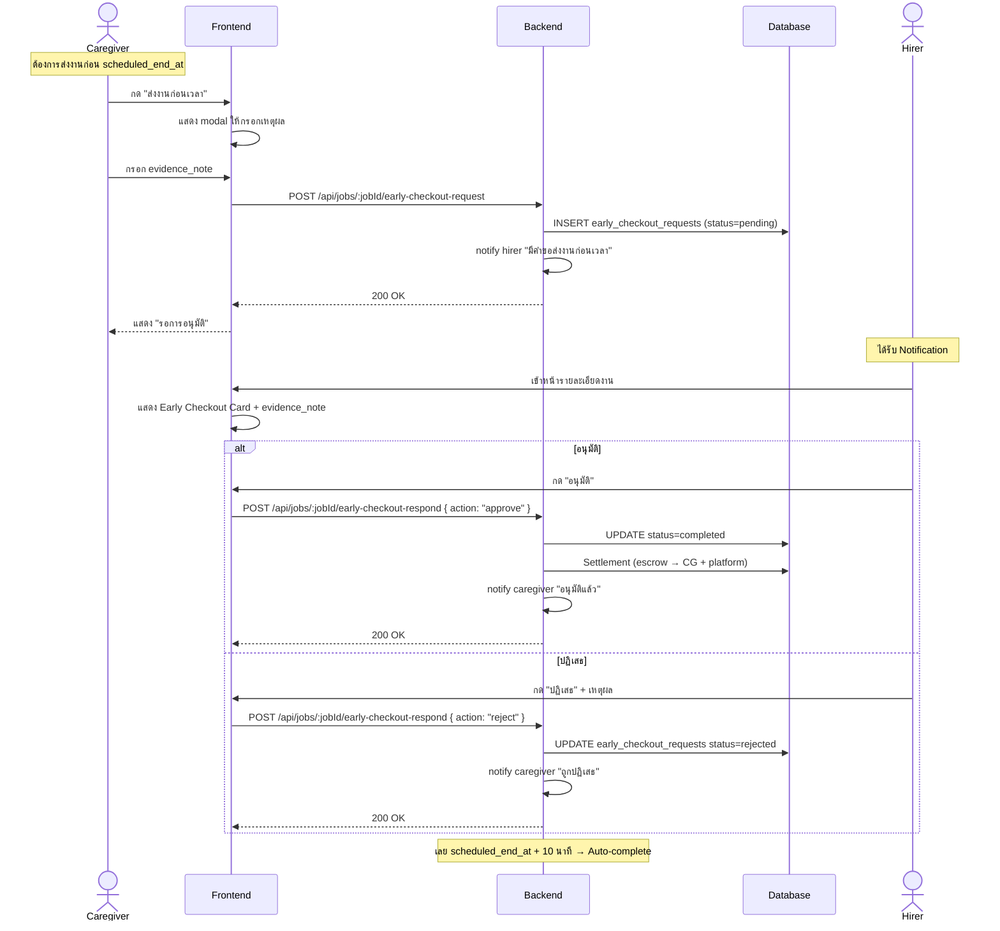
```mermaid
sequenceDiagram
    actor CG as Caregiver
    participant FE as Frontend
    participant BE as Backend
    participant DB as Database
    actor Hirer
    Note over CG: ต้องการส่งงานก่อน scheduled_end_at
    CG->>FE: กด "ส่งงานก่อนเวลา"
    FE->>FE: แสดง modal ให้กรอกเหตุผล
    CG->>FE: กรอก evidence_note
    FE->>BE: POST /api/jobs/:jobId/early-checkout-request
    BE->>DB: INSERT early_checkout_requests (status=pending)
    BE->>BE: notify hirer "มีคำขอส่งงานก่อนเวลา"
    BE-->>FE: 200 OK
    FE-->>CG: แสดง "รอการอนุมัติ"
    Note over Hirer: ได้รับ Notification
    Hirer->>FE: เข้าหน้ารายละเอียดงาน
    FE->>FE: แสดง Early Checkout Card + evidence_note
    alt อนุมัติ
        Hirer->>FE: กด "อนุมัติ"
        FE->>BE: POST /api/jobs/:jobId/early-checkout-respond { action: "approve" }
        BE->>DB: UPDATE status=completed
        BE->>DB: Settlement (escrow → CG + platform)
        BE->>BE: notify caregiver "อนุมัติแล้ว"
        BE-->>FE: 200 OK
    else ปฏิเสธ
        Hirer->>FE: กด "ปฏิเสธ" + เหตุผล
        FE->>BE: POST /api/jobs/:jobId/early-checkout-respond { action: "reject" }
        BE->>DB: UPDATE early_checkout_requests status=rejected
        BE->>BE: notify caregiver "ถูกปฏิเสธ"
        BE-->>FE: 200 OK
    end
    Note over BE: เลย scheduled_end_at + 10 นาที → Auto-complete
```

### 3.6.9 การยกเลิกงาน (Cancel Job)

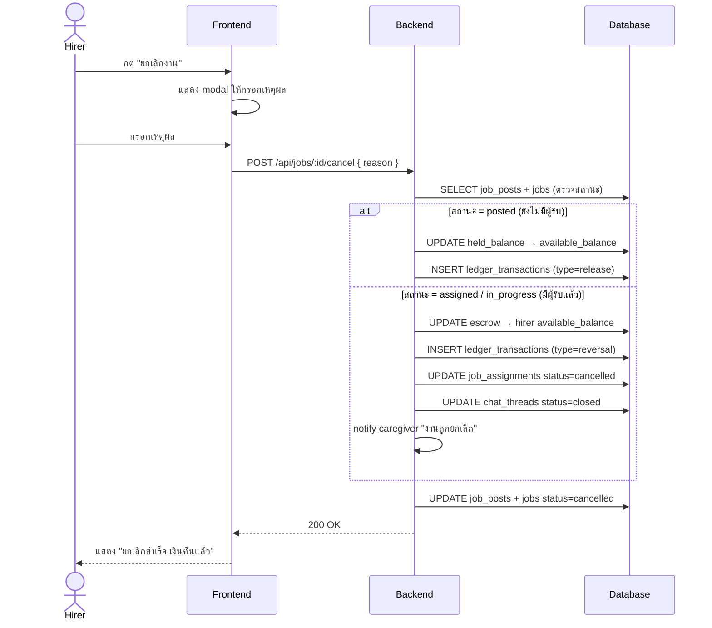
```mermaid
sequenceDiagram
    actor Hirer
    participant FE as Frontend
    participant BE as Backend
    participant DB as Database
    Hirer->>FE: กด "ยกเลิกงาน"
    FE->>FE: แสดง modal ให้กรอกเหตุผล
    Hirer->>FE: กรอกเหตุผล
    FE->>BE: POST /api/jobs/:id/cancel { reason }
    BE->>DB: SELECT job_posts + jobs (ตรวจสถานะ)
    alt สถานะ = posted (ยังไม่มีผู้รับ)
        BE->>DB: UPDATE held_balance → available_balance
        BE->>DB: INSERT ledger_transactions (type=release)
    else สถานะ = assigned / in_progress (มีผู้รับแล้ว)
        BE->>DB: UPDATE escrow → hirer available_balance
        BE->>DB: INSERT ledger_transactions (type=reversal)
        BE->>DB: UPDATE job_assignments status=cancelled
        BE->>DB: UPDATE chat_threads status=closed
        BE->>BE: notify caregiver "งานถูกยกเลิก"
    end
    BE->>DB: UPDATE job_posts + jobs status=cancelled
    BE-->>FE: 200 OK
    FE-->>Hirer: แสดง "ยกเลิกสำเร็จ เงินคืนแล้ว"
```

### 3.6.10 การเติมเงิน (Top-up Wallet)

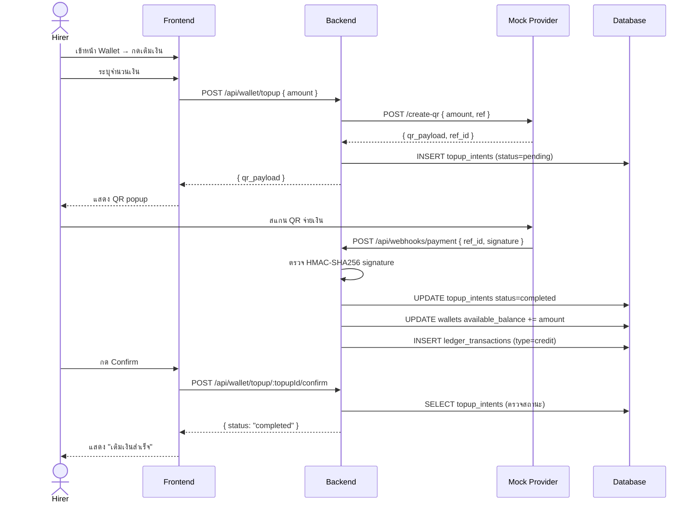
```mermaid
sequenceDiagram
    actor Hirer
    participant FE as Frontend
    participant BE as Backend
    participant MP as Mock Provider
    participant DB as Database
    Hirer->>FE: เข้าหน้า Wallet → กดเติมเงิน
    Hirer->>FE: ระบุจำนวนเงิน
    FE->>BE: POST /api/wallet/topup { amount }
    BE->>MP: POST /create-qr { amount, ref }
    MP-->>BE: { qr_payload, ref_id }
    BE->>DB: INSERT topup_intents (status=pending)
    BE-->>FE: { qr_payload }
    FE-->>Hirer: แสดง QR popup
    Hirer->>MP: สแกน QR จ่ายเงิน
    MP->>BE: POST /api/webhooks/payment { ref_id, signature }
    BE->>BE: ตรวจ HMAC-SHA256 signature
    BE->>DB: UPDATE topup_intents status=completed
    BE->>DB: UPDATE wallets available_balance += amount
    BE->>DB: INSERT ledger_transactions (type=credit)
    Hirer->>FE: กด Confirm
    FE->>BE: POST /api/wallet/topup/:topupId/confirm
    BE->>DB: SELECT topup_intents (ตรวจสถานะ)
    BE-->>FE: { status: "completed" }
    FE-->>Hirer: แสดง "เติมเงินสำเร็จ"
```

### 3.6.11 การถอนเงิน (Withdrawal)

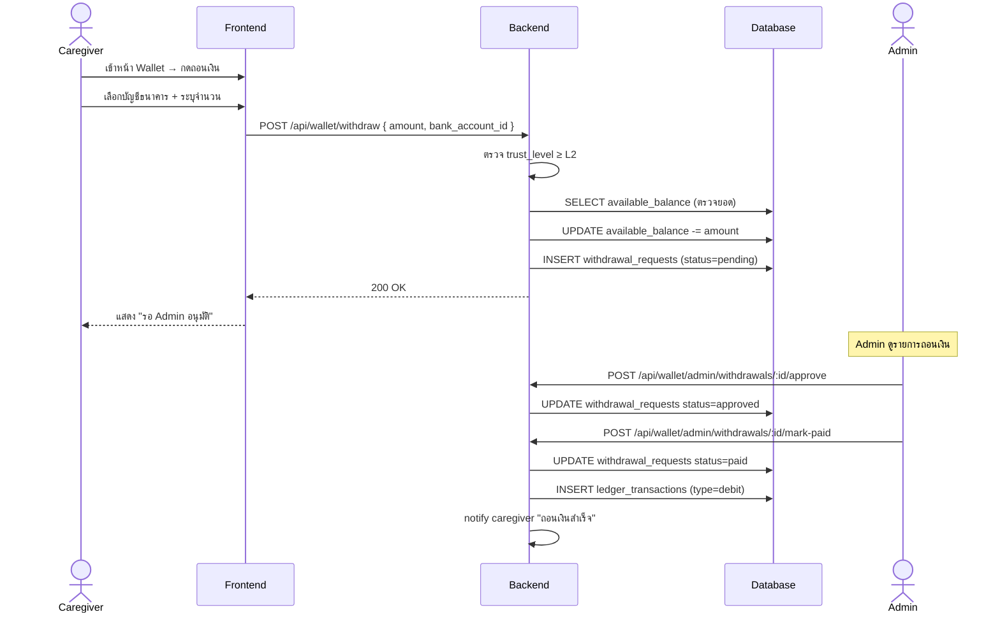
```mermaid
sequenceDiagram
    actor CG as Caregiver
    participant FE as Frontend
    participant BE as Backend
    participant DB as Database
    actor Admin
    CG->>FE: เข้าหน้า Wallet → กดถอนเงิน
    CG->>FE: เลือกบัญชีธนาคาร + ระบุจำนวน
    FE->>BE: POST /api/wallet/withdraw { amount, bank_account_id }
    BE->>BE: ตรวจ trust_level ≥ L2
    BE->>DB: SELECT available_balance (ตรวจยอด)
    BE->>DB: UPDATE available_balance -= amount
    BE->>DB: INSERT withdrawal_requests (status=pending)
    BE-->>FE: 200 OK
    FE-->>CG: แสดง "รอ Admin อนุมัติ"
    Note over Admin: Admin ดูรายการถอนเงิน
    Admin->>BE: POST /api/wallet/admin/withdrawals/:id/approve
    BE->>DB: UPDATE withdrawal_requests status=approved
    Admin->>BE: POST /api/wallet/admin/withdrawals/:id/mark-paid
    BE->>DB: UPDATE withdrawal_requests status=paid
    BE->>DB: INSERT ledger_transactions (type=debit)
    BE->>BE: notify caregiver "ถอนเงินสำเร็จ"
```

### 3.6.12 การแชทแบบเรียลไทม์ (Real-time Chat)

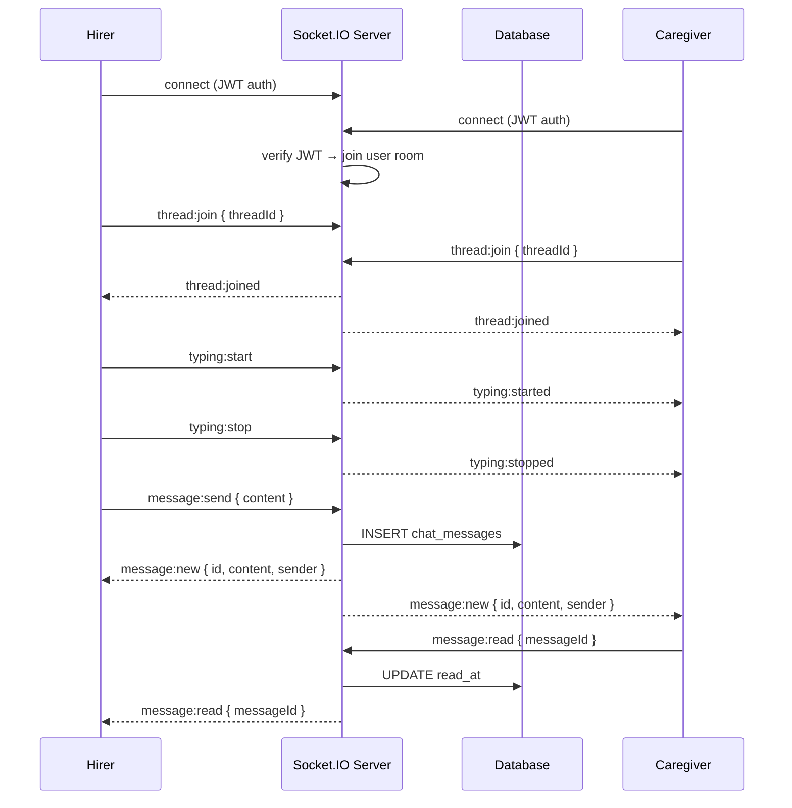
```mermaid
sequenceDiagram
    participant H as Hirer
    participant S as Socket.IO Server
    participant DB as Database
    participant CG as Caregiver
    H->>S: connect (JWT auth)
    CG->>S: connect (JWT auth)
    S->>S: verify JWT → join user room
    H->>S: thread:join { threadId }
    CG->>S: thread:join { threadId }
    S-->>H: thread:joined
    S-->>CG: thread:joined
    H->>S: typing:start
    S-->>CG: typing:started
    H->>S: typing:stop
    S-->>CG: typing:stopped
    H->>S: message:send { content }
    S->>DB: INSERT chat_messages
    S-->>H: message:new { id, content, sender }
    S-->>CG: message:new { id, content, sender }
    CG->>S: message:read { messageId }
    S->>DB: UPDATE read_at
    S-->>H: message:read { messageId }
```

### 3.6.13 การแจ้งเตือน (Notification — Dual Channel)

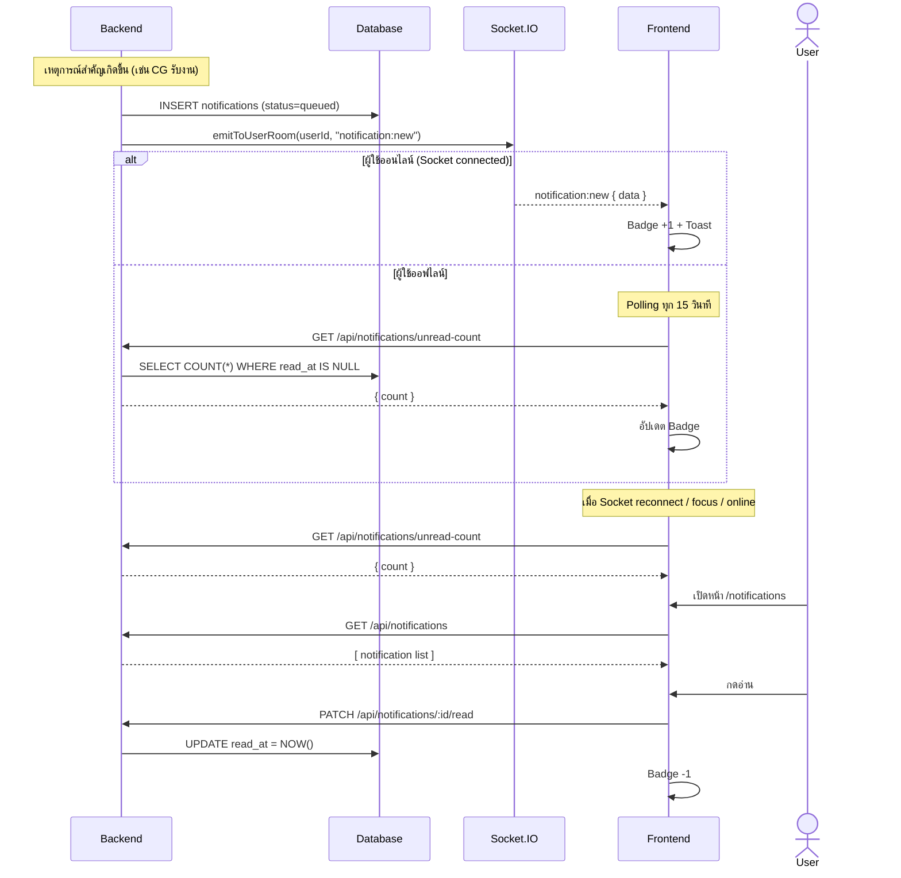
```mermaid
sequenceDiagram
    participant BE as Backend
    participant DB as Database
    participant SIO as Socket.IO
    participant FE as Frontend
    actor User
    Note over BE: เหตุการณ์สำคัญเกิดขึ้น (เช่น CG รับงาน)
    BE->>DB: INSERT notifications (status=queued)
    BE->>SIO: emitToUserRoom(userId, "notification:new")
    alt ผู้ใช้ออนไลน์ (Socket connected)
        SIO-->>FE: notification:new { data }
        FE->>FE: Badge +1 + Toast
    else ผู้ใช้ออฟไลน์
        Note over FE: Polling ทุก 15 วินาที
        FE->>BE: GET /api/notifications/unread-count
        BE->>DB: SELECT COUNT(*) WHERE read_at IS NULL
        BE-->>FE: { count }
        FE->>FE: อัปเดต Badge
    end
    Note over FE: เมื่อ Socket reconnect / focus / online
    FE->>BE: GET /api/notifications/unread-count
    BE-->>FE: { count }
    User->>FE: เปิดหน้า /notifications
    FE->>BE: GET /api/notifications
    BE-->>FE: [ notification list ]
    User->>FE: กดอ่าน
    FE->>BE: PATCH /api/notifications/:id/read
    BE->>DB: UPDATE read_at = NOW()
    FE->>FE: Badge -1
```

### 3.6.14 การยืนยัน KYC (KYC Verification)

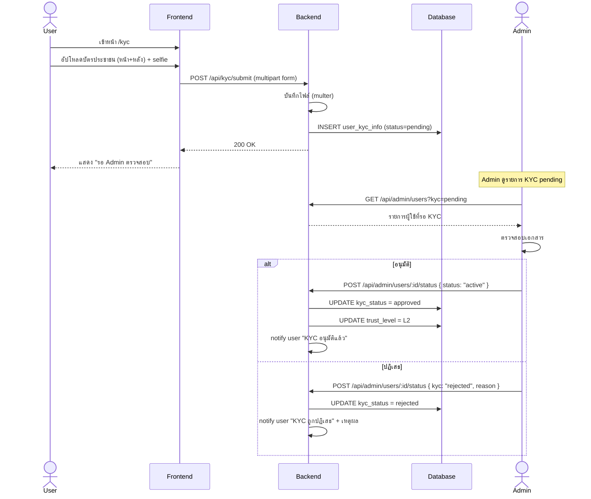
```mermaid
sequenceDiagram
    actor User
    participant FE as Frontend
    participant BE as Backend
    participant DB as Database
    actor Admin
    User->>FE: เข้าหน้า /kyc
    User->>FE: อัปโหลดบัตรประชาชน (หน้า+หลัง) + selfie
    FE->>BE: POST /api/kyc/submit (multipart form)
    BE->>BE: บันทึกไฟล์ (multer)
    BE->>DB: INSERT user_kyc_info (status=pending)
    BE-->>FE: 200 OK
    FE-->>User: แสดง "รอ Admin ตรวจสอบ"
    Note over Admin: Admin ดูรายการ KYC pending
    Admin->>BE: GET /api/admin/users?kyc=pending
    BE-->>Admin: รายการผู้ใช้ที่รอ KYC
    Admin->>Admin: ตรวจสอบเอกสาร
    alt อนุมัติ
        Admin->>BE: POST /api/admin/users/:id/status { status: "active" }
        BE->>DB: UPDATE kyc_status = approved
        BE->>DB: UPDATE trust_level = L2
        BE->>BE: notify user "KYC อนุมัติแล้ว"
    else ปฏิเสธ
        Admin->>BE: POST /api/admin/users/:id/status { kyc: "rejected", reason }
        BE->>DB: UPDATE kyc_status = rejected
        BE->>BE: notify user "KYC ถูกปฏิเสธ" + เหตุผล
    end
```

### 3.6.15 การเปิดและตัดสินข้อพิพาท (Dispute Flow)

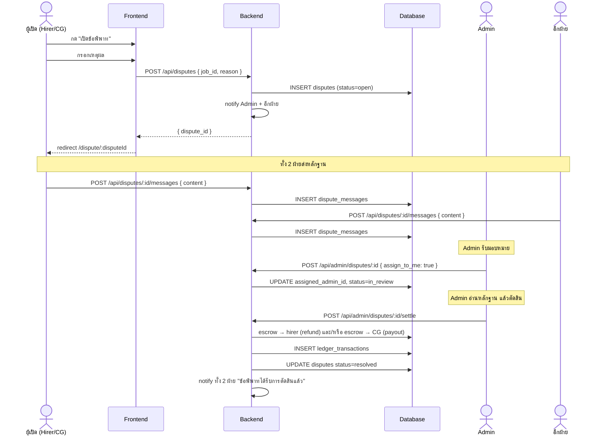
```mermaid
sequenceDiagram
    actor Opener as ผู้เปิด (Hirer/CG)
    participant FE as Frontend
    participant BE as Backend
    participant DB as Database
    actor Admin
    actor Other as อีกฝ่าย
    Opener->>FE: กด "เปิดข้อพิพาท"
    Opener->>FE: กรอกเหตุผล
    FE->>BE: POST /api/disputes { job_id, reason }
    BE->>DB: INSERT disputes (status=open)
    BE->>BE: notify Admin + อีกฝ่าย
    BE-->>FE: { dispute_id }
    FE-->>Opener: redirect /dispute/:disputeId
    Note over Opener,Other: ทั้ง 2 ฝ่ายส่งหลักฐาน
    Opener->>BE: POST /api/disputes/:id/messages { content }
    BE->>DB: INSERT dispute_messages
    Other->>BE: POST /api/disputes/:id/messages { content }
    BE->>DB: INSERT dispute_messages
    Note over Admin: Admin รับมอบหมาย
    Admin->>BE: POST /api/admin/disputes/:id { assign_to_me: true }
    BE->>DB: UPDATE assigned_admin_id, status=in_review
    Note over Admin: Admin อ่านหลักฐาน แล้วตัดสิน
    Admin->>BE: POST /api/admin/disputes/:id/settle
    BE->>DB: escrow → hirer (refund) และ/หรือ escrow → CG (payout)
    BE->>DB: INSERT ledger_transactions
    BE->>DB: UPDATE disputes status=resolved
    BE->>BE: notify ทั้ง 2 ฝ่าย "ข้อพิพาทได้รับการตัดสินแล้ว"
```

---

## 3.7 การออกแบบส่วนติดต่อผู้ใช้ (UI Design)

> 📌 **NOTE**: ในรูปเล่มจริงควรแทรก screenshot หน้าจอจริงประกอบแต่ละกลุ่ม

**ตาราง 3.17** หน้าจอ Public

| URL | หน้าจอ | คำอธิบาย |
|-----|-------|---------|
| / | LandingPage | แนะนำระบบ, featured caregivers |
| /about | AboutPage | เกี่ยวกับแพลตฟอร์ม |
| /faq | FAQPage | คำถามที่พบบ่อย |
| /contact | ContactPage | ติดต่อเรา |

**ตาราง 3.18** หน้าจอ Authentication (11 หน้า)

| URL | หน้าจอ | คำอธิบาย |
|-----|-------|---------|
| /login | LoginEntryPage | เลือก email/phone/google |
| /login/email | LoginEmailPage | login ด้วย email |
| /login/phone | LoginPhonePage | login ด้วยเบอร์โทร |
| /auth/callback | AuthCallbackPage | Google OAuth callback |
| /register | RegisterTypePage | เลือกประเภทสมัคร |
| /register/guest | GuestRegisterPage | สมัครด้วย email |
| /register/member | MemberRegisterPage | สมัครด้วยเบอร์โทร |
| /select-role | RoleSelectionPage | เลือก Hirer/Caregiver |
| /register/consent | ConsentPage | ยอมรับ policy |
| /forgot-password | ForgotPasswordPage | ขอลิงก์ reset |
| /reset-password | ResetPasswordPage | ตั้งรหัสผ่านใหม่ |

**ตาราง 3.19** หน้าจอ Hirer (11 หน้า)

| URL | หน้าจอ | คำอธิบาย |
|-----|-------|---------|
| /hirer/home | HirerHomePage | รายการงาน, ปฏิทิน, สถิติ |
| /hirer/create-job | CreateJobPage | สร้างงาน (wizard form) |
| /hirer/search-caregivers | SearchCaregiversPage | ค้นหา + Direct Assign |
| /hirer/caregiver/:id | CaregiverPublicProfilePage | โปรไฟล์ผู้ดูแล |
| /hirer/care-recipients | CareRecipientsPage | จัดการผู้รับการดูแล |
| /hirer/care-recipients/new | CareRecipientFormPage | เพิ่มผู้รับการดูแล |
| /hirer/care-recipients/:id/edit | CareRecipientFormPage | แก้ไขผู้รับการดูแล |
| /hirer/wallet | HirerWalletPage | กระเป๋าเงิน |
| /hirer/wallet/receipt/:jobId | JobReceiptPage | ใบเสร็จต่องาน |
| /hirer/wallet/history | HirerPaymentHistoryPage | ประวัติชำระเงิน |
| /hirer/favorites | FavoritesPage | caregiver ที่บันทึก |

**ตาราง 3.20** หน้าจอ Caregiver (7 หน้า)

| URL | หน้าจอ | คำอธิบาย |
|-----|-------|---------|
| /caregiver/jobs/feed | CaregiverJobFeedPage | ดูประกาศงาน |
| /caregiver/jobs/my-jobs | CaregiverMyJobsPage | งานที่รับ, check-in/out |
| /caregiver/jobs/:id/preview | JobPreviewPage | ดูงานก่อนรับ |
| /caregiver/profile | ProfilePage | โปรไฟล์ |
| /caregiver/wallet | CaregiverWalletPage | กระเป๋าเงิน |
| /caregiver/wallet/earning/:jobId | JobEarningDetailPage | รายได้ต่องาน |
| /caregiver/wallet/history | EarningsHistoryPage | ประวัติรายได้ |

**ตาราง 3.21** หน้าจอ Shared (8 หน้า)

| URL | หน้าจอ | คำอธิบาย |
|-----|-------|---------|
| /jobs/:id | JobDetailPage | รายละเอียดงาน |
| /chat/:jobId | ChatRoomPage | ห้องแชท |
| /dispute/:disputeId | DisputeChatPage | ห้องข้อพิพาท |
| /notifications | NotificationsPage | ประวัติแจ้งเตือน |
| /profile | ProfilePage | โปรไฟล์ส่วนตัว |
| /settings | SettingsPage | ตั้งค่าบัญชี |
| /kyc | KycPage | KYC verification |
| /wallet/bank-accounts | BankAccountsPage | จัดการบัญชีธนาคาร |

**ตาราง 3.22** หน้าจอ Admin (8 หน้า)

| URL | หน้าจอ | คำอธิบาย |
|-----|-------|---------|
| /admin/login | AdminLoginPage | Login Admin |
| /admin/dashboard | AdminDashboardPage | ภาพรวม, สถิติ |
| /admin/users | AdminUsersPage | จัดการ user, KYC |
| /admin/jobs | AdminJobsPage | ดู/ยกเลิกงาน |
| /admin/financial | AdminFinancialPage | ledger transactions |
| /admin/disputes | AdminDisputesPage | settle disputes |
| /admin/reports | AdminReportsPage | รายงานสรุป |
| /admin/settings | AdminSettingsPage | ตั้งค่าระบบ |

---

## 3.8 การออกแบบฐานข้อมูล (Database Design)

### 3.8.1 ER Diagram

> 📌 **DIAGRAM: ER Diagram** — นำโค้ดนี้ไปวางที่ https://dbdiagram.io/d

```dbml
Table users {
  id UUID [pk]
  email VARCHAR [unique]
  phone_number VARCHAR [unique]
  role user_role [not null]
  trust_level trust_level [default: 'L0']
  trust_score INT [default: 0]
  status user_status [default: 'active']
}
Table hirer_profiles {
  id UUID [pk]
  user_id UUID [ref: - users.id, unique]
  display_name VARCHAR
}
Table caregiver_profiles {
  id UUID [pk]
  user_id UUID [ref: - users.id, unique]
  display_name VARCHAR
  average_rating NUMERIC
}
Table patient_profiles {
  id UUID [pk]
  hirer_id UUID [ref: > users.id]
  patient_display_name VARCHAR
}
Table job_posts {
  id UUID [pk]
  hirer_id UUID [ref: > users.id]
  patient_profile_id UUID [ref: > patient_profiles.id]
  preferred_caregiver_id UUID [ref: > users.id]
  status job_status
  risk_level risk_level
}
Table jobs {
  id UUID [pk]
  job_post_id UUID [ref: > job_posts.id]
  hirer_id UUID [ref: > users.id]
  status job_status
}
Table job_assignments {
  id UUID [pk]
  job_id UUID [ref: > jobs.id]
  caregiver_id UUID [ref: > users.id]
  status assignment_status
}
Table wallets {
  id UUID [pk]
  user_id UUID [ref: > users.id]
  job_id UUID [ref: > jobs.id]
  wallet_type VARCHAR
  available_balance BIGINT
  held_balance BIGINT
}
Table ledger_transactions {
  id UUID [pk]
  from_wallet_id UUID [ref: > wallets.id]
  to_wallet_id UUID [ref: > wallets.id]
  amount BIGINT
  type transaction_type
  idempotency_key VARCHAR [unique]
}
Table chat_threads {
  id UUID [pk]
  job_id UUID [ref: - jobs.id]
  status VARCHAR
}
Table chat_messages {
  id UUID [pk]
  thread_id UUID [ref: > chat_threads.id]
  sender_id UUID [ref: > users.id]
  type chat_message_type
}
Table disputes {
  id UUID [pk]
  job_post_id UUID [ref: > job_posts.id]
  opened_by_user_id UUID [ref: > users.id]
  assigned_admin_id UUID [ref: > users.id]
  status dispute_status
}
Table notifications {
  id UUID [pk]
  user_id UUID [ref: > users.id]
  status notification_status
}
Table caregiver_reviews {
  id UUID [pk]
  job_id UUID [ref: > jobs.id]
  reviewer_id UUID [ref: > users.id]
  caregiver_id UUID [ref: > users.id]
  rating INT
}
```

### 3.8.2 รายละเอียดตารางหลัก

ตารางหลักของระบบประกอบด้วย users ซึ่งเก็บข้อมูลผู้ใช้ทุกคน มี UUID primary key, email (UNIQUE, nullable), phone_number (UNIQUE, nullable), password_hash (bcrypt), account_type (guest/member), role (hirer/caregiver/admin), trust_level (L0-L3 เป็น derived state), trust_score (0-100) และ ban flags 4 ตัว (ban_login, ban_job_create, ban_job_accept, ban_withdraw)

ตาราง job_posts เก็บประกาศงานเป็นตารางแรกใน two-table pattern มี job_type (6 ค่า), risk_level (auto-computed), schedule, GPS coordinates, geofence_radius_m (default 100), hourly_rate, total_amount, platform_fee_amount (default 10%), min_trust_level, task flags และ replacement_chain_count (max 3) ตาราง jobs เก็บ instance จริงสร้างเมื่อ Accept การแยก 2 ตารางรองรับ replacement chain สูงสุด 3 ครั้งต่อประกาศ

ตาราง wallets มี available_balance และ held_balance (BIGINT, CHECK ≥ 0) แยก 5 ประเภท ตาราง ledger_transactions เป็น immutable (DB trigger ห้าม UPDATE/DELETE) มี idempotency_key (UNIQUE)

### 3.8.3 Database Enums

**ตาราง 3.23** Database Enums

| ENUM Type | Values |
|-----------|--------|
| user_role | hirer, caregiver, admin |
| user_status | active, suspended, deleted |
| trust_level | L0, L1, L2, L3 |
| job_status | draft, posted, assigned, in_progress, completed, cancelled, expired |
| job_type | companionship, personal_care, medical_monitoring, dementia_care, post_surgery, emergency |
| risk_level | low_risk, high_risk |
| assignment_status | active, replaced, completed, cancelled |
| transaction_type | credit, debit, hold, release, reversal |
| kyc_status | pending, approved, rejected, expired |
| dispute_status | open, in_review, resolved, rejected |
| notification_status | queued, sent, delivered, read, failed |
| chat_message_type | text, image, file, system |
| gps_event_type | check_in, check_out, ping |
